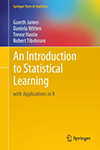

Introduction to Statistical Modeling  for Social Sciences. 
---

###Basic
[Info](#info)

**Session**:  	Fall 2015 (Sep 9 - Dec 4[)](https://github.com/andkov/psy532/edit/gh-pages/index.md)  
**Meeting Time**:		MT 11:30 - 13:00    
**Meeting Place**:		HSD A150  

Instructor | Dr. Andrey Koval
--- | --- | ---
Office       | Cornett B335g
Hours | By appointment
Email | andkov at uvic dot ca
Phone | 472-4864

###Quick Links
- [Calendar](./calendar.md): course events and timetables
- [Resources](./resources.md): collection of materials that were used extensively to put together this course and this website. Study it for inspiration and scripting detail.
- [Projects](./projects/README.md): gallery of reports
- [Swirl courses](https://github.com/swirldev/swirl_courses) and my [annotations](./materials/swirl/course_notes.md) to them 
- [Data Science Specialization](https://github.com/DataScienceSpecialization) and particularly their [Curated Knowledge](http://datasciencespecialization.github.io/curated/) page.  
- [Data Science Toolbox](http://datasciencetoolbox.org/) virtual environment for data science

##Texts

###Books 
 
   
[Designing Experiments and Analyzing Data](http://www.designingexperiments.com/) the book has a [website](http://www.designingexperiments.com/) with  scripts used in the text, datasets are on the CD that comes with the book. Uvic Library has a [hardcopy](http://voyager.library.uvic.ca/vwebv/holdingsInfo?bibId=1337909)

 
     
   
[Introduction to Statistical Learning](http://www-bcf.usc.edu/~gareth/ISL/) free text, slides, and videos online. UVic Library has a [hardcopy](http://voyager.library.uvic.ca/vwebv/holdingsInfo?bibId=3011282)

 

     
[Data Analysis Using Regression and Multilevel/Hierarchical Models](http://www-bcf.usc.edu/~gareth/ISL/). Uvic Library has a [hardcopy](http://voyager.library.uvic.ca/vwebv/holdingsInfo?bibId=1553520)

 

   
[R Cookbook](http://shop.oreilly.com/product/9780596809164.do) by Winston Chang  is a perfect book to get you started with producing graphs with RStudio

##Overview

  
Elaborating on the graphing templates developed in [DeShea, Toochacher, and Beasley]() we  will look at some famous datasets in the history of statistics (e.g. [HistData]() package) and some real-world collections of social science data (e.g. [ELSA](), [HRS](), [NLSY]()).
  
###Software  

I will be making extensive use of the following packages:
   - dplyr  
   - reshape2  
   - ggplot2  
   - knitr  
   - HistData  
   - stats  
   

##Info
  

[IMPORTANT COURSE POLICY INFORMATION](./policy.md)

