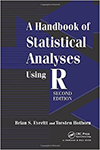

Introduction to Statistical Modeling  for Social Sciences. 
---

        
         
[ToC](https://github.com/andkov/psy532/raw/master/materials/texts/toc/toc.pdf)

*PSYC-532* at [University of Victoria](http://www.uvic.ca/socialsciences/psychology/)  by Dr. **[Andrey V. Koval](https://github.com/andkov)**  

| When  | Where  | Semester  | Dates  | Email   |Office   | Hours | Phone  |
|---|---|---|---|---|---|---|---|
| Monday, Thursday    11:30 - 13:00   | HSD A150    | Winter 2015   | Sep 9 [-](https://github.com/andkov/psy532/edit/gh-pages/index.md) Dec 10  |andkov at uvic dot ca |Cornett B335g|   By appointment  | 472-4864  |

- [To do](./todo.md) for assignments and homework
- [Library](./library.md) for books and articles  
- [Resources](./resources.md) for learning online  
- [Skills](./skills.md) for practical R knowledge
- [Forest](./forest.md) for a big picture  
- [Trees](./trees.md) for the details   
- [Timeline](./materials/people/timeline.md) for key individuals  
- [Policy](./policy.md) for IMPORTANT COURSE POLICY INFORMATION 
- [Projects](./projects/README.md) for students' work  
- [QUICK START](./materials/swirl/quickstart.md) with swirl

Date  | Topic/Activity           | Reference      |Points      (350)| Cases
------|--------------------------|----------------|-----------------|---------|
Sep 07|**Labour Day**            |                |                 |  |  
10    |Syllabus. *R graphics.*   |       James 1  |                 | Wage (ITSL)|   
14    |History & Philosophy      |M&D 1, James 2  |Homework 0    (5)|  |   
17    |*data workshop*           |M&D 2, James 2  |Homework 1   (20)|  |   
21    |GLM in 7 People           |M&D 2, Rodgers  |                 |Galton  | 
24    |*data workshop*           |M&D 3, James 3  |                 |  |   
28    |Anatomy of GLM            |M&D 3, James 3  |                 |  |       	
Oct 1 |*data workshop*           |M&D 3, James 3  |Homework 2   (30)|  |   
05    |EXAM I. Test              |                |EXAM I       (50)|  |     
08    |EXAM I. Debriefing        |                |                 |  |     	
12    |**Thanksgiving**          |                |                 |  |    
15    |Regression Strategies     |       James 6  |                 |  |
19    |Nonlinearity              |       James 7  |                 |  |   
22    |Longitudinal Models       |M&D 8           |                 |  |    
26    |*tidy data workshop*      |       Wickham  |Homework 3   (40)|  | 
29    |**No class**              |                |                 | Academic Drop Deadline (Oct 31)  | 
Nov 02|Discussion. Review        |                |                 |  |      	
05    |Exam II. Test             |                |EXAM II     (100)|  |   
09    |**Reading Week**          |                |                 |  |   
12    |EXAM II. Debriefing       |                |                 |  |   
16    |Production: Reports       |                |                 |  |   
19    |Production: Reports       |                |Report       (40)|  |   
23    |Production: Slides        |                |                 |  |   
26    |**No class**              |                |                 |  |   
30    |Production: Poster        |                |                 |  |   
Dec 03|**Student Presentations** |                |Slides       (20)|  |   
07    |**Rest Day **             |                |                 |  |   
10    |**Student Posters**       |                |Poster       (30)|  |   
