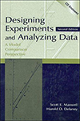
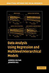
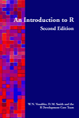

Introduction to Statistical Modeling  for Social Sciences. 
---

        
         

*Psyc-532* at UVic by Dr. **[Andrey V. Koval](https://github.com/andkov)**  

| When  | Where  | Semester  | Dates  | Email   |Office   | Hours | Phone  |
|---|---|---|---|---|---|---|---|
| M,Th    11:30 - 13:00   | HSD A150    | Winter 2015   | Sep 9 - Dec 4[.](https://github.com/andkov/psy532/edit/gh-pages/index.md)  |andkov at uvic dot ca |Cornett B335g|   By appointment  | 472-4864  |

###See
- [Calendar](./calendar.md) for events and timetables  
- [Library](./library.md) for books and articles  
- [Resources](./resources.md) for learning online  
- [Howtos](./howtos.md) for practical R knowledge
- [Forest](./forest.md) for a big picture  
- [Trees](./trees.md) for the details  
- [Projects](./projects/README.md) for students' reports  
- [IMPORTANT COURSE POLICY INFORMATION](./policy.md) for all the rules  

 
[quick start with swirl](./materials/swirl/quickstart.md)
