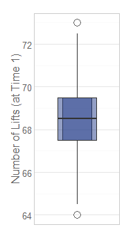
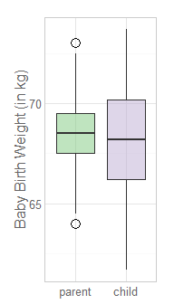

# Encyclopedia of Historical Datasets


<!--  The 1st mandatory chunck  -->
<!--  Set the working directory to the repository's base directory -->


<!--  The 2nd mandatory chunck  -->
<!-- Set the report-wide options, and point to the external code file. -->


<!-- Load the sources.  Suppress the output when loading sources. --> 


<!-- Load 'sourced' R files.  Suppress the output when loading packages. --> 


<!-- Load any Global functions and variables declared in the R file.  Suppress the output. --> 


<!-- Declare any global functions specific to a Rmd output.  Suppress the output. --> 


<!-- Load the datasets.   -->


<!-- Tweak the datasets.   -->


<!-- Basic table view.   -->


<!-- Basic graph view.   -->


## Galton
<!-- Basic graph view.   -->

```
'data.frame':	928 obs. of  2 variables:
 $ parent: num  70.5 68.5 65.5 64.5 64 67.5 67.5 67.5 66.5 66.5 ...
 $ child : num  61.7 61.7 61.7 61.7 61.7 62.2 62.2 62.2 62.2 62.2 ...
```

```
  parent child
1   70.5  61.7
2   68.5  61.7
3   65.5  61.7
4   64.5  61.7
5   64.0  61.7
6   67.5  62.2
```



<!-- Basic graph view.   -->

```
  person height
1 parent   70.5
2 parent   68.5
3 parent   65.5
4 parent   64.5
5 parent   64.0
6 parent   67.5
```



<!-- Basic graph view.   -->

```
  person height
1 parent   70.5
2 parent   68.5
3 parent   65.5
4 parent   64.5
5 parent   64.0
6 parent   67.5
```


