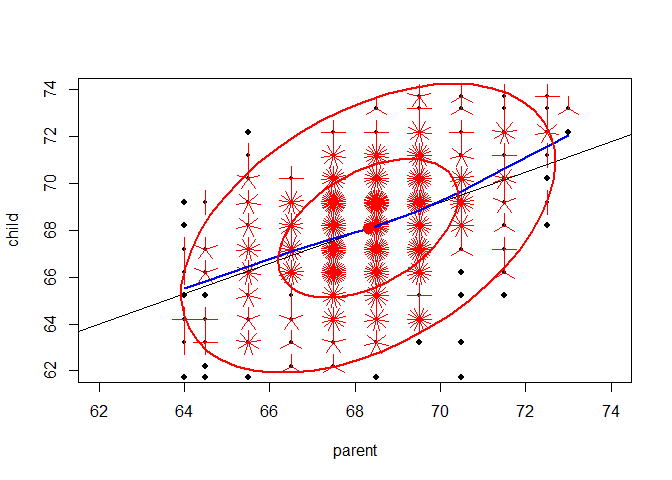

# Encyclopedia of Historical Datasets

<!--  The 1st mandatory chunck  -->
<!--  Set the working directory to the repository's base directory -->


<!--  The 2nd mandatory chunck  -->
<!-- Set the report-wide options, and point to the external code file. -->


<!-- Load the sources.  Suppress the output when loading sources. --> 


<!-- Load 'sourced' R files.  Suppress the output when loading packages. --> 


<!-- Load any Global functions and variables declared in the R file.  Suppress the output. --> 


<!-- Declare any global functions specific to a Rmd output.  Suppress the output. --> 


<!-- Load the datasets.   -->


<!-- Tweak the datasets.   -->

```
'data.frame':	928 obs. of  2 variables:
 $ parent: num  70.5 68.5 65.5 64.5 64 67.5 67.5 67.5 66.5 66.5 ...
 $ child : num  61.7 61.7 61.7 61.7 61.7 62.2 62.2 62.2 62.2 62.2 ...
```

```
Source: local data frame [928 x 2]

   parent child
1    70.5  61.7
2    68.5  61.7
3    65.5  61.7
4    64.5  61.7
5    64.0  61.7
6    67.5  62.2
7    67.5  62.2
8    67.5  62.2
9    66.5  62.2
10   66.5  62.2
..    ...   ...
```


<!-- Basic table view.   -->


<!-- Basic graph view.   -->

```r
with(Galton, 
	{
	sunflowerplot(parent,child, xlim=c(62,74), ylim=c(62,74))
	reg <- lm(child ~ parent)
	abline(reg)
	lines(lowess(parent, child), col="blue", lwd=2)
	if(require(car)) {
	dataEllipse(parent,child, xlim=c(62,74), ylim=c(62,74), plot.points=FALSE)
		}
  })
```

 

```r
# rmarkdown::render(input = "./data/HistData/Encyclopedia_HistData.Rmd", output_format="html_document", clean=TRUE)
```


