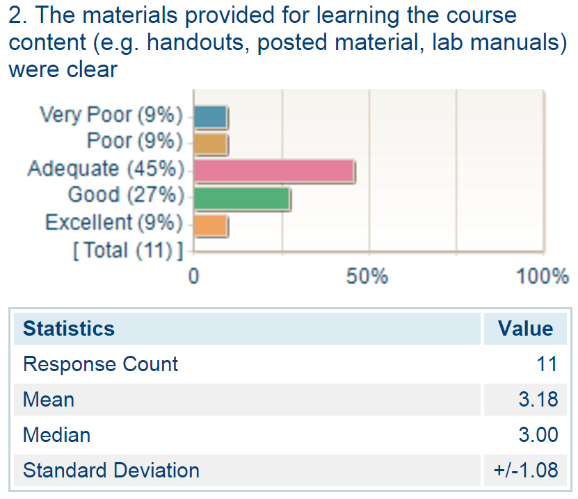

PSYC-532: Course in review
========================================================
author: Andriy Koval  
date: 21-Jan-2016

Learning and Teaching Development Grant (LTDG):  
Completion Report

What will be covered
===============
Joe asked to answer the following:  
- What were your project **GOALS**?    
-	What did you **DO**?   
-	What did you **LEARN**?  

I would also like to tell you about:
- What we did NOT DO
- Why not
- What is yet to be done

What were your project GOALS? 
========================================================
- 1. to flip introductory graduate statistics course that introduces R programming  
- 2. to produce a set of interactive lessons using [swirl](https://github.com/andkov/psy532/blob/master/materials/swirl/quickstart.md) 

What we DID  
========================================================
- flipped introductory graduate statistics course base on R
 
Specifically, 
* course [portal/calendar](https://github.com/andkov/psy532/blob/master/README.md) and [log](https://github.com/andkov/psy532/blob/master/log.md)
* video lectures, radio podcasts, slides, scripts, [etc](https://github.com/andkov/psy532/blob/master/resources.md).
* course specific materials such as lectures, [timeline](https://github.com/andkov/psy532/blob/master/materials/people/timeline.md), demonstrations (see [./materials](https://github.com/andkov/psy532/tree/master/materials))

What else we DID  
========================================================
* sourced [bibliography](https://github.com/andkov/psy532/blob/master/library.md) and [content scope](https://github.com/andkov/psy532/blob/master/materials/scope.md) of the course 
*  review of [online resources](https://github.com/andkov/psy532/blob/master/resources.md) on statistics with R  
* reproducible examples of real-life analytic [reporting](https://github.com/andkov/psy532/tree/master/projects)
* publishing self-containt [github repository](https://github.com/andkov/psy532/blob/master/README.md) with all course materials

What did we NOT DO? 
=======================================
- we did not produce a set of interactive lessons using [swirl](https://github.com/andkov/psy532/blob/master/materials/swirl/quickstart.md).  We hoped to  to extend the existing [collection of swirl courses](../materials/swirl/course_notes.md), but flipping the course consumed of our resources. 

so before telling you we should get the money to do it after all, let me tell you about

What did you LEARN?  

Dynamics of course development
=================================

Contributions patterns
=================================
  

Student Reviews
======================
- standard student review
- instructor evaluation
- course evaluation

Clarity of Materials
============================
 

Relevancy of Learned Skills 
============================
 

Overall Experience
============================
 

Student Reviews
======================
- some felt overwhelmed with R  
- desired less focus on programming  
- many wanted more structure beyond the readings and videos
 
- loved self-paced videos
- appreciated documented examples

Next Steps
======================
- swirt courses should provides structure to the knowledge and skillset

