## Scope
 

[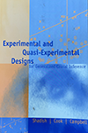](./materials/texts/toc/core_SCC_toc.pdf) [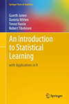](./materials/texts/toc/model_JWHT_toc.pdf) [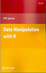](./materials/texts/toc/R_Spector_toc.pdf) [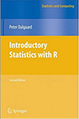](./materials/texts/toc/stat_Dalgaard_toc.pdf) [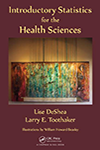](./materials/texts/toc/) [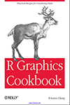](./materials/texts/toc/graph_Chang_toc.pdf)   
[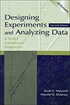](./materials/texts/toc/core_MD_toc.pdf) [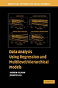](./materials/texts/toc/model_GH_toc.pdf) [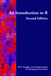](./materials/texts/toc/R_Venables_toc.pdf)  [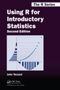](./materials/texts/toc/stat_Verzani_toc.pdf) [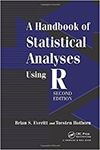](./materials/texts/toc/stat_EH_toc.pdf) [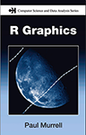](./materials/texts/toc/graph_Murrell_toc.pdf)  

[Tables of Content](https://github.com/andkov/psy532/raw/master/materials/texts/toc/toc.pdf)

[References](./library.md#references)

## Designs and Methods

    
- William R. Shadish, Cook, T. D., & Campbell, D. T. (2002). [*Experimental and quasi-experimental designs for generalized causal inference*](https://scholar.google.ca/scholar?q=Experimental+and+quasi-experimental+designs+for+generalized+causal+inference&btnG=&hl=en&as_sdt=0%2C5). Wadsworth Cengage learning.   
- [amazon](http://www.amazon.com/Experimental-Quasi-Experimental-Designs-Generalized-Inference/dp/0395615569/ref=sr_1_1?ie=UTF8&qid=1435984771&sr=8-1&keywords=shadish+cook+and+campbell&pebp=1435984771016&perid=1DMRH03RWE7YCWQZE31Z),UVic Library has a [hardcopy](http://voyager.library.uvic.ca/vwebv/holdingsInfo?bibId=1328797)[.](https://drive.google.com/file/d/0B8KlNxv-FHyjdVNmdm9ZZDloMDQ/view?usp=sharing)  

 

   
- Maxwell, S. E., & Delaney, H. D. (2004). [*Designing experiments and analyzing data: A model comparison perspective* (Vol. 1)](https://scholar.google.ca/scholar?q=+Designing+experiments+and+analyzing+data%3A+A+model+comparison+perspective&btnG=&hl=en&as_sdt=0%2C5). Psychology Press.    
- The book has a [website](http://www.designingexperiments.com/) with  scripts used in the text, datasets are on the CD that comes with the book. Uvic Library has a [hardcopy](http://voyager.library.uvic.ca/vwebv/holdingsInfo?bibId=1337909)

 
## Statistical Modeling

     
- James, G., Witten, D., Hastie, T., & Tibshirani, R. (2013). [*An introduction to statistical learning*](https://scholar.google.ca/scholar?q=An+introduction+to+statistical+learning&btnG=&hl=en&as_sdt=0%2C5). New York: Springer.   
- Full text, [slides and videos](http://www.dataschool.io/15-hours-of-expert-machine-learning-videos/) are available online for free. Book's [website](http://www.statlearning.com). UVic Library has a [hardcopy](http://voyager.library.uvic.ca/vwebv/holdingsInfo?bibId=3011282).  

 

     
- Gelman, A., & Hill, J. (2006). [*Data analysis using regression and multilevel/hierarchical models*](https://scholar.google.ca/scholar?hl=en&q=Data+analysis+using+regression+and+multilevel%2Fhierarchical+models&btnG=&as_sdt=1%2C5&as_sdtp=). Cambridge University Press.   
- [publisher](http://www.cambridge.org/us/academic/subjects/statistics-probability/statistical-theory-and-methods/data-analysis-using-regression-and-multilevelhierarchical-models), [amazon](http://www.amazon.ca/Analysis-Regression-Multilevel-Hierarchical-Models/dp/052168689X),  Uvic Library has a [hardcopy](http://voyager.library.uvic.ca/vwebv/holdingsInfo?bibId=1553520)    

## R

  
- Spector, P. (2008). [Data manipulation with R](https://scholar.google.ca/scholar?hl=en&q=data+manipulation+with+R&btnG=&as_sdt=1%2C5&as_sdtp=). Springer Science & Business Media.  
- [publisher](http://www.springer.com/us/book/9780387747309), [amazon](http://www.amazon.com/Data-Manipulation-R-Use/dp/0387747303/ref=sr_1_1?ie=UTF8&qid=1435985565&sr=8-1&keywords=data+manipulation+with+r&pebp=1435985565937&perid=09BPKFCSYR1GTK7HR0MC), UVic Library has an [ecopy](http://link.springer.com.ezproxy.library.uvic.ca/book/10.1007%2F978-0-387-74731-6)  

 

- Venables, W. N., Smith, D. M., & R Development Core Team. (2002). [An introduction to R](https://scholar.google.ca/scholar?q=An+introduction+to+R&btnG=&hl=en&as_sdt=0%2C5).

## R for Statistics

   
- Dalgaard, P. (2008). [Introductory Statistics with R](https://scholar.google.ca/scholar?q=Introductory+Statistics+with+R&btnG=&hl=en&as_sdt=0%2C5). Springer Science & Business Media. Peter Dalgaard walks through the major statistical methods in R. 
- [publisher](http://www.springer.com/us/book/9780387790534), [amazon](http://www.amazon.com/Introductory-Statistics-R-Computing/dp/0387954759),  UVic Library has an [ecopy](http://link.springer.com.ezproxy.library.uvic.ca/book/10.1007%2F978-0-387-79054-1)

 

   
- Verzani, J. (2014). [Using R for introductory statistics](https://cran.r-project.org/doc/contrib/Verzani-SimpleR.pdf).  CRC Press.
- [publisher](https://www.crcpress.com/Using-R-for-Introductory-Statistics-Second-Edition/Verzani/9781466590731), [amazon](http://www.amazon.ca/Using-Introductory-Statistics-Second-Chapman-ebook/dp/B00L2EBHXM/ref=sr_1_1?ie=UTF8&qid=1441288302&sr=8-1&keywords=Using+R+for+Introductory+Statistics%2C+Second+Edition)

 

   
- Hothorn, T., & Everitt, B. S. (2014). [A handbook of statistical analyses using R](https://scholar.google.ca/scholar?q=A+Handbook+of+Statistical+Analyses+using+R&btnG=&hl=en&as_sdt=0%2C5). CRC press.
- [publisher](https://www.crcpress.com/A-Handbook-of-Statistical-Analyses-using-R-Third-Edition/Hothorn-Everitt/9781482204582), [amazon](http://www.amazon.com/Handbook-Statistical-Analyses-Using-Second/dp/1420079336/ref=sr_1_2?ie=UTF8&qid=1435986045&sr=8-2&keywords=A+Handbook+of+Statistical+Analyses+Using+R&pebp=1435986048108&perid=177DZ3S2R9QC4EQ6H5TD), UVic Library has an [hard copy](http://voyager.library.uvic.ca/vwebv/holdingsInfo?bibId=1551977), 
 [direct download link](http://xa.yimg.com/kq/groups/16412409/783160322/name/A%2BHandbook%2Bof%2BStatistical%2BAnalyses%2BUsing%2BR.pdf)

## Statistics and Graphics

     
[Introductory Statistics for the Health Sciences](http://desheastats.com/) covers an undergraduate statistics course and offers a collection of templates for visualizing basic statistical tests in R. See their [GitHub repository](https://github.com/OuhscBbmc/DeSheaToothakerIntroStats) for scripts and graph examples.

## Graphics

   
- Chang, W. (2012). [R Cookbook](https://scholar.google.ca/scholar?hl=en&q=r+graphic+cookbook&btnG=&as_sdt=1%2C5&as_sdtp=). O'Reilly Media, Inc.
- perfect book to get you started producing graphs with ggplot2 in RStudio
- [publisher](http://shop.oreilly.com/product/9780596809164.do), [amazon](http://www.amazon.ca/R-Graphics-Cookbook-Winston-Chang/dp/1449316956)
- I recommend hardcopy + ecopy bundle from the publisher's website  

 

  
- Murrell, P. (2011). [R graphics](https://scholar.google.ca/scholar?q=R+Graphics&btnG=&hl=en&as_sdt=0%2C5). CRC Press.
- [publisher](), [amazon](), Uvic Library [hard copy](),
- see [book's website](https://www.stat.auckland.ac.nz/~paul/RG2e/) for the R code for all the graphs in the book

## Meta resources
- [Resources Opinions](https://github.com/OuhscBbmc/RedcapExamplesAndPatterns/blob/master/DocumentationGlobal/ResourcesOpinions.md)  Will Beasley gives  brief reviews of key books and resources    
- [CRAN books on R]()

## Academic Sources

#### Articles  

- Appelbaum, M. I., & Cramer, E. M. (1974). Some problems in the nonorthogonal analysis of variance. *Psychological Bulletin*, *81*(6), 335.

- Cramer, E. M., & Appelbaum, M. I. (1980). Nonorthogonal analysis of variance—once again. *Psychological Bulletin*, *87*(1), 51.

- Friendly, M., & Denis, D. (2005).[The early origins and development of the scatterplot](http://euclid.psych.yorku.ca/datavis.ca/papers/friendly-scat.pdf). Journal of the History of the Behavioral Sciences, 41(2), 103-130.

- Jones, L. V., & Tukey, J. W. (2000). [A sensible formulation of the significance test](http://forrest.psych.unc.edu/jones-tukey112399.html). *Psychological methods*, *5*(4), 411.
 
- Mook, D. G. (1983). [In defense of external invalidity](http://www.vanderbilt.edu/psychological_sciences/graduate/programs/quantitative-methods/quantitative-content/mook_1983.pdf). *American psychologist*, *38*(4), 379.

- Lee Rodgers, J., & Nicewander, W. A. (1988). [Thirteen ways to look at the correlation coefficient](http://www.mapleprimes.com/DocumentFiles/131581/432006/rodgers-nicewander-1.pdf). The American Statistician, 42(1), 59-66.

- Rodgers, J. L. (1999).[The Bootstrap, the Jackknife, and the Randomization Test: A Sampling Taxonomy](http://www.tandfonline.com/doi/pdf/10.1207/S15327906MBR3404_2). Multivariate Behavioral Research, 34(4), 441-456.    

- Rodgers, J. L. (2010). [The epistemology of mathematical and statistical modeling: a quiet methodological revolution](http://www.researchgate.net/profile/Joe_Rodgers/publication/40906532_The_epistemology_of_mathematical_and_statistical_modeling_a_quiet_methodological_revolution/links/546b68ae0cf2f5eb18091cbd.pdf). *American Psychologist*, *65*(1), 1.

- Wickham, H. (2014). [Tidy Data](http://www.jstatsoft.org/v59/i10/paper). *Journal of Statistical Software*, *59*(10). 

#### Books

- Dalgaard, P. (2008). [Introductory Statistics with R](http://down.cenet.org.cn/upfile/28/200612374427146.pdf). Springer Science & Business Media.

- James, G., Witten, D., Hastie, T., & Tibshirani, R. (2013). [*An introduction to statistical learning*](http://www-bcf.usc.edu/~gareth/ISL/ISLR%20First%20Printing.pdf). New York: Springer.

- Gelman, A., & Hill, J. (2006). [*Data analysis using regression and multilevel/hierarchical models*](). Cambridge University Press.

- Maxwell, S. E., & Delaney, H. D. (2004). [Designing experiments and analyzing data: A model comparison perspective (Vol. 1)](https://books.google.ca/books?id=gKZbD3lL88AC&printsec=frontcover#v=onepage&q&f=false). Psychology Press.
 
- Murrell, P. (2011). [R graphics](http://www.e-reading.club/bookreader.php/137370/C486x_C06.pdf). CRC Press.

- William R. Shadish, Cook, T. D., & Campbell, D. T. (2002). [*Experimental and quasi-experimental designs for generalized causal inference*](http://impact.cgiar.org/pdf/147.pdf). Wadsworth Cengage learning.

- Venables, W. N., Smith, D. M., & R Development Core Team. (2002). [An introduction to R](http://www.ms.uky.edu/~molzon/courses/ma320/R/Introduction-to-R.pdf).

- Verzani, J. (2014). [Using R for Introductory Statistics](https://cran.r-project.org/doc/contrib/Verzani-SimpleR.pdf). CRC Press.
 

 
