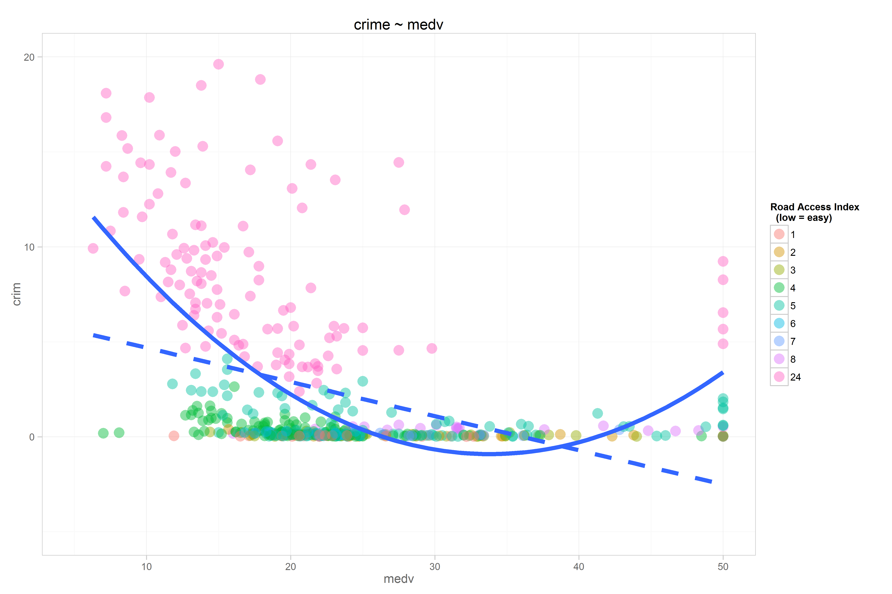

# Title

<!-- These two chunks should be added in the beginning of every .Rmd that you want to source an .R script -->
<!--  The 1st mandatory chunck  -->
<!--  Set the working directory to the repository's base directory -->


<!--  The 2nd mandatory chunck  -->
<!-- Set the report-wide options, and point to the external code file. -->


<!-- Load 'sourced' R files.  Suppress the output when loading packages. --> 


<!-- Load the sources.  Suppress the output when loading sources. --> 


<!-- Load any Global functions and variables declared in the R file.  Suppress the output. --> 


<!-- Declare any global functions specific to a Rmd output.  Suppress the output. --> 


<!-- Load the datasets.   -->


<!-- Tweak the datasets.   -->


<!-- Basic table view.   -->


<!-- Basic graph view.   -->

```r
ds$chasF <- factor(ds$chas, levels=c(0, 1), labels=c("No", "Yes"))
ds$radF <- factor(ds$rad)

g <- ggplot2::ggplot(data=ds, aes(x= medv, y=crim)) +
  geom_point(aes(color=radF), size=5, alpha=.45) + 
  geom_smooth(method="lm", size=2, formula = y ~ x,  linetype="dashed", se=F)+
  geom_smooth(method="lm", size=2, formula = y ~ x + I(x^2),  linetype="solid", se=F)+
  scale_y_continuous(limits=c(-5, 20), breaks=seq(0,50, by=10))+
  main_theme +
  labs(title=paste0("crime ~ ","medv"), color="Road Access Index \n  (low = easy)")
  g 
```

```
Warning: Removed 18 rows containing missing values (stat_smooth).
```

```
Warning: Removed 18 rows containing missing values (stat_smooth).
```

```
Warning: Removed 18 rows containing missing values (geom_point).
```




