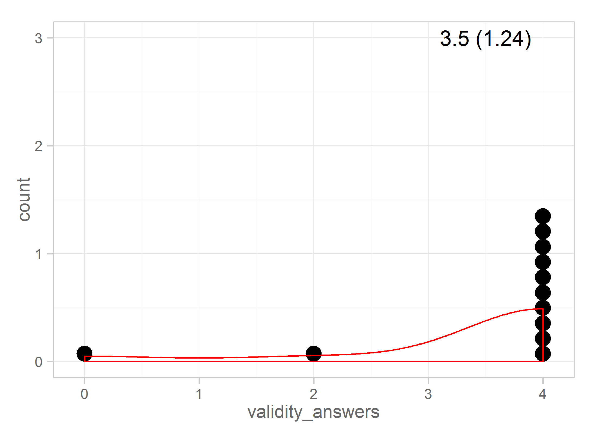

# Exam I

<!-- These two chunks should be added in the beginning of every .Rmd that you want to source an .R script -->
<!--  The 1st mandatory chunck  -->
<!--  Set the working directory to the repository's base directory -->


<!--  The 2nd mandatory chunck  -->
<!-- Set the report-wide options, and point to the external code file. -->


We load the data from a private, secure location and de-identify it


Compute the total score for the exam

```r
# head(ds) 
ds$total <- rowSums(ds) # compute the total
# head(ds)
```

## Basic stats
Get basic statistical summary for each item

```
        FvNP_statements FvNP_concepts NHST_statements define_model tension_riddle define_parsimony mill_canons
Min.               5.00         0.000           2.000        0.000          0.000             0.00       0.000
1st Qu.            6.75         4.000           5.000        2.750          2.125             1.00       3.500
Median             8.00         5.000           5.000        3.500          5.000             1.50       4.000
Mean               7.25         4.167           5.167        3.083          4.000             1.75       3.833
3rd Qu.            8.00         5.000           6.000        4.000          6.000             3.00       5.000
Max.               8.00         5.000           6.000        4.000          6.000             3.00       5.000
        validity_questions validity_answers ch2_slide4 find_complex bonus_models sse_formula glm_anatomy total
Min.                 0.000              0.0     0.0000       0.0000        0.000       0.000       3.000 32.00
1st Qu.              1.000              4.0     0.0000       1.0000        0.750       1.500       4.000 37.00
Median               1.000              4.0     1.0000       1.0000        1.000       2.000       4.750 44.75
Mean                 1.167              3.5     0.9167       0.9167        1.167       1.917       4.792 43.62
3rd Qu.              2.000              4.0     2.0000       1.0000        2.000       3.000       6.000 48.25
Max.                 2.000              4.0     2.0000       1.0000        2.000       3.000       6.000 55.00
```

## Correlations
CPrint the matrix of correlations

```r
corr <- cor(ds)
corr 
```

```
                   FvNP_statements FvNP_concepts NHST_statements define_model tension_riddle define_parsimony
FvNP_statements         1.00000000    0.02358115     0.100654518   0.34680374     0.14533152       0.26578872
FvNP_concepts           0.02358115    1.00000000     0.497126625  -0.10015123     0.39601858       0.46171338
NHST_statements         0.10065452    0.49712662     1.000000000   0.38364372     0.72193243       0.34778686
define_model            0.34680374   -0.10015123     0.383643723   1.00000000     0.47479688       0.29523204
tension_riddle          0.14533152    0.39601858     0.721932435   0.47479688     1.00000000       0.46496040
define_parsimony        0.26578872    0.46171338     0.347786859   0.29523204     0.46496040       1.00000000
mill_canons            -0.02549616    0.57968464    -0.176076948  -0.16659149     0.22077983       0.17619138
validity_questions     -0.57315512    0.45256964    -0.037877701  -0.32343061     0.05469028      -0.06001200
validity_answers       -0.27074558   -0.23055106    -0.065606103   0.26535707     0.25260359       0.17323973
ch2_slide4              0.51922078   -0.37139590     0.105685212   0.41389476     0.39238757       0.07176157
find_complex           -0.19432508    0.43023721     0.894675058   0.27510532     0.54391153       0.22381413
bonus_models            0.22398041   -0.50352347    -0.227951363   0.24879233     0.14105613       0.05159394
sse_formula             0.13570581   -0.45453251    -0.120573742   0.12315271     0.36401094      -0.01736659
glm_anatomy            -0.41675686   -0.24917507    -0.006445981  -0.05504103     0.11168551       0.23489370
total                   0.26110623    0.38489765     0.558534728   0.52773695     0.91922036       0.63743119
                   mill_canons validity_questions validity_answers  ch2_slide4 find_complex bonus_models sse_formula
FvNP_statements    -0.02549616        -0.57315512      -0.27074558  0.51922078  -0.19432508   0.22398041  0.13570581
FvNP_concepts       0.57968464         0.45256964      -0.23055106 -0.37139590   0.43023721  -0.50352347 -0.45453251
NHST_statements    -0.17607695        -0.03787770      -0.06560610  0.10568521   0.89467506  -0.22795136 -0.12057374
define_model       -0.16659149        -0.32343061       0.26535707  0.41389476   0.27510532   0.24879233  0.12315271
tension_riddle      0.22077983         0.05469028       0.25260359  0.39238757   0.54391153   0.14105613  0.36401094
define_parsimony    0.17619138        -0.06001200       0.17323973  0.07176157   0.22381413   0.05159394 -0.01736659
mill_canons         1.00000000         0.67641655      -0.04985480 -0.11473051  -0.25047969  -0.30932635  0.04164787
validity_questions  0.67641655         1.00000000       0.10188534 -0.25791484   0.07312724  -0.50572174  0.01702266
validity_answers   -0.04985480         0.10188534       1.00000000  0.28427739  -0.12666010   0.61315502  0.44226178
ch2_slide4         -0.11473051        -0.25791484       0.28427739  1.00000000  -0.02914820   0.50394623  0.72601212
find_complex       -0.25047969         0.07312724      -0.12666010 -0.02914820   1.00000000  -0.31434731 -0.27510532
bonus_models       -0.30932635        -0.50572174       0.61315502  0.50394623  -0.31434731   1.00000000  0.45368013
sse_formula         0.04164787         0.01702266       0.44226178  0.72601212  -0.27510532   0.45368013  1.00000000
glm_anatomy        -0.15674791         0.11011568       0.05201617 -0.11571431   0.08711294  -0.11188204  0.36790581
total               0.33747894         0.13116727       0.38841884  0.50090205   0.34190485   0.20007233  0.46651456
                    glm_anatomy     total
FvNP_statements    -0.416756859 0.2611062
FvNP_concepts      -0.249175072 0.3848977
NHST_statements    -0.006445981 0.5585347
define_model       -0.055041027 0.5277369
tension_riddle      0.111685506 0.9192204
define_parsimony    0.234893702 0.6374312
mill_canons        -0.156747908 0.3374789
validity_questions  0.110115682 0.1311673
validity_answers    0.052016170 0.3884188
ch2_slide4         -0.115714307 0.5009021
find_complex        0.087112935 0.3419049
bonus_models       -0.111882042 0.2000723
sse_formula         0.367905814 0.4665146
glm_anatomy         1.000000000 0.1044088
total               0.104408823 1.0000000
```

## CorrPlots
Print the graph of the correlations

```r
# see basics of corrplot
# https://cran.r-project.org/web/packages/corrplot/vignettes/corrplot-intro.html
# corrplot::corrplot(corr) 
corrplot::corrplot(corr,type="upper")
```


```r
# corrplot::corrplot(corr,type="upper", method="number") 
corrplot::corrplot(corr,type="upper", method="pie") 
```


```r
# corrplot::corrplot.mixed(corr, upper="pie", lower="number", tl.pos = "lt") 
# corrplot::corrplot(corr, order = "hclust", addrect = 3, method="pie")
# corrplot::corrplot.mixed(corr, order = "FPC", upper="pie", lower="number", tl.pos="lt")

# corrplotCustom <- function (corr, lower="number", upper="pie", bg="white", addgrid.col="gray", tl.cex=2)  {
#   n <- nrow(corr)
#   corrplot(corr, type="upper", method=upper, diag=TRUE, tl.pos="n", tl.cex=tl.cex)
#   corrplot(corr, add=TRUE, type="lower", method=lower, tl.pos="lt")
# }
# corrplotCustom(corr, tl.cex=1.2)  
```

## Item performance
Explore the performance of the items

```r
# http://www.sthda.com/english/wiki/factominer-and-factoextra-principal-component-analysis-visualization-r-software-and-data-mining#at_pco=smlwn-1.0&at_si=56168e3a61660900&at_ab=-&at_pos=0&at_tot=1
PerformanceAnalytics::chart.Correlation(ds, histogram=TRUE, pch=1)
```


```r
###############################
```

## Individual items

```r
# for( i in 1:ncol(ds) ) {
  for( i in 1:15 ) {

  item  <- ds[i]
  item_name <- colnames(item)
  item_mean <-   round(mean(ds[,i]),2)
  item_sd <-  round(sd(ds[,i]),2)
  middle <- 3

  # d_bivariate_study <- ds_bivariate_pretty[ds_bivariate_pretty$study==study_name, ]
  # d_bivariate_study <- d_bivariate_study[ , -(1:2)]
  cat("") #Force a new line
  cat(paste0("### ", item_name))
  cat("\n") #Force a new line

#   mean(item)
#   sd(item)
#   cat("") #Force a new line
# #   cat(paste0("### ", gender))
#   cat("\n") #Force a new line

  g <- ggplot2::ggplot(item, aes_string(x=item_name))
  g <- g + geom_dotplot(aes(stat="identity"))
  # g <- g + geom_histogram(aes(stat="identity"))
  g <- g + geom_density(aes(stat="identity"), color="red")
  g <- g + geom_vline(xintercept = mean)
  g <- g + annotate(geom="text",x=item_mean, y=middle, label=paste0(item_mean," (",item_sd,")"))
  g <- g + main_theme
  print(g)
  cat("\n\n") #Force a new line
}
```

### FvNP_statements


### FvNP_concepts


### NHST_statements


### define_model


### tension_riddle


### define_parsimony


### mill_canons


### validity_questions


### validity_answers


### ch2_slide4


### find_complex


### bonus_models


### sse_formula


### glm_anatomy


### total


## Distribution view

```r
ds
```

   FvNP_statements FvNP_concepts NHST_statements define_model tension_riddle define_parsimony mill_canons
1                8             5               6            3            6.0                2         5.0
2                8             4               6            3            6.0                0         3.5
3                8             5               5            4            6.0                3         5.0
4                8             5               6            4            6.0                3         3.5
5                8             2               2            2            0.0                1         5.0
6                8             5               6            4            4.5                3         2.5
7                6             5               5            3            1.0                1         4.0
8                5             4               5            4            5.5                1         5.0
9                8             5               5            2            1.0                1         3.5
10               7             0               5            4            2.5                1         0.0
11               8             5               6            4            6.0                3         5.0
12               5             5               5            0            3.5                2         4.0
   validity_questions validity_answers ch2_slide4 find_complex bonus_models sse_formula glm_anatomy total
1                   1                2          1            1            0           2         5.0  47.0
2                   1                4          2            1            2           3         3.0  46.5
3                   1                4          2            1            2           2         4.0  52.0
4                   1                4          1            1            1           3         6.0  52.5
5                   1                4          1            0            2           3         4.5  35.5
6                   0                4          0            1            2           0         4.0  44.0
7                   2                4          0            1            0           0         3.5  35.5
8                   2                4          0            1            1           2         6.0  45.5
9                   1                0          0            1            0           0         4.5  32.0
10                  0                4          2            1            2           3         6.0  37.5
11                  2                4          2            1            1           3         5.0  55.0
12                  2                4          0            1            1           2         6.0  40.5

```r
  g <- ggplot2::ggplot(item, aes(x=total, y=total))
  g <- g + geom_point(size=2, color="blue")
  g <- g + geom_text(aes(label=total), vjust=-2)
  # g <- g + geom_histogram(aes(stat="identity"))
  # g <- g + geom_density(aes(stat="identity"), color="red")
  # g <- g + geom_vline(xintercept = mean)
  # g <- g + annotate(geom="text",x=item_mean, y=middle, label=paste0(item_mean," (",item_sd,")"))
  g <- g + main_theme
  g
```


```r
####################################  
# d <- tidyr::spread(dsL,name,score)
# head(d)

## @kntir basic_table
dsL <- tidyr::gather(ds, item_name, item_score, 1:15)
```
