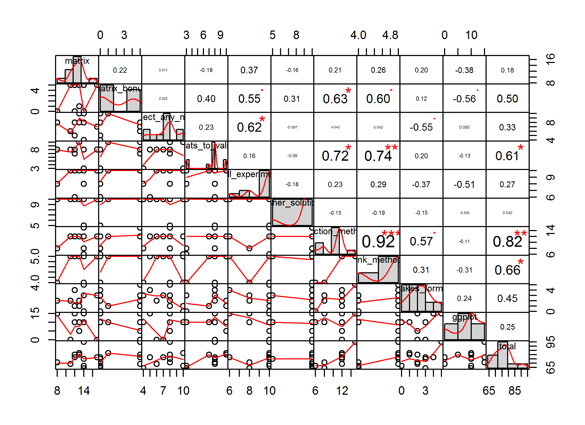
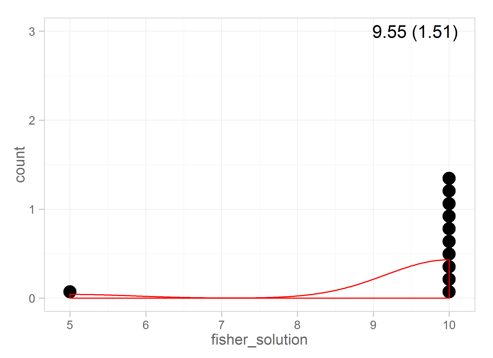

# Exam II

<!-- These two chunks should be added in the beginning of every .Rmd that you want to source an .R script -->
<!--  The 1st mandatory chunck  -->
<!--  Set the working directory to the repository's base directory -->


<!--  The 2nd mandatory chunck  -->
<!-- Set the report-wide options, and point to the external code file. -->


We load the data from a private, secure location and de-identify it


Compute the total score for the exam

```r
# head(ds) 
ds$total <- rowSums(ds) # compute the total
# head(ds)
```

## Basic stats
Get basic statistical summary for each item

```
        matrix matrix_bonus reject_any_null threats_to_validity mill_experiment fisher_solution selection_methods
Min.      8.00        0.000           4.000               3.000           6.000           5.000                 6
1st Qu.  12.00        0.000           6.500               7.500           9.000          10.000                10
Median   13.00        1.000           8.000               8.000          10.000          10.000                12
Mean     12.91        2.364           7.455               7.364           9.273           9.545                11
3rd Qu.  14.00        5.000           8.000               8.000          10.000          10.000                12
Max.     17.00        5.000          10.000              10.000          10.000          10.000                15
        rank_methods mistakes_formulas ggplot total
Min.           4.000             0.000  0.000 64.00
1st Qu.        4.500             1.500  7.500 70.00
Median         5.000             2.000 10.000 77.00
Mean           4.727             2.364  9.091 76.09
3rd Qu.        5.000             3.000 12.500 80.00
Max.           5.000             5.000 15.000 95.00
```

## Correlations
CPrint the matrix of correlations

```r
corr <- cor(ds)
corr 
```

```
                         matrix matrix_bonus reject_any_null threats_to_validity mill_experiment fisher_solution
matrix               1.00000000   0.21568290      0.01081046         -0.18286737       0.3705209     -0.16035675
matrix_bonus         0.21568290   1.00000000      0.02496218          0.39682129       0.5519747      0.30856323
reject_any_null      0.01081046   0.02496218      1.00000000          0.23394336       0.6222742     -0.09707772
threats_to_validity -0.18286737   0.39682129      0.23394336          1.00000000       0.1558846     -0.09036961
mill_experiment      0.37052087   0.55197469      0.62227416          0.15588457       1.0000000     -0.17888544
fisher_solution     -0.16035675   0.30856323     -0.09707772         -0.09036961      -0.1788854      1.00000000
selection_methods    0.20701967   0.62817270     -0.04177560          0.71666667       0.2309401     -0.12909944
rank_methods         0.25877458   0.59753013      0.04177560          0.74166667       0.2886751     -0.19364917
mistakes_formulas    0.19676589   0.12482070     -0.55475561          0.19552516      -0.3668811     -0.14724611
ggplot              -0.37724403  -0.55728214      0.09496917         -0.12990381      -0.5125000     -0.05590170
total                0.18191364   0.50016202      0.32981328          0.60918958       0.2665469      0.04232074
                    selection_methods rank_methods mistakes_formulas      ggplot      total
matrix                      0.2070197    0.2587746         0.1967659 -0.37724403 0.18191364
matrix_bonus                0.6281727    0.5975301         0.1248207 -0.55728214 0.50016202
reject_any_null            -0.0417756    0.0417756        -0.5547556  0.09496917 0.32981328
threats_to_validity         0.7166667    0.7416667         0.1955252 -0.12990381 0.60918958
mill_experiment             0.2309401    0.2886751        -0.3668811 -0.51250000 0.26654693
fisher_solution            -0.1290994   -0.1936492        -0.1472461 -0.05590170 0.04232074
selection_methods           1.0000000    0.9166667         0.5702817 -0.10825318 0.81953755
rank_methods                0.9166667    1.0000000         0.3122971 -0.30671733 0.65790653
mistakes_formulas           0.5702817    0.3122971         1.0000000  0.24105972 0.44585355
ggplot                     -0.1082532   -0.3067173         0.2410597  1.00000000 0.25136637
total                       0.8195375    0.6579065         0.4458535  0.25136637 1.00000000
```

## CorrPlots
Print the graph of the correlations

```r
# see basics of corrplot
# https://cran.r-project.org/web/packages/corrplot/vignettes/corrplot-intro.html
# corrplot::corrplot(corr) 
corrplot::corrplot(corr,type="upper")
```


```r
# corrplot::corrplot(corr,type="upper", method="number") 
corrplot::corrplot(corr,type="upper", method="pie") 
```


```r
# corrplot::corrplot.mixed(corr, upper="pie", lower="number", tl.pos = "lt") 
# corrplot::corrplot(corr, order = "hclust", addrect = 3, method="pie")
# corrplot::corrplot.mixed(corr, order = "FPC", upper="pie", lower="number", tl.pos="lt")

# corrplotCustom <- function (corr, lower="number", upper="pie", bg="white", addgrid.col="gray", tl.cex=2)  {
#   n <- nrow(corr)
#   corrplot(corr, type="upper", method=upper, diag=TRUE, tl.pos="n", tl.cex=tl.cex)
#   corrplot(corr, add=TRUE, type="lower", method=lower, tl.pos="lt")
# }
# corrplotCustom(corr, tl.cex=1.2)  
```

## Item performance
Explore the performance of the items

```r
# http://www.sthda.com/english/wiki/factominer-and-factoextra-principal-component-analysis-visualization-r-software-and-data-mining#at_pco=smlwn-1.0&at_si=56168e3a61660900&at_ab=-&at_pos=0&at_tot=1
PerformanceAnalytics::chart.Correlation(ds, histogram=TRUE, pch=1)
```



```r
###############################
```

## Individual items

```r
for( i in 1:ncol(ds) ) {
  # for( i in 1:15 ) {

  item  <- ds[i]
  item_name <- colnames(item)
  item_mean <-   round(mean(ds[,i]),2)
  item_sd <-  round(sd(ds[,i]),2)
  middle <- 3

  # d_bivariate_study <- ds_bivariate_pretty[ds_bivariate_pretty$study==study_name, ]
  # d_bivariate_study <- d_bivariate_study[ , -(1:2)]
  cat("") #Force a new line
  cat(paste0("### ", item_name))
  cat("\n") #Force a new line

#   mean(item)
#   sd(item)
#   cat("") #Force a new line
# #   cat(paste0("### ", gender))
#   cat("\n") #Force a new line

  g <- ggplot2::ggplot(item, aes_string(x=item_name))
  g <- g + geom_dotplot(aes(stat="identity"))
  # g <- g + geom_histogram(aes(stat="identity"))
  g <- g + geom_density(aes(stat="identity"), color="red")
  g <- g + geom_vline(xintercept = mean)
  g <- g + annotate(geom="text",x=item_mean, y=middle, label=paste0(item_mean," (",item_sd,")"))
  g <- g + main_theme
  print(g)
  cat("\n\n") #Force a new line
}
```

### matrix

```
stat_bindot: binwidth defaulted to range/30. Use 'binwidth = x' to adjust this.
```


### matrix_bonus

```
stat_bindot: binwidth defaulted to range/30. Use 'binwidth = x' to adjust this.
```


### reject_any_null

```
stat_bindot: binwidth defaulted to range/30. Use 'binwidth = x' to adjust this.
```


### threats_to_validity

```
stat_bindot: binwidth defaulted to range/30. Use 'binwidth = x' to adjust this.
```


### mill_experiment

```
stat_bindot: binwidth defaulted to range/30. Use 'binwidth = x' to adjust this.
```


### fisher_solution

```
stat_bindot: binwidth defaulted to range/30. Use 'binwidth = x' to adjust this.
```



### selection_methods

```
stat_bindot: binwidth defaulted to range/30. Use 'binwidth = x' to adjust this.
```


### rank_methods

```
stat_bindot: binwidth defaulted to range/30. Use 'binwidth = x' to adjust this.
```


### mistakes_formulas

```
stat_bindot: binwidth defaulted to range/30. Use 'binwidth = x' to adjust this.
```


### ggplot

```
stat_bindot: binwidth defaulted to range/30. Use 'binwidth = x' to adjust this.
```


### total

```
stat_bindot: binwidth defaulted to range/30. Use 'binwidth = x' to adjust this.
```


## Distribution view

```r
ds
```

   matrix matrix_bonus reject_any_null threats_to_validity mill_experiment fisher_solution selection_methods
1      14            0              10                   3              10              10                 6
2      13            5               8                  10              10              10                12
3      13            1              10                  10              10              10                12
4      12            5               8                   7              10              10                12
5      17            5               7                   8              10              10                12
6      14            0               8                   8              10               5                12
7      12            0               5                   8               6              10                12
8      14            0               4                   3               8              10                 8
9       8            0               8                   8               8              10                 8
10     14            5               8                   8              10              10                15
11     11            5               6                   8              10              10                12
   rank_methods mistakes_formulas ggplot total
1             4                 0     10    67
2             5                 2      5    80
3             5                 1     10    82
4             5                 1     10    80
5             5                 3      0    77
6             5                 3     10    75
7             5                 4     15    77
8             4                 3     10    64
9             4                 2     15    71
10            5                 5     15    95
11            5                 2      0    69

```r
  g <- ggplot2::ggplot(item, aes(x=total, y=total))
  g <- g + geom_point(size=2, color="blue", position=position_jitter(width=0.6, height=0))
  g <- g + geom_text(aes(label=total), vjust=-2)
  # g <- g + geom_jitter(aes(x=1, y=0)) 
  # g <- g + geom_histogram(aes(stat="identity"))
  # g <- g + geom_density(aes(stat="identity"), color="red")
  # g <- g + geom_vline(xintercept = mean)
  # g <- g + annotate(geom="text",x=item_mean, y=middle, label=paste0(item_mean," (",item_sd,")"))
  g <- g + main_theme
  g
```


```r
####################################  
# d <- tidyr::spread(dsL,name,score)
# head(d)

# @kntir basic_table ------
dsL <- tidyr::gather(ds, item_name, item_score, 1:length(names(ds)))
```
