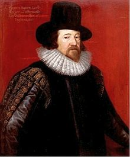
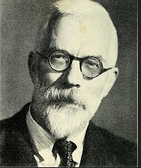
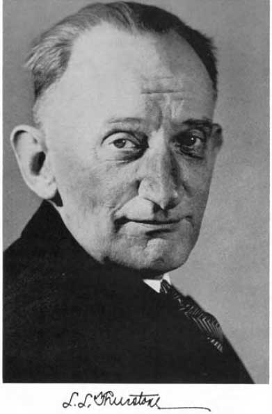

- [timeline](./timeline.md) contains the complete list.

##Aristotle
  
Aristotle (384 – 322 BC)

##Bacon

 
    
Francis Bacon (1561 -1626)    

##Mill
  
John Stuart Mill (1806 - 1873)  

##Fisher
   
Ronald Aylmer Fisher (1890 - 1962)  

##Tukey
  
John Wilder Tukey (1915 - 2000)  

##Thurstone
  
Louis Leon Thurstone (1887 - 1955) 

##Wickham
    
Hadley Wickham 

