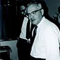

## Aristotel
-  [384 - 322 B.C.](https://en.wikipedia.org/wiki/Aristotle)   
- "the first geniune scientist in history"

## Nikolaus Copernicus
-  [1473 - 1543](https://en.wikipedia.org/wiki/Nicolaus_Copernicus)
- [1543 - On the Revolution of Celestial Bodies](https://en.wikipedia.org/wiki/De_revolutionibus_orbium_coelestium)

## Andreas Vesalius
-   [1514-1564](https://en.wikipedia.org/wiki/Andreas_Vesalius)
- [1543 - On the Fabric of Human Body](https://en.wikipedia.org/wiki/De_humani_corporis_fabrica)

## Galileo Galilei
-   [1564-1642](https://en.wikipedia.org/wiki/Galileo_Galilei)  
- [1610 - Jupiter moons](https://en.wikipedia.org/wiki/Galilean_moons)

## Francis Bacon
-   [1561 - 1561](https://en.wikipedia.org/wiki/Francis_Bacon) 
- [1620 - Novum Organum](https://en.wikipedia.org/wiki/Novum_Organum) 
 
## David Hume
-   [1711-1776](https://en.wikipedia.org/wiki/David_Hume) 
- [1738 - Treatise of Human Nature](https://en.wikipedia.org/wiki/A_Treatise_of_Human_Nature)  
- [BBC4 podcast](http://www.bbc.co.uk/programmes/b015cpfp) 

## August Comte 
-   [1798-1857](https://en.wikipedia.org/wiki/Auguste_Comte)  
- [1835 - The Course in Positive Philosophy](https://en.wikipedia.org/wiki/The_Course_in_Positive_Philosophy) 

## Vienna Circle
- [1924-1936](https://en.wikipedia.org/wiki/Vienna_Circle)  

## Karl Popper
-   [1902-1994](https://en.wikipedia.org/wiki/Karl_Popper)
- [1934 - The Logic of Scientific Discovery](https://en.wikipedia.org/wiki/The_Logic_of_Scientific_Discovery) 

## Thomas Kuhn
- [1922-1996](https://en.wikipedia.org/wiki/Thomas_Kuhn)  
- [1962 - The Structure of Scientific Revolutions](https://en.wikipedia.org/wiki/The_Structure_of_Scientific_Revolutions) 

## John Stewart Mill
-   [1806-1873](https://en.wikipedia.org/wiki/John_Stuart_Mill) 
- [1843 - A System of Logic](https://en.wikipedia.org/wiki/A_System_of_Logic)  

## Francis Galton
-  [1822-1911](https://en.wikipedia.org/wiki/Francis_Galton)
- [1886 - Regression towards mediocrity in hereditary stature](https://books.google.ca/books?id=JPcRAAAAYAAJ&pg=PA246&hl=en#v=onepage&q&f=false)
- [Account of the Invention of Correlation](http://projecteuclid.org/download/pdf_1/euclid.ss/1177012580)

## Karl Pearson
-  [1857-1936](https://en.wikipedia.org/wiki/Karl_Pearson)  
- [1895 - Note on Regression and Inheritance](http://rspl.royalsocietypublishing.org/content/58/347-352/240.full.pdf+html) 

## Ronald Fisher
-  [1890-1962](https://en.wikipedia.org/wiki/Ronald_Fisher)  
- [1921, 1923 - Studies in Crop Variantion](https://drmc.library.adelaide.edu.au/dspace/bitstream/2440/15179/1/32.pdf)  
- [1935 - Design of Experiments](https://en.wikipedia.org/wiki/The_Design_of_Experiments)  

## Egon Pearson
-   [1895 - 1980](https://en.wikipedia.org/wiki/Egon_Pearson)
- co-author of [Neyman-Pearson lemma](https://en.wikipedia.org/wiki/Neyman%E2%80%93Pearson_lemma) ( null hypothesis testing)
- Son of Karl Pearson
- Teacher of George E.P. Box

## Raymond Cattell
-   [1905 - 1988](https://en.wikipedia.org/wiki/Raymond_Cattell)  
- University of Illinois 1945 - 1973
- factor analysis, personality
- worked with Charlse Spearman
- founded Society of Multivariate Experimental Psychology (1960)
- founded *Multivariate Behavioral Research*, journal of SMEP

## Ewdard Thorndike
-   [1874 - 1949](https://en.wikipedia.org/wiki/Edward_Thorndike)
- Columbia University
- intelligence, learning, law of effect
- invited Cattell to US from England

## L.L. Thurstone
-   [1887 - 1955](https://en.wikipedia.org/wiki/Louis_Leon_Thurstone)
- University of chicago ( 1924 - 1952)
- opposed singular general intelligence (Spearman's Model)
- founded Psychometric Society (1935)    
- founded *Psychometrika*, journal of Psychometric Society    

## George E.P. Box   
-   [1949 -2013](https://en.wikipedia.org/wiki/George_E._P._Box)  
- University Wisconsin-Madison (1960 - 1992)  
- married to Joan Fisher, daughter of Ronald Fisher  
- Time-series, Bayesian  
- "all models are wrong, but some are useful"   

## Jerzy Neyman  
-   [1894 - 1981](https://en.wikipedia.org/wiki/Jerzy_Neyman)    
- [confidence interval](https://en.wikipedia.org/wiki/Confidence_interval)  
- [hypothesis testing](https://en.wikipedia.org/wiki/Statistical_hypothesis_testing) and [null hypothesis significance testing (NHST)](https://en.wikipedia.org/wiki/Null_hypothesis)   
 

## John Tukey 
-   [1915-2000](https://en.wikipedia.org/wiki/John_Tukey)  
- [1977 - Exploratory Data Analysis](https://scholar.google.ca/scholar?q=author%3Atukey+exploratory+data+analysis&btnG=&hl=en&as_sdt=0%2C5)  
 

## Paul Meehl
- [1920 - 2003](https://en.wikipedia.org/wiki/Paul_E._Meehl)  
- follower of Popper  
- critic of NHST  

 
