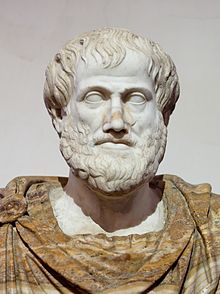
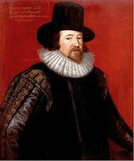
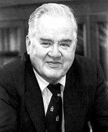
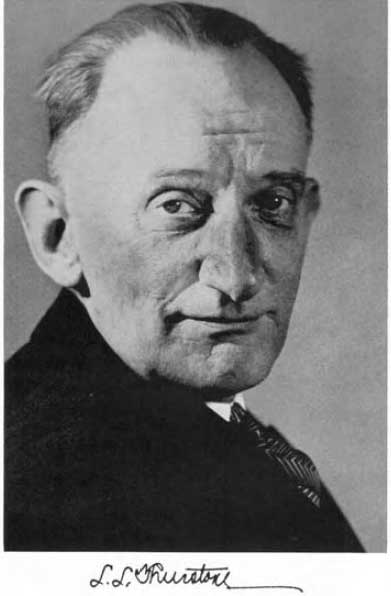

##Aristotle
  Aristotle (384 – 322 BC)

##Bacon

 
    Francis Bacon (1561-Jan-22 : 1626-Apr-9)    

##Mill
  John Stuart Mill (1806-May-20 : 1873-May-8)

##Fisher
  Ronald Aylmer Fisher (1890-Feb-17 : 1962-Jul-29)  

##Tukey
  John Wilder Tukey (1915-Jun-16 : 2000-Jul-26) 

##Thurstone
  Louis Leon Thurstone (1887-May-29 : 1955-Sep-30) 

##Wickham
    

