# Data Analysis
<!-- for more options study http://rmarkdown.rstudio.com/html_document_format.html  -->
<!-- The report is produced from
REPOSITORY: the-name-of-the-repository
BRANCH: the-name-of-the-branch
PATH: ../Reports/
-->

<!--  Set the working directory to the repository's base directory; this assumes the report is nested inside of only one directory.-->


<!-- Set the report-wide options, and point to the external script file. -->


#Load R Packages

```r
# Load the necessary packages.
base::require(base)
base::require(knitr)
base::require(markdown)
base::require(testit)
base::require(dplyr)
base::require(reshape2)
base::require(stringr)
base::require(stats)
base::require(ggplot2)
base::require(extrafont)
```

#Load graphing sources

```r
source("./scripts/graphs/graph_themes.R")
```

#Load tidy dataset

```r
dsM <- readRDS("./data/derived/dsM.rds")
```

#Exploring the data
##Histograms

```r
hist(dsM$bmi, xlab="BMI", main="BMI")
```

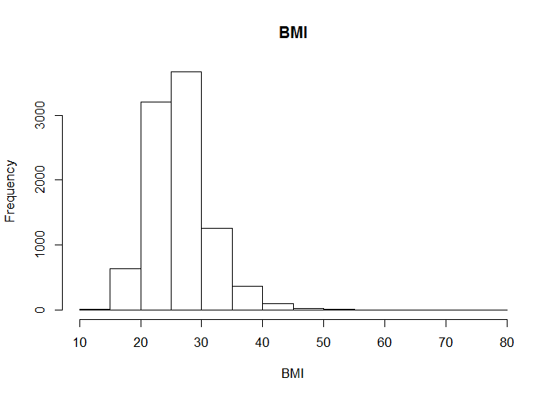 

```r
hist(dsM$agey, xlab="Age in Years", main="Age Distribution")
```

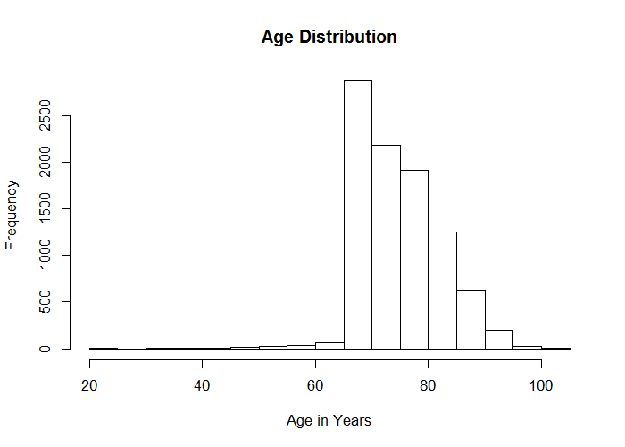 

```r
hist(dsM$cogtot, xlab="Cognition", main="Cognition")
```

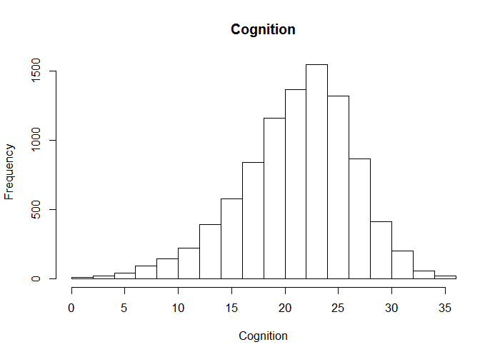 

```r
hist(dsM$raedyrs, xlab="Years of Education", main="Years of Education")
```

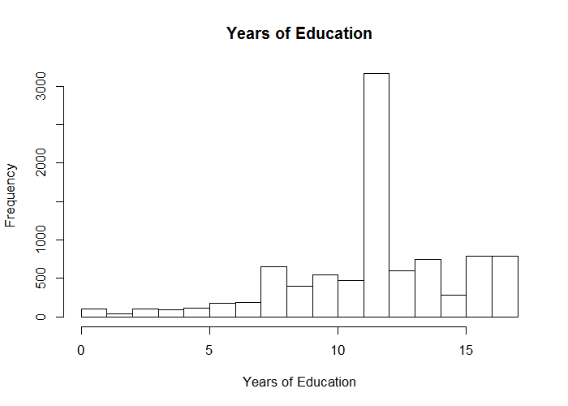 

```r
hist(dsM$ragender, xlab="Gender, 1=male, 2=female", main="Gender")
```

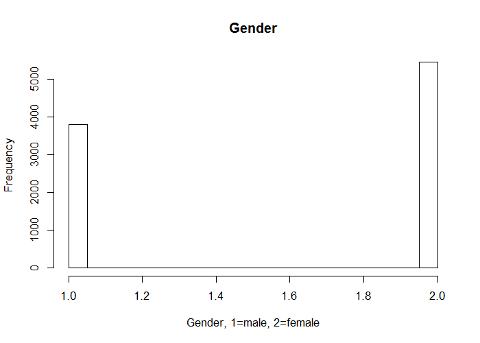 

```r
hist(dsM$vigact, xlab="0=No Vigorous Activity, 1=Vigorous Activity", main="Vigorous Activity")
```

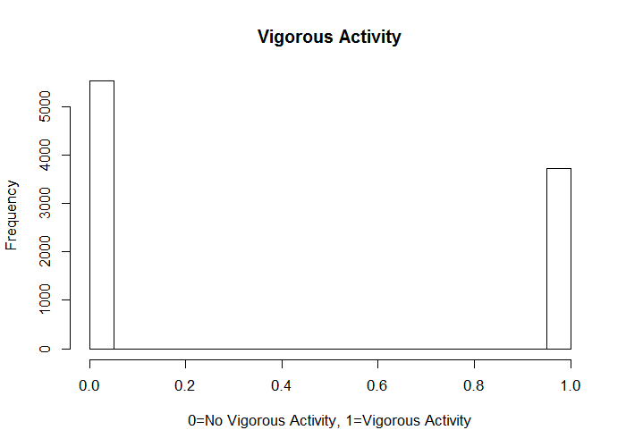 

```r
hist(dsM$psych, xlab="0=No Psychiatric Issues, 1=Psychiatric Issues", main="Psychiatric Issues")
```

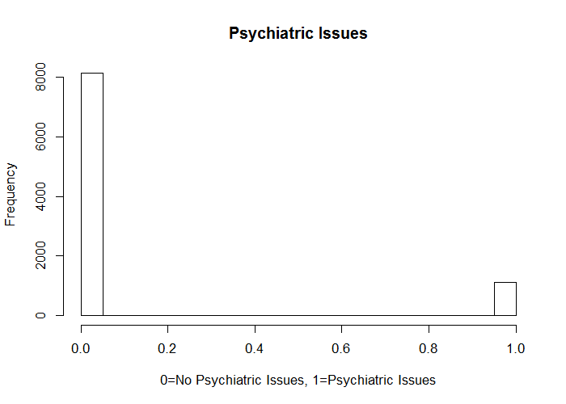 
Majority of BMI values between 20 and 30

##Scatterplots
To view relationship between BMI and other continuous variables


```r
# d <- dplyr::sample_n(dsM, 1000)
set.seed(41)
d <- dsM %>% dplyr::sample_n(1000)
p <- ggplot2::ggplot(data=d, aes(x=cogtot, y=bmi))+
  geom_point(shape=21, fill=NA, alpha=.4, size=4)+
  geom_smooth(method="lm", formula = y ~ x, se=F)+
  labs(title="Cognition and BMI")+
  xlab("Cognition")+
  ylab("BMI")+
  theme1
p
```

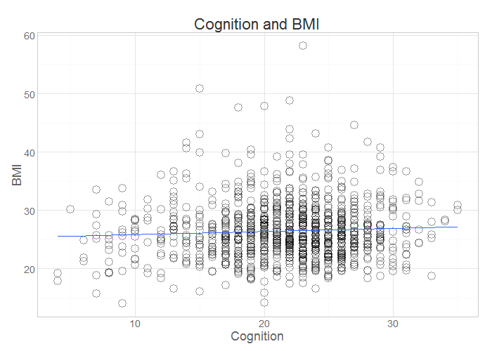 

The general trend of this scatterplot suggests that cognition increases as BMI increases


```r
set.seed(41)
d <- dsM %>% dplyr::sample_n(1000)
p <- ggplot2::ggplot(data=d, aes(x=agey, y=bmi)) +
  geom_point(shape=21, fill=NA, alpha=.4, size=4)+
  geom_smooth(method="lm", formula = y ~ x, se=F)+
  labs(title="Age and BMI")+
  xlab("Age in Years")+
  ylab("BMI")+
  theme1
p
```

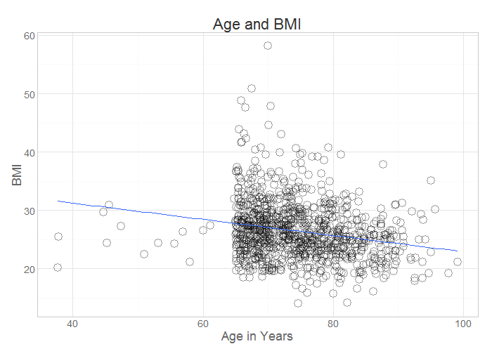 

The general trend of this scatterplot suggests that as individuals get older, their BMI decreases


```r
set.seed(41)
d <- dsM %>% dplyr::sample_n(1000)
p <- ggplot2::ggplot(data=d, aes(x=raedyrs, y=bmi)) +
  geom_point(shape=21, fill=NA, alpha=.4, size=4)+
  geom_smooth(method="lm", formula = y ~ x, se=F)+
  labs(title="Years of Education and BMI")+
  xlab("Years of Education")+
  ylab("BMI")+
  theme1
p
```

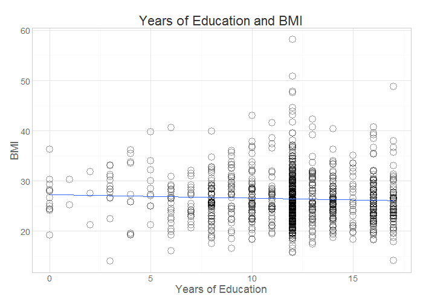 

The general trend of this scatterplot suggests that as years of education increases, BMI decreases 


To view a snapshot of the data.

```r
head(dsM)
```

```
  psych ragender vigact cogtot     agey  bmi raedyrs wave
1     1        2      0     14 65.41666 17.4       8    5
2     0        1      0     20 71.50000 29.1      17    5
3     0        2      1     27 66.75000 26.6      17    5
4     0        2      0     28 67.75000 27.6       8    5
5     1        2      0     16 65.66666 23.4      12    5
6     1        2      1     18 65.25000 31.5       8    5
```

#Creating a Model to Predict BMI
##Best subset selection
Regsubsets function performs best-subset selection by identifying the best model that contains a given number of predictors, where best is defined using RSS.
Best subset selection fits a separate least squares regression for each possible combination of the p predictors.

```r
library(leaps)
regfit.full=regsubsets(bmi~agey + cogtot + raedyrs + vigact + ragender + psych, data=dsM, nvmax =10)
summary(regfit.full)
```

```
Subset selection object
Call: regsubsets.formula(bmi ~ agey + cogtot + raedyrs + vigact + ragender + 
    psych, data = dsM, nvmax = 10)
6 Variables  (and intercept)
         Forced in Forced out
agey         FALSE      FALSE
cogtot       FALSE      FALSE
raedyrs      FALSE      FALSE
vigact       FALSE      FALSE
ragender     FALSE      FALSE
psych        FALSE      FALSE
1 subsets of each size up to 6
Selection Algorithm: exhaustive
         agey cogtot raedyrs vigact ragender psych
1  ( 1 ) "*"  " "    " "     " "    " "      " "  
2  ( 1 ) "*"  " "    "*"     " "    " "      " "  
3  ( 1 ) "*"  " "    "*"     "*"    " "      " "  
4  ( 1 ) "*"  " "    "*"     "*"    "*"      " "  
5  ( 1 ) "*"  " "    "*"     "*"    "*"      "*"  
6  ( 1 ) "*"  "*"    "*"     "*"    "*"      "*"  
```

```r
reg.summary=summary(regfit.full)
```

##Best subset selection - forward stepwise
Regsubsets function can also perform forward stepwise selection by using the method="forward". Forward stepwise begins with a model containing no predictors, and then adds predictors to the model one-at-a-time, until all of the predictors are in the model.

```r
library(leaps)
leaps = regsubsets(bmi ~ raedyrs + vigact + psych + agey + cogtot + ragender, data = dsM, nvmax = 10, method = "forward")
summary(leaps)
```

```
Subset selection object
Call: regsubsets.formula(bmi ~ raedyrs + vigact + psych + agey + cogtot + 
    ragender, data = dsM, nvmax = 10, method = "forward")
6 Variables  (and intercept)
         Forced in Forced out
raedyrs      FALSE      FALSE
vigact       FALSE      FALSE
psych        FALSE      FALSE
agey         FALSE      FALSE
cogtot       FALSE      FALSE
ragender     FALSE      FALSE
1 subsets of each size up to 6
Selection Algorithm: forward
         raedyrs vigact psych agey cogtot ragender
1  ( 1 ) " "     " "    " "   "*"  " "    " "     
2  ( 1 ) "*"     " "    " "   "*"  " "    " "     
3  ( 1 ) "*"     "*"    " "   "*"  " "    " "     
4  ( 1 ) "*"     "*"    " "   "*"  " "    "*"     
5  ( 1 ) "*"     "*"    "*"   "*"  " "    "*"     
6  ( 1 ) "*"     "*"    "*"   "*"  "*"    "*"     
```

##Best subset selection - backward stepwise
Use function regsubsets and method="backward". Backward stepwise begins with the full least squares model containing all p predictors, and then removes the least useful predictor, one-at-a-time.

```r
library(leaps)
leaps = regsubsets(bmi ~ raedyrs + vigact + psych + agey + cogtot + ragender, data = dsM, nvmax = 10, method = "backward")
summary(leaps)
```

```
Subset selection object
Call: regsubsets.formula(bmi ~ raedyrs + vigact + psych + agey + cogtot + 
    ragender, data = dsM, nvmax = 10, method = "backward")
6 Variables  (and intercept)
         Forced in Forced out
raedyrs      FALSE      FALSE
vigact       FALSE      FALSE
psych        FALSE      FALSE
agey         FALSE      FALSE
cogtot       FALSE      FALSE
ragender     FALSE      FALSE
1 subsets of each size up to 6
Selection Algorithm: backward
         raedyrs vigact psych agey cogtot ragender
1  ( 1 ) " "     " "    " "   "*"  " "    " "     
2  ( 1 ) "*"     " "    " "   "*"  " "    " "     
3  ( 1 ) "*"     "*"    " "   "*"  " "    " "     
4  ( 1 ) "*"     "*"    " "   "*"  " "    "*"     
5  ( 1 ) "*"     "*"    "*"   "*"  " "    "*"     
6  ( 1 ) "*"     "*"    "*"   "*"  "*"    "*"     
```

All three methods of best subset selection produce same results.   

##Using Adjusted R-Squared
A large value of adjusted r-squared indicates a model with a small test error.
The which.max() function can be used to identify the location of the maximum point of a vector.
Adjusted r-squared says that a model with 5 factors will produce the largest adjusted r-squared.


```r
which.max(reg.summary$adjr2)
```

```
[1] 5
```

##Using Cp
Cp is an unbiased estimate of test MSE. The Cp statistic takes on a small value for models with low test error.
The which.min() function can be used to identify the location of the minimum point of a vector.
Cp says that a model with 4 factors will produce the smallest Cp.

```r
which.min(reg.summary$cp)
```

```
[1] 4
```

##Using BIC
Bayesian information criterion (BIC) will take on a small value for a model with a
low test error, so we select the model that has the lowest BIC value.
The which.min() function can be used again to idenify the location of the minimum point of the vector.
BIC says that a model with 4 factors suggests that 4 factors optimal.

```r
which.min(reg.summary$bic)
```

```
[1] 4
```


###Plots of all 3 methods
Plot Adjusted r-squared with a point on the which.max() value calculated above

```r
par(mfrow =c(2,2))
plot(reg.summary$adjr2, xlab ="Number of Variables",
       ylab="Adjusted RSquared", type="l")
points(5, reg.summary$adjr2[5], pch = 4, col = "red", lwd = 7)
```

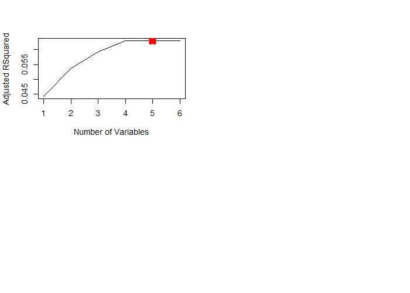 

Plot Cp with a point on the which.min() value calculated above

```r
par(mfrow =c(2,2))
plot(reg.summary$bic, xlab="Number of Variables", ylab="BIC",
     type="l")
points(4, reg.summary$bic[4], pch = 4, col = "red", lwd = 7)
```

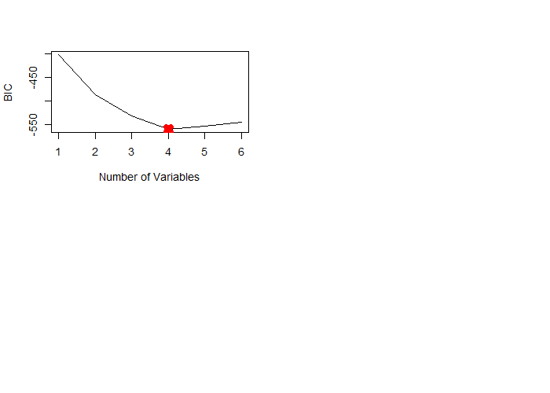 

Plot BIC with a point on the which.min() value calculated above

```r
par(mfrow =c(2,2))
plot(reg.summary$cp, xlab ="Number of Variables",
     ylab="Cp", type="l")
points(4, reg.summary$cp[4], pch = 4, col = "red", lwd = 7)
```

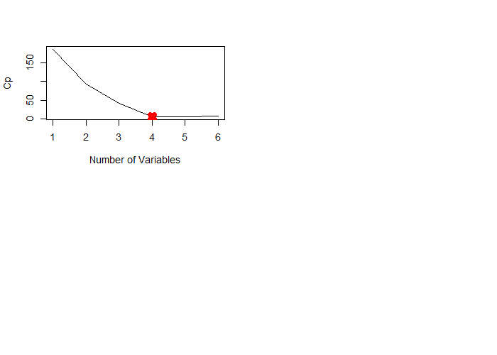 

#Investigating which model best predicts BMI
#Linear model with all 6 factors


```r
lm.all = lm(bmi~raedyrs + vigact + agey + ragender + cogtot + psych + raedyrs, data=dsM)
summary(lm.all)
```

```

Call:
lm(formula = bmi ~ raedyrs + vigact + agey + ragender + cogtot + 
    psych + raedyrs, data = dsM)

Residuals:
    Min      1Q  Median      3Q     Max 
-14.242  -3.125  -0.432   2.485  50.416 

Coefficients:
             Estimate Std. Error t value Pr(>|t|)    
(Intercept) 40.596157   0.663957  61.143  < 2e-16 ***
raedyrs     -0.138125   0.016631  -8.305  < 2e-16 ***
vigact      -0.816840   0.104130  -7.844 4.83e-15 ***
agey        -0.151980   0.007219 -21.053  < 2e-16 ***
ragender    -0.648638   0.102246  -6.344 2.35e-10 ***
cogtot       0.006229   0.011285   0.552    0.581    
psych        0.197129   0.155034   1.272    0.204    
---
Signif. codes:  0 '***' 0.001 '**' 0.01 '*' 0.05 '.' 0.1 ' ' 1

Residual standard error: 4.754 on 9242 degrees of freedom
Multiple R-squared:  0.06358,	Adjusted R-squared:  0.06297 
F-statistic: 104.6 on 6 and 9242 DF,  p-value: < 2.2e-16
```

The linear model with all 6 factors shows that all variables are significant predictors of BMI except for psychiatric issues and cognition.

#Linear model with 5 factors
Relationship of BMI with vigorous activity, age, gender, years of education, and psychiatric issues.
These variables were chosen by looking at best subset selection.
This is the optimal model size suggested by adjusted r-squared which.max() function.

```r
lm.fit5 = lm(bmi~ raedyrs + vigact + agey + ragender + psych, data=dsM)
summary(lm.fit5)
```

```

Call:
lm(formula = bmi ~ raedyrs + vigact + agey + ragender + psych, 
    data = dsM)

Residuals:
    Min      1Q  Median      3Q     Max 
-14.269  -3.130  -0.431   2.484  50.437 

Coefficients:
             Estimate Std. Error t value Pr(>|t|)    
(Intercept) 40.768813   0.585641  69.614  < 2e-16 ***
raedyrs     -0.134170   0.015008  -8.940  < 2e-16 ***
vigact      -0.811285   0.103639  -7.828 5.50e-15 ***
agey        -0.153272   0.006828 -22.447  < 2e-16 ***
ragender    -0.642432   0.101622  -6.322 2.71e-10 ***
psych        0.192351   0.154787   1.243    0.214    
---
Signif. codes:  0 '***' 0.001 '**' 0.01 '*' 0.05 '.' 0.1 ' ' 1

Residual standard error: 4.754 on 9243 degrees of freedom
Multiple R-squared:  0.06355,	Adjusted R-squared:  0.06304 
F-statistic: 125.4 on 5 and 9243 DF,  p-value: < 2.2e-16
```
The linear model with 5 variables shows that all variables are significant predictors of BMI at the .001 level except for psychiatric issues.


#Linear model with 4 factors
Relationship of BMI with vigorous activity, age, gender, and years of education.
Variables were chosen by looking at best subset selection.
This is the optimal model size suggested by Cp and BIC which.min() function

```r
lm.fit4 = lm(bmi~ raedyrs + vigact + agey + ragender, data=dsM)
summary(lm.fit4)
```

```

Call:
lm(formula = bmi ~ raedyrs + vigact + agey + ragender, data = dsM)

Residuals:
    Min      1Q  Median      3Q     Max 
-14.317  -3.136  -0.443   2.482  50.412 

Coefficients:
             Estimate Std. Error t value Pr(>|t|)    
(Intercept) 40.833693   0.583327  70.001  < 2e-16 ***
raedyrs     -0.136005   0.014936  -9.106  < 2e-16 ***
vigact      -0.822788   0.103227  -7.971 1.77e-15 ***
agey        -0.153723   0.006819 -22.545  < 2e-16 ***
ragender    -0.631042   0.101211  -6.235 4.72e-10 ***
---
Signif. codes:  0 '***' 0.001 '**' 0.01 '*' 0.05 '.' 0.1 ' ' 1

Residual standard error: 4.754 on 9244 degrees of freedom
Multiple R-squared:  0.06339,	Adjusted R-squared:  0.06299 
F-statistic: 156.4 on 4 and 9244 DF,  p-value: < 2.2e-16
```
The linear model with 4 variables shows that all variables are significant predictors of BMI

#Linear model with 3 factors
Relationship of BMI with age, years of education and vigorous activity
Variables were chosen by looking at best subset selection.

```r
lm.fit3 = lm(bmi~ raedyrs + vigact + agey, data=dsM)
summary(lm.fit3)
```

```

Call:
lm(formula = bmi ~ raedyrs + vigact + agey, data = dsM)

Residuals:
    Min      1Q  Median      3Q     Max 
-14.595  -3.118  -0.406   2.517  50.179 

Coefficients:
             Estimate Std. Error t value Pr(>|t|)    
(Intercept) 39.830593   0.561849  70.892  < 2e-16 ***
raedyrs     -0.132768   0.014958  -8.876  < 2e-16 ***
vigact      -0.756386   0.102887  -7.352 2.12e-13 ***
agey        -0.154596   0.006831 -22.631  < 2e-16 ***
---
Signif. codes:  0 '***' 0.001 '**' 0.01 '*' 0.05 '.' 0.1 ' ' 1

Residual standard error: 4.763 on 9245 degrees of freedom
Multiple R-squared:  0.05945,	Adjusted R-squared:  0.05915 
F-statistic: 194.8 on 3 and 9245 DF,  p-value: < 2.2e-16
```

#Linear model with 2 factors
Relationship of BMI with age and years of education
Variables were chosen by looking at best subset selection.

```r
lm.fit2 = lm(bmi~ raedyrs + agey, data=dsM)
summary(lm.fit2)
```

```

Call:
lm(formula = bmi ~ raedyrs + agey, data = dsM)

Residuals:
    Min      1Q  Median      3Q     Max 
-14.547  -3.144  -0.465   2.490  50.456 

Coefficients:
             Estimate Std. Error t value Pr(>|t|)    
(Intercept) 39.125926   0.555198  70.472   <2e-16 ***
raedyrs     -0.144844   0.014910  -9.715   <2e-16 ***
agey        -0.147305   0.006778 -21.733   <2e-16 ***
---
Signif. codes:  0 '***' 0.001 '**' 0.01 '*' 0.05 '.' 0.1 ' ' 1

Residual standard error: 4.777 on 9246 degrees of freedom
Multiple R-squared:  0.05395,	Adjusted R-squared:  0.05375 
F-statistic: 263.7 on 2 and 9246 DF,  p-value: < 2.2e-16
```

#Linear model with 1 factor
Relationship of BMI with age. Age was chosen as the factor to use in the one variable model after looking at best subset selection.

```r
lm.fit1 = lm(bmi~ agey, data=dsM)
summary(lm.fit1)
```

```

Call:
lm(formula = bmi ~ agey, data = dsM)

Residuals:
    Min      1Q  Median      3Q     Max 
-14.853  -3.171  -0.506   2.508  50.094 

Coefficients:
             Estimate Std. Error t value Pr(>|t|)    
(Intercept) 36.879783   0.507307    72.7   <2e-16 ***
agey        -0.140210   0.006773   -20.7   <2e-16 ***
---
Signif. codes:  0 '***' 0.001 '**' 0.01 '*' 0.05 '.' 0.1 ' ' 1

Residual standard error: 4.801 on 9247 degrees of freedom
Multiple R-squared:  0.0443,	Adjusted R-squared:  0.04419 
F-statistic: 428.6 on 1 and 9247 DF,  p-value: < 2.2e-16
```

#Linear model with cognition
Wanted to explore whether cognition would be a significant predictor on its own in a model since it was not significant in the model with 6 factors

```r
lm.fit1.1 = lm(bmi ~ cogtot, data=dsM)
summary(lm.fit1.1)
```

```

Call:
lm(formula = bmi ~ cogtot, data = dsM)

Residuals:
    Min      1Q  Median      3Q     Max 
-13.837  -3.320  -0.614   2.609  48.995 

Coefficients:
             Estimate Std. Error t value Pr(>|t|)    
(Intercept) 25.933931   0.216374 119.857   <2e-16 ***
cogtot       0.022856   0.009723   2.351   0.0188 *  
---
Signif. codes:  0 '***' 0.001 '**' 0.01 '*' 0.05 '.' 0.1 ' ' 1

Residual standard error: 4.91 on 9247 degrees of freedom
Multiple R-squared:  0.0005972,	Adjusted R-squared:  0.0004891 
F-statistic: 5.525 on 1 and 9247 DF,  p-value: 0.01876
```
The results show that cognition would be considered a significant predictor of BMI if it was the only factor in a model with BMI

#Linear model with psychiatric issues
Wanted to explore whether psychiatric issues would be a significant predictor on its own in a model since it was not significant in the model with 5 or 6 factors

```r
lm.fit1.2 = lm(bmi ~ psych, data=dsM)
summary(lm.fit1.2)
```

```

Call:
lm(formula = bmi ~ psych, data = dsM)

Residuals:
    Min      1Q  Median      3Q     Max 
-13.774  -3.331  -0.574   2.626  49.126 

Coefficients:
            Estimate Std. Error t value Pr(>|t|)    
(Intercept)  26.3735     0.0544 484.850  < 2e-16 ***
psych         0.4574     0.1574   2.907  0.00366 ** 
---
Signif. codes:  0 '***' 0.001 '**' 0.01 '*' 0.05 '.' 0.1 ' ' 1

Residual standard error: 4.909 on 9247 degrees of freedom
Multiple R-squared:  0.0009128,	Adjusted R-squared:  0.0008047 
F-statistic: 8.448 on 1 and 9247 DF,  p-value: 0.003663
```

#Linear model with cognition and psychiatric issues
Wanted to explore whether both cognition and psychiatric issues would be significant predictors of BMI on their own in a model since they weren't significant in the model with 6 factors

```r
lm.fit2.1 = lm(bmi ~ cogtot + psych, data=dsM)
summary(lm.fit2.1)
```

```

Call:
lm(formula = bmi ~ cogtot + psych, data = dsM)

Residuals:
    Min      1Q  Median      3Q     Max 
-13.779  -3.304  -0.579   2.600  49.045 

Coefficients:
             Estimate Std. Error t value Pr(>|t|)    
(Intercept) 25.820511   0.219317 117.731  < 2e-16 ***
cogtot       0.025385   0.009753   2.603  0.00926 ** 
psych        0.491626   0.157871   3.114  0.00185 ** 
---
Signif. codes:  0 '***' 0.001 '**' 0.01 '*' 0.05 '.' 0.1 ' ' 1

Residual standard error: 4.907 on 9246 degrees of freedom
Multiple R-squared:  0.001644,	Adjusted R-squared:  0.001428 
F-statistic: 7.614 on 2 and 9246 DF,  p-value: 0.0004965
```
Results show that cognition and psychiatric issues would be considered significant predictors of BMI if in a model with just those 2 factors

#Final linear model
The final model I chose to predict BMI is the model with 4 factors (age, years of education, gender, and vigorous activity). Since both BIC and Cp had the lowest values with this model size, and best subset selection (all 3 methods) suggested that these 4 factors should be the factors included in this size model, and all factors within this model are statistically significant predictors of BMI, I think this is the most simple and most accurate model to use to best predict BMI.


```r
lm.fit4.1 = lm(bmi~ raedyrs + vigact + agey + ragender, data=dsM)
summary(lm.fit4.1)
```

```

Call:
lm(formula = bmi ~ raedyrs + vigact + agey + ragender, data = dsM)

Residuals:
    Min      1Q  Median      3Q     Max 
-14.317  -3.136  -0.443   2.482  50.412 

Coefficients:
             Estimate Std. Error t value Pr(>|t|)    
(Intercept) 40.833693   0.583327  70.001  < 2e-16 ***
raedyrs     -0.136005   0.014936  -9.106  < 2e-16 ***
vigact      -0.822788   0.103227  -7.971 1.77e-15 ***
agey        -0.153723   0.006819 -22.545  < 2e-16 ***
ragender    -0.631042   0.101211  -6.235 4.72e-10 ***
---
Signif. codes:  0 '***' 0.001 '**' 0.01 '*' 0.05 '.' 0.1 ' ' 1

Residual standard error: 4.754 on 9244 degrees of freedom
Multiple R-squared:  0.06339,	Adjusted R-squared:  0.06299 
F-statistic: 156.4 on 4 and 9244 DF,  p-value: < 2.2e-16
```

The coefficients tell us the as BMI increases by 1 point, vigorous activity decreases by (.82, SD=.103), age decreases by (.15, SD=.007), the effect of being male increases by (.63, SD=.101), and years of education decreases by (.14, SD=.015).

#Conclusions

- From the 6 initial predictors in my dataset, I found that the model with age, years of education, vigorous activity and gender best predicts BMI

- The coefficients tell us that as BMI increases:
- age decreases (what our initial scatterplot showed)
- years of education decreases (what our initial scatterplot showed)
- effect of being male increases
- vigorous activity decreases

- I also discovered how misleading linear models can be when I looked into cognition and psychiatric issues on their own

- Although cognition and psychiatric issues appear to be significant predictors of BMI when in a model on their own, when looking at the more complex model with 6 predictors, they are no longer significant predictors of BMI

