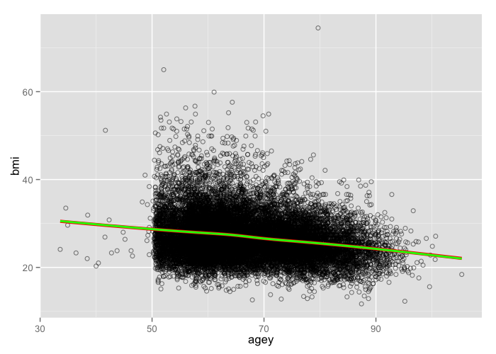

# Data Analysis for Final Project
<!-- for more options study http://rmarkdown.rstudio.com/html_document_format.html  -->
<!-- The report is produced from
REPOSITORY: the-name-of-the-repository
BRANCH: the-name-of-the-branch
PATH: ../Reports/
-->

<!--  Set the working directory to the repository's base directory; this assumes the report is nested inside of only one directory.-->


<!-- Set the report-wide options, and point to the external script file. -->

##Load Packages
Prepare RStudio environment for all tasks to follow.

```r
# Load the necessary packages.
base::require(base)
base::require(knitr)
base::require(markdown)
base::require(testit)
base::require(dplyr)
base::require(reshape2)
base::require(stringr)
base::require(stats)
base::require(ggplot2)
base::require(extrafont)
```
##Load Data

```r
dsM <- readRDS("./data/derived/dsM.rds")
```

##Select Wave

```r
ds <- dsM %>% dplyr::filter(wave==4) %>%
  dplyr::select(-wave)
head(ds)
```

```
        id chronicc   cogslope depressivesym  bmi    cogsc     agey smoken drink strok psych diab arthr cancr vigact
1     2010        3 -0.3217508             0 15.1 18.35956 63.66667      1     1     0     1    0     1     0      0
2     3010        1 -0.5978775             3 25.8 27.97182 62.25000      0     1     0     0    0     0     0      1
3     3020        2 -0.1403390             0 29.1 26.19590 59.58333      0     1     0     0    0     1     1      1
4 10001010        0 -0.1760317             5 23.3 28.31025 58.75000      0     0     0     1    0     0     0      1
5 10004010        3 -0.1194601             3 29.0 26.17286 58.33333      0     1     0     0    0     1     1      0
6 10013010        2 -0.2340541             8 23.0 21.80249 60.33333      1     0     0     1    0     0     0      0
```

####The data was collected across different time points, so I choose to explore what is going on at one point in time.  The data for Wave 4 was collected in 1996.


##Summarize Data

```r
summary(ds)
```

```
       id               chronicc        cogslope       depressivesym        bmi            cogsc       
 Min.   :     2010   Min.   :0.000   Min.   :-1.1961   Min.   :0.000   Min.   :11.70   Min.   : 4.531  
 1st Qu.: 45922018   1st Qu.:1.000   1st Qu.:-0.3077   1st Qu.:0.000   1st Qu.:23.50   1st Qu.:20.455  
 Median : 98109020   Median :1.000   Median :-0.2523   Median :1.000   Median :26.40   Median :23.536  
 Mean   :120780081   Mean   :1.581   Mean   :-0.2574   Mean   :1.589   Mean   :26.94   Mean   :22.878  
 3rd Qu.:204471260   3rd Qu.:2.000   3rd Qu.:-0.1897   3rd Qu.:2.000   3rd Qu.:29.60   3rd Qu.:25.869  
 Max.   :213479020   Max.   :8.000   Max.   : 0.3368   Max.   :8.000   Max.   :74.50   Max.   :34.369  
      agey            smoken          drink            strok             psych             diab           arthr       
 Min.   : 33.58   Min.   :0.000   Min.   :0.0000   Min.   :0.00000   Min.   :0.0000   Min.   :0.000   Min.   :0.0000  
 1st Qu.: 59.08   1st Qu.:0.000   1st Qu.:0.0000   1st Qu.:0.00000   1st Qu.:0.0000   1st Qu.:0.000   1st Qu.:0.0000  
 Median : 65.50   Median :0.000   Median :0.0000   Median :0.00000   Median :0.0000   Median :0.000   Median :1.0000  
 Mean   : 67.02   Mean   :0.161   Mean   :0.4881   Mean   :0.07214   Mean   :0.1406   Mean   :0.145   Mean   :0.5525  
 3rd Qu.: 74.42   3rd Qu.:0.000   3rd Qu.:1.0000   3rd Qu.:0.00000   3rd Qu.:0.0000   3rd Qu.:0.000   3rd Qu.:1.0000  
 Max.   :105.33   Max.   :1.000   Max.   :1.0000   Max.   :2.00000   Max.   :1.0000   Max.   :1.000   Max.   :1.0000  
     cancr            vigact      
 Min.   :0.0000   Min.   :0.0000  
 1st Qu.:0.0000   1st Qu.:0.0000  
 Median :0.0000   Median :0.0000  
 Mean   :0.1116   Mean   :0.4402  
 3rd Qu.:0.0000   3rd Qu.:1.0000  
 Max.   :1.0000   Max.   :1.0000  
```
####Create a summary of the data at this point in time. 

##Histograms
###What is the distribution of BMI in the sample.

```r
hist(ds$bmi, xlab="BMI", main="BMI Histogram")
```

 

####BMI is typically between between 11.7 and 74.5, the mean BMI is 26.94.


###What is the distribution of chronic conditions in the sample.

```r
hist(ds$chronicc, xlab="Chronic Conditions", main="Chronic Conditions Histogram")
```

 

```r
table(ds$chronicc)
```

```

   0    1    2    3    4    5    6    7    8 
3860 5294 4253 2363  958  341  105   14    2 
```


####Chronic conditions range from 0-8, people most frequently report having one chronic condition, although reports of no chronic conditions and two chronic conditions are also quite common.


###What is the distribution of people who smoke versus people who do not currently smoke in the sample.

```r
hist(ds$smoken, xlab="Smoken", main="Currently Smoke Histogram")
```

 

```r
table(ds$smoken)
```

```

    0     1 
14423  2767 
```


####The majority of people do not smoke. Specifically, only 16.1% of the sample currently smokes.  


##Best Subset Selection


```r
library(leaps)
d <- ds %>% dplyr::select(-id)
regfit.full=regsubsets(bmi~.,d, nvmax=13)
summary(regfit.full)
```

```
Subset selection object
Call: regsubsets.formula(bmi ~ ., d, nvmax = 13)
13 Variables  (and intercept)
              Forced in Forced out
chronicc          FALSE      FALSE
cogslope          FALSE      FALSE
depressivesym     FALSE      FALSE
cogsc             FALSE      FALSE
agey              FALSE      FALSE
smoken            FALSE      FALSE
drink             FALSE      FALSE
strok             FALSE      FALSE
psych             FALSE      FALSE
diab              FALSE      FALSE
arthr             FALSE      FALSE
cancr             FALSE      FALSE
vigact            FALSE      FALSE
1 subsets of each size up to 13
Selection Algorithm: exhaustive
          chronicc cogslope depressivesym cogsc agey smoken drink strok psych diab arthr cancr vigact
1  ( 1 )  " "      " "      " "           " "   "*"  " "    " "   " "   " "   " "  " "   " "   " "   
2  ( 1 )  "*"      " "      " "           " "   "*"  " "    " "   " "   " "   " "  " "   " "   " "   
3  ( 1 )  "*"      " "      " "           " "   "*"  "*"    " "   " "   " "   " "  " "   " "   " "   
4  ( 1 )  "*"      " "      " "           " "   "*"  "*"    " "   " "   " "   "*"  " "   " "   " "   
5  ( 1 )  "*"      " "      " "           " "   "*"  "*"    " "   " "   " "   "*"  " "   " "   "*"   
6  ( 1 )  "*"      " "      " "           " "   "*"  "*"    " "   " "   " "   "*"  "*"   " "   "*"   
7  ( 1 )  "*"      " "      " "           " "   "*"  "*"    "*"   " "   " "   "*"  "*"   " "   "*"   
8  ( 1 )  "*"      " "      " "           " "   "*"  "*"    " "   "*"   " "   "*"  "*"   "*"   "*"   
9  ( 1 )  "*"      " "      " "           " "   "*"  "*"    "*"   "*"   " "   "*"  "*"   "*"   "*"   
10  ( 1 ) "*"      " "      " "           " "   "*"  "*"    "*"   "*"   "*"   "*"  "*"   "*"   "*"   
11  ( 1 ) "*"      " "      " "           "*"   "*"  "*"    "*"   "*"   "*"   "*"  "*"   "*"   "*"   
12  ( 1 ) "*"      " "      "*"           "*"   "*"  "*"    "*"   "*"   "*"   "*"  "*"   "*"   "*"   
13  ( 1 ) "*"      "*"      "*"           "*"   "*"  "*"    "*"   "*"   "*"   "*"  "*"   "*"   "*"   
```

```r
reg.summary=summary(regfit.full)
```
###Which variables to include in a 1,2,3...13 variable model. Best subset selection creates a set of models, each of which contains a subset of the p predictors.  We can look across each row to determine which variables should be included in that model. For example, the first row has a star under 'agey', thus we know that if we were to use a model with one predictor, the predictor we would include would be Age in Years. 

###We have to determine which of these models is best.  We can look at R^2 and RSS to further interpret the model.  We can look at adjusted R^2, Cp and BIC to try to select the best overall model.


##How much variance does R^2 account for when only one variable is included compared to when 13 variables are included.

```r
reg.summary$rsq 
```

```
 [1] 0.04805999 0.09248401 0.11487744 0.12629427 0.13258939 0.13752616 0.13897117 0.14072686 0.14205414 0.14303540
[11] 0.14392712 0.14427697 0.14438457
```


####The R^2 statistic increases from 4.8% to 14.4% when 13 variables are included.  R^2 will always increase monotonically as more variables are included in the model, thus this isn't sufficient for selecting which model we should use. 

#####In a model with one predictor variable (in this case, age), that variable (age) explains 4.8% of the variance in the outcome variable (BMI).  When you include 13 predictor variables, together they explain more than 14% of the variability in BMI. 

###Plot RSS for each number of variables. 

```r
par(mfrow=c(1,1))
plot(reg.summary$rss, xlab="Number of Variables", ylab="RSS", type="l")
```

 


####The model containing the greatest number of predictors will always have the smallest RSS.  Thus, this too is not sufficient in deciding which model is best. However, the graph does provide information to interpret regarding how rapidly RSS drops with each added predictor.

##Adjusted R squared, Cp(AIC) and BIC are all approaches for adjusting the training error for the model size.  

###Plot adjusted R squared for each number of variables.

```r
plot(reg.summary$adjr2, xlab="Number of Variables", ylab= "Adjusted Rsq", type="l")

which.max(reg.summary$adjr2)
```

```
[1] 13
```

```r
#Add a point to indicate the model with the largest adjusted R^2 statistic
points (13, reg.summary$adjr2[13], col="red", cex=2, pch=20)
```

 


####R^2 increases with each added predictor.  The model with the highest R^2 is the model with 13 predictors.

###Plot Cp(AIC) for each number of variables.

####The Cp statistic essentially adjusts for the fact that training error tends to underestimate test error by adding penalty to the training RSS. The penalty increases as the number of predictors in the model increases.  For least squares models, Cp and AIC are proportional to each other, and so only Cp will be displayed.  We choose the model with the lowest Cp when determining which set of models is best.

```r
plot(reg.summary$cp, xlab="Number of Variables", ylab="Cp", type="l")
which.min(reg.summary$cp)
```

```
[1] 13
```

```r
points (13, reg.summary$cp[13], col="red", cex=2, pch=20)
```

 


####The model with the lowest Cp is the model with 13 predictors.


###Plot BIC for each number of variables. The BIC statistic tends to place a heavier penalty on models with many variables, and thus results in the selection of smaller models than Cp.  BIC tends to take on a small value for a model with low test error, so we should select the model with the lowest BIC value.  

```r
plot(reg.summary$bic, xlab="Number of Variables", ylab="Bic", type="l")
which.min(reg.summary$bic)
```

```
[1] 11
```

```r
points (11, reg.summary$bic[11], col="red", cex=2, pch=20)
```

 


####The lowest BIC occurs in the model with 11 variables. 


###What are the coefficients included in each model:

####The model with 13 predictors includes chronic conditions, cognitive slope, depressive symptoms, expected cognition, age in years, current smoking, drinking, stroke, psychiatric condition, diabetes, arthritis, cancer, and vigorous activity. 

```r
coef(regfit.full, 13)
```

```
  (Intercept)      chronicc      cogslope depressivesym         cogsc          agey        smoken         drink 
  38.38540602    0.60466234   -0.46753664    0.05521591   -0.03833112   -0.16763851   -2.15501160   -0.33250306 
        strok         psych          diab         arthr         cancr        vigact 
  -0.89725811   -0.60579503    1.59968010    0.65912399   -0.72490057   -0.79272563 
```

####The model with 11 predictors includes chronic conditions, expected cognition, age in years, current smoking, drinking, stroke, psychiatric condition, diabetes, arthritis, cancer, and vigorous activity. 

```r
coef(regfit.full, 11)
```

```
(Intercept)    chronicc       cogsc        agey      smoken       drink       strok       psych        diab       arthr 
 38.7115234   0.6130832  -0.0448939  -0.1674824  -2.1342400  -0.3472273  -0.8894529  -0.5323593   1.6033381   0.6729143 
      cancr      vigact 
 -0.7294094  -0.8072525 
```


##Linear Model with Thirteen Predictors

```r
d <- ds %>% dplyr::select(-id)
head(d)
```

```
  chronicc   cogslope depressivesym  bmi    cogsc     agey smoken drink strok psych diab arthr cancr vigact
1        3 -0.3217508             0 15.1 18.35956 63.66667      1     1     0     1    0     1     0      0
2        1 -0.5978775             3 25.8 27.97182 62.25000      0     1     0     0    0     0     0      1
3        2 -0.1403390             0 29.1 26.19590 59.58333      0     1     0     0    0     1     1      1
4        0 -0.1760317             5 23.3 28.31025 58.75000      0     0     0     1    0     0     0      1
5        3 -0.1194601             3 29.0 26.17286 58.33333      0     1     0     0    0     1     1      0
6        2 -0.2340541             8 23.0 21.80249 60.33333      1     0     0     1    0     0     0      0
```

```r
lm.fit = lm(bmi ~ chronicc + cogslope + depressivesym + cogsc + agey + smoken + drink + strok + psych + diab + arthr + cancr + vigact, data=d)
m13 <-lm.fit
summary(lm.fit)
```

```

Call:
lm(formula = bmi ~ chronicc + cogslope + depressivesym + cogsc + 
    agey + smoken + drink + strok + psych + diab + arthr + cancr + 
    vigact, data = d)

Residuals:
    Min      1Q  Median      3Q     Max 
-16.323  -3.165  -0.447   2.562  48.411 

Coefficients:
               Estimate Std. Error t value Pr(>|t|)    
(Intercept)   38.385406   0.484876  79.165  < 2e-16 ***
chronicc       0.604662   0.044445  13.605  < 2e-16 ***
cogslope      -0.467537   0.318119  -1.470 0.141664    
depressivesym  0.055216   0.020932   2.638 0.008351 ** 
cogsc         -0.038331   0.010835  -3.538 0.000405 ***
agey          -0.167639   0.004541 -36.919  < 2e-16 ***
smoken        -2.155012   0.101839 -21.161  < 2e-16 ***
drink         -0.332503   0.076218  -4.363 1.29e-05 ***
strok         -0.897258   0.137791  -6.512 7.63e-11 ***
psych         -0.605795   0.116361  -5.206 1.95e-07 ***
diab           1.599680   0.118899  13.454  < 2e-16 ***
arthr          0.659124   0.088468   7.450 9.75e-14 ***
cancr         -0.724901   0.124200  -5.837 5.42e-09 ***
vigact        -0.792726   0.076123 -10.414  < 2e-16 ***
---
Signif. codes:  0 '***' 0.001 '**' 0.01 '*' 0.05 '.' 0.1 ' ' 1

Residual standard error: 4.774 on 17176 degrees of freedom
Multiple R-squared:  0.1444,	Adjusted R-squared:  0.1437 
F-statistic:   223 on 13 and 17176 DF,  p-value: < 2.2e-16
```


####All variables are significant expect cognitive slope.  

##Linear Model with Eleven Predictors

```r
lm.fit2 = lm(bmi~chronicc + cogsc + agey + smoken + drink + strok + psych + diab + arthr + cancr + vigact, data=d)
m11 <- lm.fit2
summary(lm.fit2)
```

```

Call:
lm(formula = bmi ~ chronicc + cogsc + agey + smoken + drink + 
    strok + psych + diab + arthr + cancr + vigact, data = d)

Residuals:
    Min      1Q  Median      3Q     Max 
-16.053  -3.156  -0.457   2.559  48.641 

Coefficients:
             Estimate Std. Error t value Pr(>|t|)    
(Intercept) 38.711523   0.472881  81.863  < 2e-16 ***
chronicc     0.613083   0.044267  13.850  < 2e-16 ***
cogsc       -0.044894   0.010613  -4.230 2.35e-05 ***
agey        -0.167482   0.004473 -37.440  < 2e-16 ***
smoken      -2.134240   0.101610 -21.004  < 2e-16 ***
drink       -0.347227   0.076079  -4.564 5.05e-06 ***
strok       -0.889453   0.137776  -6.456 1.11e-10 ***
psych       -0.532359   0.113450  -4.692 2.72e-06 ***
diab         1.603338   0.118852  13.490  < 2e-16 ***
arthr        0.672914   0.088364   7.615 2.77e-14 ***
cancr       -0.729409   0.124201  -5.873 4.36e-09 ***
vigact      -0.807253   0.075873 -10.639  < 2e-16 ***
---
Signif. codes:  0 '***' 0.001 '**' 0.01 '*' 0.05 '.' 0.1 ' ' 1

Residual standard error: 4.775 on 17178 degrees of freedom
Multiple R-squared:  0.1439,	Adjusted R-squared:  0.1434 
F-statistic: 262.5 on 11 and 17178 DF,  p-value: < 2.2e-16
```

```r
ds$bmi_m13 <- predict(m13)
ds$bmi_m11 <- predict(m11)
head(ds)
```

```
        id chronicc   cogslope depressivesym  bmi    cogsc     agey smoken drink strok psych diab arthr cancr vigact
1     2010        3 -0.3217508             0 15.1 18.35956 63.66667      1     1     0     1    0     1     0      0
2     3010        1 -0.5978775             3 25.8 27.97182 62.25000      0     1     0     0    0     0     0      1
3     3020        2 -0.1403390             0 29.1 26.19590 59.58333      0     1     0     0    0     1     1      1
4 10001010        0 -0.1760317             5 23.3 28.31025 58.75000      0     0     0     1    0     0     0      1
5 10004010        3 -0.1194601             3 29.0 26.17286 58.33333      0     1     0     0    0     1     1      0
6 10013010        2 -0.2340541             8 23.0 21.80249 60.33333      1     0     0     1    0     0     0      0
   bmi_m13  bmi_m11
1 26.53891 26.72258
2 26.80233 26.48859
3 27.47676 27.57152
4 26.41134 26.26136
5 29.24047 29.20224
6 26.43518 26.18752
```


####In the model with 11 predictors, all predictors are significant (p=0)  The model with eleven variables is also more parsimonious than the 13 predictor model.  Is this parsimony worth the reduced information?


##Plot Age and BMI

```r
ds %>% dplyr::select(id, bmi, bmi_m13, bmi_m11) %>% dplyr::top_n(10)
```

```
          id  bmi  bmi_m13  bmi_m11
1   44003030 29.0 33.61125 33.35745
2   45433011 51.2 34.03922 33.87212
3   51534020 20.8 33.52727 33.56612
4  111666010 23.3 33.46127 33.34201
5  122305010 39.1 33.84402 33.76273
6  122983010 30.3 33.53453 33.50788
7  144785010 35.2 33.71418 33.69620
8  158252010 30.3 33.52668 33.55594
9  184954010 33.9 33.71052 33.76382
10 186929010 23.2 33.86056 33.67922
```

```r
p <- ggplot2::ggplot(data=ds, aes(x=agey, y=bmi)) +
  geom_point(shape=21, fill=NA, alpha=.5)+
  geom_smooth(aes(y=bmi_m11),  color="red", size=1.5, se=F)+ 
  geom_smooth(aes(y=bmi_m13), color="green", size=1.0, se=F)


p
```

 

####It appears that as age increases BMI linearly decreases. The green line represents the predictions of the model with 13 predictors, whereas the red line represents the predictions of the model with only 11 predictors.  As you can see, there is not a big difference between the predictions of these two models in predicting BMI based on age.


##Plot Chronic Conditions and BMI

```r
ds %>% dplyr::select(id, bmi, bmi_m13, bmi_m11) %>% dplyr::top_n(10)
```

```
          id  bmi  bmi_m13  bmi_m11
1   44003030 29.0 33.61125 33.35745
2   45433011 51.2 34.03922 33.87212
3   51534020 20.8 33.52727 33.56612
4  111666010 23.3 33.46127 33.34201
5  122305010 39.1 33.84402 33.76273
6  122983010 30.3 33.53453 33.50788
7  144785010 35.2 33.71418 33.69620
8  158252010 30.3 33.52668 33.55594
9  184954010 33.9 33.71052 33.76382
10 186929010 23.2 33.86056 33.67922
```

```r
p <- ggplot2::ggplot(data=ds, aes(x=chronicc, y=bmi)) +
  geom_point(shape=21, fill=NA, alpha=.5)+
  geom_smooth(aes(y=bmi_m11),  method= 'lm', formula = y ~ x, color="red", size=1.5, se=F)+ 
  geom_smooth(aes(y=bmi_m13), method= 'lm', formula = y ~ x, color="green", size=1.0, se=F)


p
```

 

####It appears that, on average, as the number of chronic conditions increase, so does BMI.  The green line represents the predictions of the model with 13 predictors, whereas the red line represents the predictions of the model with only 11 predictors.  As you can see, there is not a big difference between the predictions of these two models in predicting BMI based on chronic conditions.


##Plot Smoking and BMI

```r
ds %>% dplyr::select(id, bmi, bmi_m13, bmi_m11) %>% dplyr::top_n(10)
```

```
          id  bmi  bmi_m13  bmi_m11
1   44003030 29.0 33.61125 33.35745
2   45433011 51.2 34.03922 33.87212
3   51534020 20.8 33.52727 33.56612
4  111666010 23.3 33.46127 33.34201
5  122305010 39.1 33.84402 33.76273
6  122983010 30.3 33.53453 33.50788
7  144785010 35.2 33.71418 33.69620
8  158252010 30.3 33.52668 33.55594
9  184954010 33.9 33.71052 33.76382
10 186929010 23.2 33.86056 33.67922
```

```r
p <- ggplot2::ggplot(data=ds, aes(x=smoken, y=bmi)) +
  geom_point(shape=21, fill=NA, alpha=.5)+
  geom_smooth(aes(y=bmi_m11),  method= 'lm', formula = y ~ x, color="red", size=1.5, se=F)+ 
  geom_smooth(aes(y=bmi_m13), method= 'lm', formula = y ~ x, color="green", size=1.0, se=F)

p
```

 

####As you can see in the plot, smoking (value 1) appears to be associated with a lower BMI on average.  Again, there doesn't appear to be a big difference between the predictions of the 13 variable model and 11 variable model.

###There does not seem to be a big difference in prediction between the two models.  Therefore, I will choose the eleven variable model because it is more parsimonious.  

##Further Explore the Model with 11 Predictors
####The negative correlation between BMI and Age is well supported by current literature.  Andersen and Olsen (2015) reported that "BMI decreases as age increases (P < 0·001) from about 60 years and up."  

####When looking further at the model with 11 predictors, I wanted to further explore whether any of the variables within this model could have been related to one another, in addition to BMI.  The positive association between the number of chronic conditions and BMI is also well established.  However, less research examines the possible explanations for this association

####One possible reason for this association may involve the effect of chronic conditions on activity levels.  For example, an individual with multiple chronic conditions may be less likely to engage in vigourous activity.  Is this supported by our data?


```r
p <- ggplot2::ggplot(data=dsM, aes(x=chronicc, y=vigact)) +
  geom_point()+
  geom_jitter()
p
```

 

###The graph tends to suggest that the more chronic conditions someone is diagnosed with, the less likely they are to engage in vigorous activity. 


```r
lm.fit3 = lm(bmi~chronicc, data=d)
summary(lm.fit3)
```

```

Call:
lm(formula = bmi ~ chronicc, data = d)

Residuals:
    Min      1Q  Median      3Q     Max 
-15.795  -3.395  -0.596   2.605  47.304 

Coefficients:
            Estimate Std. Error t value Pr(>|t|)    
(Intercept) 25.99682    0.06121  424.68   <2e-16 ***
chronicc     0.59950    0.02991   20.05   <2e-16 ***
---
Signif. codes:  0 '***' 0.001 '**' 0.01 '*' 0.05 '.' 0.1 ' ' 1

Residual standard error: 5.1 on 17188 degrees of freedom
Multiple R-squared:  0.02284,	Adjusted R-squared:  0.02279 
F-statistic: 401.8 on 1 and 17188 DF,  p-value: < 2.2e-16
```

####In a model with just one predictor, chronic conditions are a significant predictor of BMI, accounting for 2.3% of the variance. 

```r
lm.fit4 = lm(vigact~chronicc, data=d)
summary(lm.fit4)
```

```

Call:
lm(formula = vigact ~ chronicc, data = d)

Residuals:
    Min      1Q  Median      3Q     Max 
-0.5606 -0.4844 -0.2559  0.5156  0.9727 

Coefficients:
             Estimate Std. Error t value Pr(>|t|)    
(Intercept)  0.560615   0.005839   96.01   <2e-16 ***
chronicc    -0.076186   0.002853  -26.71   <2e-16 ***
---
Signif. codes:  0 '***' 0.001 '**' 0.01 '*' 0.05 '.' 0.1 ' ' 1

Residual standard error: 0.4864 on 17188 degrees of freedom
Multiple R-squared:  0.03984,	Adjusted R-squared:  0.03978 
F-statistic: 713.2 on 1 and 17188 DF,  p-value: < 2.2e-16
```

####Number of chronic conditions is significantly associated with vigorous activity levels, such that increases in chronic conditions decrease vigorous activity.

```r
lm.fit5 = lm(bmi~vigact, data=d)
summary(lm.fit5)
```

```

Call:
lm(formula = bmi ~ vigact, data = d)

Residuals:
    Min      1Q  Median      3Q     Max 
-15.574  -3.474  -0.674   2.726  47.226 

Coefficients:
            Estimate Std. Error t value Pr(>|t|)    
(Intercept) 27.27447    0.05245 519.987   <2e-16 ***
vigact      -0.74987    0.07906  -9.485   <2e-16 ***
---
Signif. codes:  0 '***' 0.001 '**' 0.01 '*' 0.05 '.' 0.1 ' ' 1

Residual standard error: 5.145 on 17188 degrees of freedom
Multiple R-squared:  0.005207,	Adjusted R-squared:  0.005149 
F-statistic: 89.97 on 1 and 17188 DF,  p-value: < 2.2e-16
```


####Additionally,  vigorous activity is significantly negatively associated with BMI, such that decreases in vigorous activity increase BMI. 

```r
lm.fit6 = lm(bmi~vigact + chronicc, data=d)
summary(lm.fit6)
```

```

Call:
lm(formula = bmi ~ vigact + chronicc, data = d)

Residuals:
    Min      1Q  Median      3Q     Max 
-15.911  -3.352  -0.562   2.668  47.119 

Coefficients:
            Estimate Std. Error t value Pr(>|t|)    
(Intercept) 26.25160    0.07580 346.307  < 2e-16 ***
vigact      -0.45448    0.07989  -5.689  1.3e-08 ***
chronicc     0.56488    0.03049  18.525  < 2e-16 ***
---
Signif. codes:  0 '***' 0.001 '**' 0.01 '*' 0.05 '.' 0.1 ' ' 1

Residual standard error: 5.095 on 17187 degrees of freedom
Multiple R-squared:  0.02468,	Adjusted R-squared:  0.02457 
F-statistic: 217.5 on 2 and 17187 DF,  p-value: < 2.2e-16
```

#### However, chronic conditions are still a significant predictor of BMI even when accounting for vigorous activity.  Therefore, vigorous activity is only a part of the explanation as to how an increased number of chronic conditions may increase BMI.

##Conclusion
#### Chronic conditions, cognitive slope, age, smoking, diabetes, arthritis, and vigorous activity are all significantly associated with BMI.  Having chronic conditions, diabetes and arthritis is associated with a higher BMI.  On the other hand, BMI decreases as expected cognition, age and vigorous activity increase.  Smoking is also associated with a lower BMI. 

####The more chronic conditions an individual is diagnosed with, the higher their BMI.  One explanation for this relationship may involve vigorous activity, such that individual's with more chronic conditions are less likely to engage in vigorous activity.  And, as seen above, BMI decreases as vigorous activity increases.  Therefore, future interventions could focus on examining what kinds of exercise would be comfortable for individual's with multiple chronic conditions, and whether or not increasing vigorous activity in this population is effective in decreasing BMI and improving longevity.  
