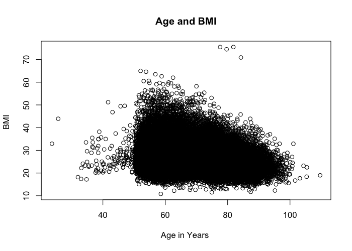
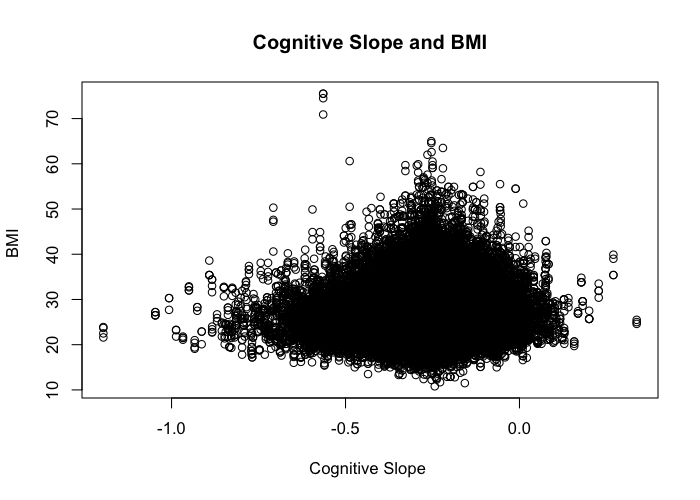

# Data Preparation for Final Project
<!-- for more options study http://rmarkdown.rstudio.com/html_document_format.html  -->
<!-- The report is produced from
REPOSITORY: the-name-of-the-repository
BRANCH: the-name-of-the-branch
PATH: ../Reports/
-->

<!--  Set the working directory to the repository's base directory; this assumes the report is nested inside of only one directory.-->


<!-- Set the report-wide options, and point to the external script file. -->


##Load Packages
Prepare RStudio environment for all tasks to follow.

```r
# Load the necessary packages.
base::require(base)
base::require(knitr)
base::require(markdown)
base::require(testit)
base::require(dplyr)
base::require(reshape2)
base::require(stringr)
base::require(stats)
base::require(ggplot2)
base::require(extrafont)
```

##HRS Data Set
#####I used data from [the Health and Retirement Study](http://hrsonline.isr.umich.edu/).  This study, is a longitudinal panel study surveying a representative sample of approximately 20,000 Americans over the age of 50 every two years. I focused on a subset of the whole data set, specifically looking at the variables: BMI, age in years, chronic conditions, depressive symptoms,  and expected cognition.


```r
# Link to the data source 
pathDir <- getwd()
myExtract <- file.path(pathDir,"data/raw/hrs_retirement")
pathSourceData <- paste0(myExtract,".csv") 
SourceData <- read.csv(pathSourceData,header=TRUE, skip=0,sep=",")
ds0 <- SourceData
```


```r
# rename variables for easier handling
ds0 <- plyr::rename(ds0, 
                    c("conde"="chronicc",
                      "hhidpn"="id",
                      "cesd"="depressivesym"
                    )
)
```


```r
dsM = ds0[ ,c("id", "wave", "chronicc","cogslope",  "depressivesym", "bmi", "cogsc", "agey", "smoken", "drink", "strok", "psych", "diab", "arthr", "cancr", "vigact")]

#knitr DeleteMissing ------------------------
sum(is.na(ds0$bmi))
```

```
[1] 2519
```

```r
dsM <- na.omit(dsM)
```
##Missing Data

####BMI is missing for 2519 participants.  The na.omit() function removed all of these rows that have missing values in any variable. I choose to remove missing values because the data set is quite large, there are many participants so the sample size will still be large.  Additionally, the missing values could skew my results.


##Brief summary of 15 variables in the data set.

```r
  summary(dsM)
```

```
       id                 wave         chronicc        cogslope       depressivesym        bmi            cogsc       
 Min.   :     2010   Min.   :2.00   Min.   :0.000   Min.   :-1.1961   Min.   :0.000   Min.   :10.80   Min.   : 4.531  
 1st Qu.: 43298040   1st Qu.:3.00   1st Qu.:1.000   1st Qu.:-0.3088   1st Qu.:0.000   1st Qu.:23.50   1st Qu.:20.394  
 Median : 81850010   Median :4.00   Median :1.000   Median :-0.2510   Median :1.000   Median :26.40   Median :23.442  
 Mean   :112861038   Mean   :4.39   Mean   :1.618   Mean   :-0.2556   Mean   :1.474   Mean   :26.98   Mean   :22.813  
 3rd Qu.:203394020   3rd Qu.:5.00   3rd Qu.:2.000   3rd Qu.:-0.1848   3rd Qu.:2.000   3rd Qu.:29.60   3rd Qu.:25.785  
 Max.   :213479020   Max.   :6.00   Max.   :8.000   Max.   : 0.3368   Max.   :8.000   Max.   :75.50   Max.   :34.369  
      agey            smoken          drink            strok             psych             diab            arthr       
 Min.   : 23.67   Min.   :0.000   Min.   :0.0000   Min.   :0.00000   Min.   :0.0000   Min.   :0.0000   Min.   :0.0000  
 1st Qu.: 59.58   1st Qu.:0.000   1st Qu.:0.0000   1st Qu.:0.00000   1st Qu.:0.0000   1st Qu.:0.0000   1st Qu.:0.0000  
 Median : 65.33   Median :0.000   Median :0.0000   Median :0.00000   Median :0.0000   Median :0.0000   Median :1.0000  
 Mean   : 67.53   Mean   :0.155   Mean   :0.4808   Mean   :0.06715   Mean   :0.1338   Mean   :0.1463   Mean   :0.5446  
 3rd Qu.: 75.00   3rd Qu.:0.000   3rd Qu.:1.0000   3rd Qu.:0.00000   3rd Qu.:0.0000   3rd Qu.:0.0000   3rd Qu.:1.0000  
 Max.   :109.67   Max.   :1.000   Max.   :1.0000   Max.   :2.00000   Max.   :1.0000   Max.   :1.0000   Max.   :1.0000  
     cancr            vigact      
 Min.   :0.0000   Min.   :0.0000  
 1st Qu.:0.0000   1st Qu.:0.0000  
 Median :0.0000   Median :0.0000  
 Mean   :0.1161   Mean   :0.4205  
 3rd Qu.:0.0000   3rd Qu.:1.0000  
 Max.   :1.0000   Max.   :1.0000  
```

##Graphical Data Exploration:


```r
plot(dsM$agey, dsM$bmi, main="Age and BMI", 
     xlab="Age in Years ", ylab="BMI ", pch=1)
```

 

####BMI appears to decrease with age.


```r
plot(dsM$cogslope, dsM$bmi, main="Cognitive Slope and BMI", 
     xlab="Cognitive Slope ", ylab="BMI ", pch=1)
```

 

####BMI and Cognitive slope appear to have a slightly inverted U shaped curve. It appears a slight decrease in cognitive slope is associated with higher a higher BMI, and no cognitive decline, or very significant cognitive decline is associated with a lower BMI.


```r
pathdsMcsv <- "./data/derived/dsM.csv"
write.csv(dsM,pathdsMcsv,  row.names=FALSE)

pathdsMrds <- "./data/derived/dsM.rds"
saveRDS(object=dsM, file=pathdsMrds, compress="xz")
```


```r
# # remove all but specified dataset
rm(list=setdiff(ls(), c("dsM")))
```


