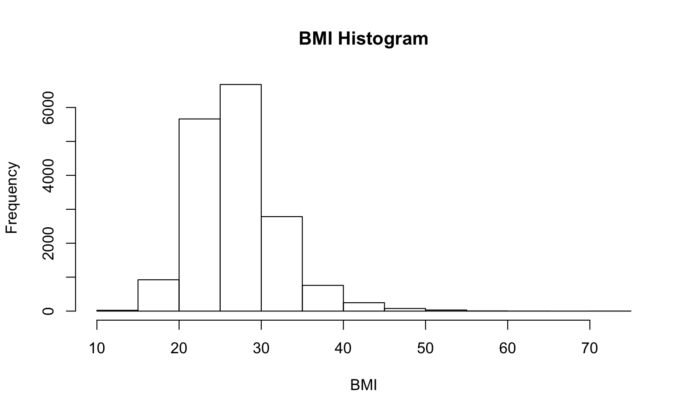
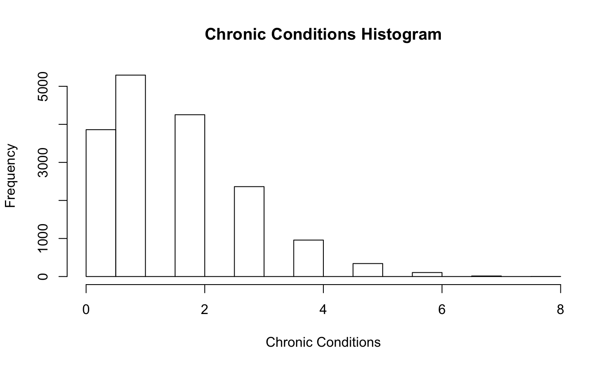
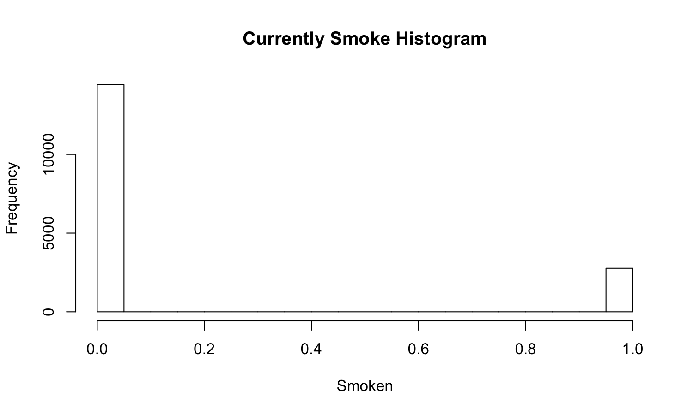
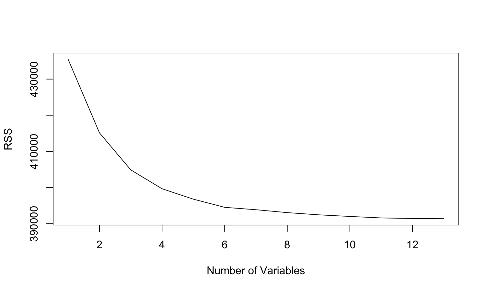
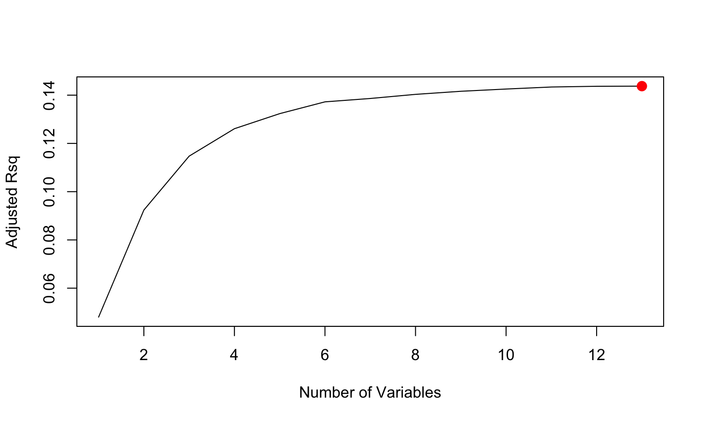
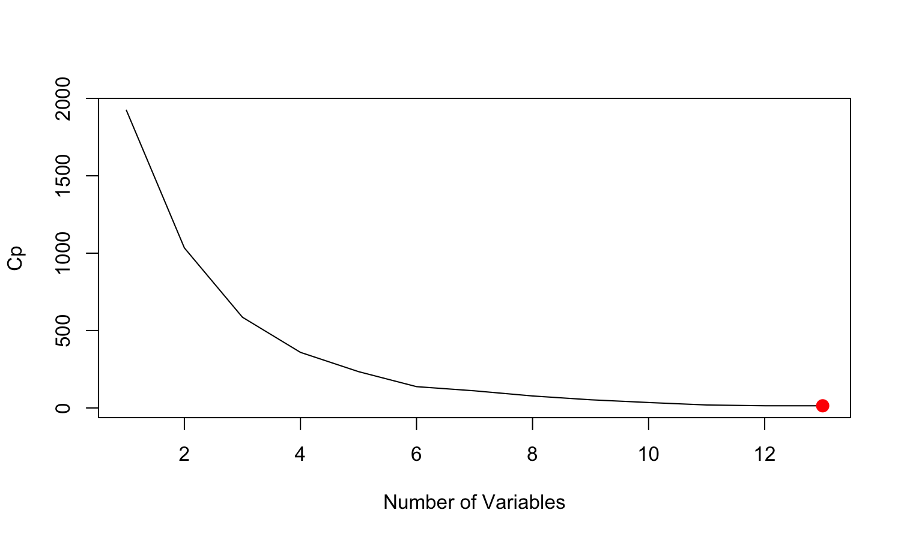
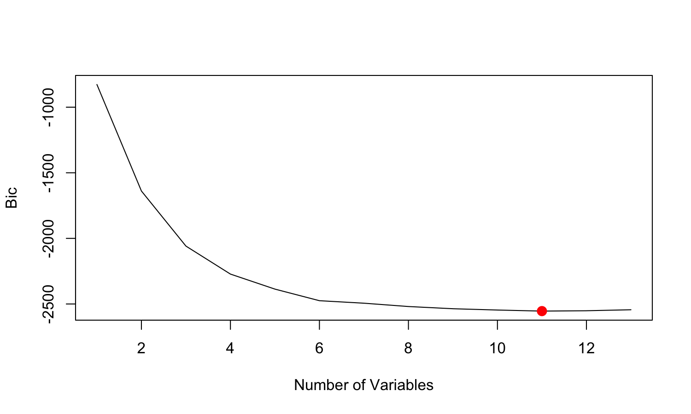
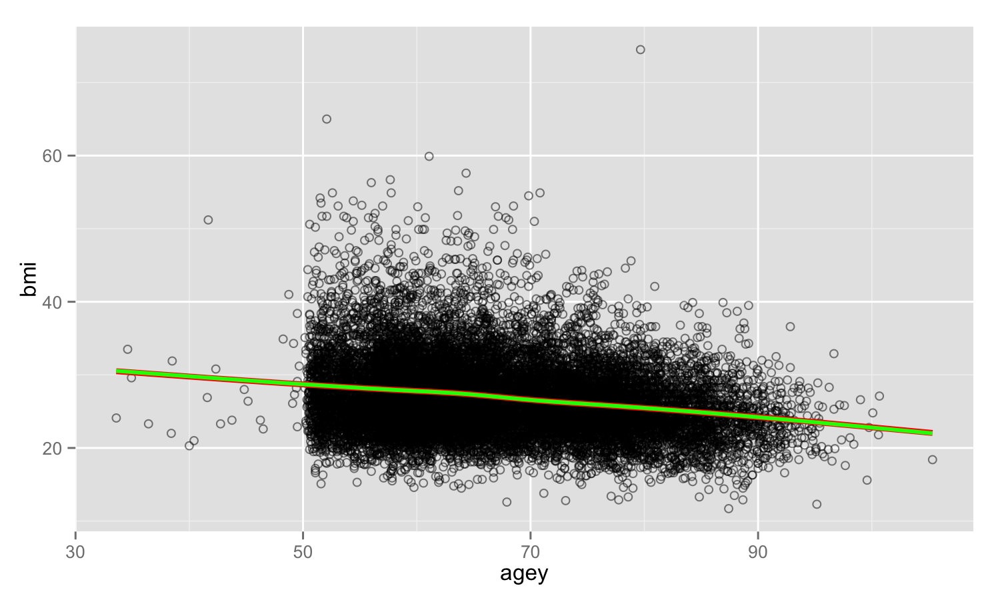
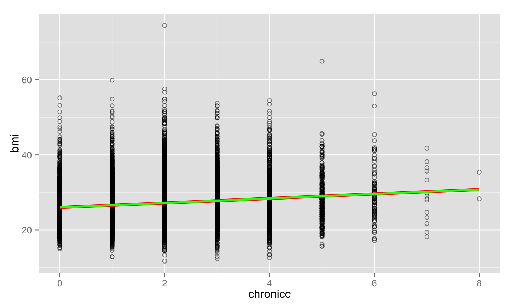
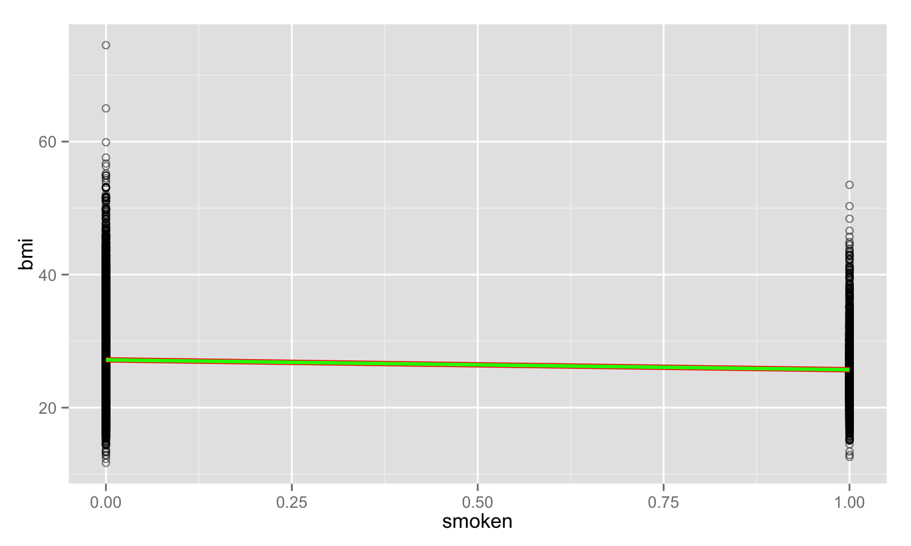

# Data Analysis for Final Project
<!-- for more options study http://rmarkdown.rstudio.com/html_document_format.html  -->
<!-- The report is produced from
REPOSITORY: the-name-of-the-repository
BRANCH: the-name-of-the-branch
PATH: ../Reports/
-->

<!--  Set the working directory to the repository's base directory; this assumes the report is nested inside of only one directory.-->


<!-- Set the report-wide options, and point to the external script file. -->


##Slide 1
Load Packages
Prepare RStudio environment for all tasks to follow.

```r
# Load the necessary packages.
base::require(base)
base::require(knitr)
base::require(markdown)
base::require(testit)
base::require(dplyr)
base::require(reshape2)
base::require(stringr)
base::require(stats)
base::require(ggplot2)
base::require(extrafont)
```

##Slide 2
Summary of the data set

```r
dsM <- readRDS("./data/derived/dsM.rds")

summary(dsM)
```

```
       id               chronicc        cogslope       depressivesym        bmi            cogsc       
 Min.   :     3010   Min.   :0.000   Min.   :-1.1961   Min.   :0.000   Min.   :12.80   Min.   : 6.497  
 1st Qu.: 43956032   1st Qu.:1.000   1st Qu.:-0.3074   1st Qu.:0.000   1st Qu.:23.40   1st Qu.:20.504  
 Median : 82968540   Median :1.000   Median :-0.2509   Median :1.000   Median :26.30   Median :23.430  
 Mean   :113784873   Mean   :1.593   Mean   :-0.2548   Mean   :1.522   Mean   :26.82   Mean   :22.824  
 3rd Qu.:203411768   3rd Qu.:2.000   3rd Qu.:-0.1832   3rd Qu.:2.000   3rd Qu.:29.40   3rd Qu.:25.748  
 Max.   :213479020   Max.   :7.000   Max.   : 0.1406   Max.   :8.000   Max.   :70.90   Max.   :33.261  
      agey            smoken           drink            strok            psych             diab            arthr       
 Min.   : 39.42   Min.   :0.0000   Min.   :0.0000   Min.   :0.0000   Min.   :0.0000   Min.   :0.0000   Min.   :0.0000  
 1st Qu.: 59.83   1st Qu.:0.0000   1st Qu.:0.0000   1st Qu.:0.0000   1st Qu.:0.0000   1st Qu.:0.0000   1st Qu.:0.0000  
 Median : 65.42   Median :0.0000   Median :0.0000   Median :0.0000   Median :0.0000   Median :0.0000   Median :1.0000  
 Mean   : 67.77   Mean   :0.1604   Mean   :0.4698   Mean   :0.0682   Mean   :0.1314   Mean   :0.1432   Mean   :0.5424  
 3rd Qu.: 75.08   3rd Qu.:0.0000   3rd Qu.:1.0000   3rd Qu.:0.0000   3rd Qu.:0.0000   3rd Qu.:0.0000   3rd Qu.:1.0000  
 Max.   :105.33   Max.   :1.0000   Max.   :1.0000   Max.   :2.0000   Max.   :1.0000   Max.   :1.0000   Max.   :1.0000  
     cancr            vigact      
 Min.   :0.0000   Min.   :0.0000  
 1st Qu.:0.0000   1st Qu.:0.0000  
 Median :0.0000   Median :0.0000  
 Mean   :0.1102   Mean   :0.4284  
 3rd Qu.:0.0000   3rd Qu.:1.0000  
 Max.   :1.0000   Max.   :1.0000  
```

##Slide 3
Histograms
###What is the distribution of BMI in the sample.

```r
hist(dsM$bmi, xlab="BMI", main="BMI Histogram")
```

 

####BMI is typically between typically between 13 and 55, the mean BMI is 27.


###What is the distribution of chronic conditions in the sample.

```r
hist(dsM$chronicc, xlab="Chronic Conditions", main="Chronic Conditions Histogram")
```

 


####Chronic conditions range from 0-8, people most frequently report having one chronic condition, although reports of no chronic conditions and two chronic conditions are also quite common.


###What is the distribution of people who smoke versus people who do not currently smoke in the sample.

```r
hist(dsM$smoken, xlab="Smoken", main="Currently Smoke Histogram")
```

 

```r
table(dsM$smoken)
```

```

   0    1 
4198  802 
```


####The majority of people do not smoke. Specifically, 4229 people currently do not smoke, compared to the 771 individuals who do currently smoke. 


Best Subset Selection


```r
library(leaps)
regfit.full=regsubsets(bmi~.,dsM, nvmax=14)
summary(regfit.full)
```

```
Subset selection object
Call: regsubsets.formula(bmi ~ ., dsM, nvmax = 14)
14 Variables  (and intercept)
              Forced in Forced out
id                FALSE      FALSE
chronicc          FALSE      FALSE
cogslope          FALSE      FALSE
depressivesym     FALSE      FALSE
cogsc             FALSE      FALSE
agey              FALSE      FALSE
smoken            FALSE      FALSE
drink             FALSE      FALSE
strok             FALSE      FALSE
psych             FALSE      FALSE
diab              FALSE      FALSE
arthr             FALSE      FALSE
cancr             FALSE      FALSE
vigact            FALSE      FALSE
1 subsets of each size up to 14
Selection Algorithm: exhaustive
          id  chronicc cogslope depressivesym cogsc agey smoken drink strok psych diab arthr cancr vigact
1  ( 1 )  " " " "      " "      " "           " "   "*"  " "    " "   " "   " "   " "  " "   " "   " "   
2  ( 1 )  " " "*"      " "      " "           " "   "*"  " "    " "   " "   " "   " "  " "   " "   " "   
3  ( 1 )  " " "*"      " "      " "           " "   "*"  "*"    " "   " "   " "   " "  " "   " "   " "   
4  ( 1 )  " " "*"      " "      " "           " "   "*"  "*"    " "   " "   " "   "*"  " "   " "   " "   
5  ( 1 )  " " "*"      " "      " "           " "   "*"  "*"    " "   " "   " "   "*"  "*"   " "   " "   
6  ( 1 )  " " "*"      " "      " "           " "   "*"  "*"    " "   " "   " "   "*"  "*"   " "   "*"   
7  ( 1 )  " " "*"      " "      " "           " "   "*"  "*"    " "   " "   " "   "*"  "*"   "*"   "*"   
8  ( 1 )  " " "*"      " "      " "           " "   "*"  "*"    " "   " "   "*"   "*"  "*"   "*"   "*"   
9  ( 1 )  " " "*"      " "      " "           " "   "*"  "*"    " "   "*"   "*"   "*"  "*"   "*"   "*"   
10  ( 1 ) " " "*"      " "      " "           " "   "*"  "*"    "*"   "*"   "*"   "*"  "*"   "*"   "*"   
11  ( 1 ) " " "*"      " "      " "           "*"   "*"  "*"    "*"   "*"   "*"   "*"  "*"   "*"   "*"   
12  ( 1 ) " " "*"      " "      "*"           "*"   "*"  "*"    "*"   "*"   "*"   "*"  "*"   "*"   "*"   
13  ( 1 ) "*" "*"      " "      "*"           "*"   "*"  "*"    "*"   "*"   "*"   "*"  "*"   "*"   "*"   
14  ( 1 ) "*" "*"      "*"      "*"           "*"   "*"  "*"    "*"   "*"   "*"   "*"  "*"   "*"   "*"   
```

```r
reg.summary=summary(regfit.full)
```
###What variables to include in a 1,2,3...14 variable model. Best subset selection creates a set of models, each of which contains a subset of the p predictors.  We have to determine which of these models is best.  We can look at R^2, RSS to further interpret the model.  We can look at adjusted R^2, Cp and BIC to try to select the best overall model.


How much variance does R^2 account for when only one variable is included compared to when 10 variables are included.

```r
reg.summary$rsq 
```

```
 [1] 0.03689382 0.08996185 0.11375203 0.12376951 0.13184460 0.13623208 0.13812492 0.13972652 0.14114271 0.14197887
[11] 0.14229231 0.14240339 0.14250031 0.14250678
```


####The R^2 statistic increases from 4.4% to 14.9% when all variables are included.  R^2 will always increase monotonically as more variables are included in the model, thus this isn't sufficient for selecting which model we should use. 

#####In a model with one predictor variable (in this case, age), that variable (age) explains 4.4% of the variance in the outcome variable (BMI).  When you include ten predictor variables, together they explain almost 15% of the variability in BMI. 

###Plot RSS for each number of variables. 

```r
par(mfrow=c(2,3))
plot(reg.summary$rss, xlab="Number of Variables", ylab="RSS", type="l")
```

 


####The model containing the greatest number of predictors will always have the smallest RSS.  Thus, this too is not sufficient in deciding which model is best. 


###Plot adjusted R squared for each number of variables.

```r
plot(reg.summary$adjr2, xlab="Number of Variables", ylab= "Adjusted Rsq", type="l")

which.max(reg.summary$adjr2)
```

```
[1] 11
```

```r
#Add a point to indicate the model with the largest adjusted R^2 statistic
points (12, reg.summary$adjr2[12], col="red", cex=2, pch=20)
```

 


####R^2 increases with each added predictor.  The model with the highest R^2 is the model with 12 predictors.

###Plot Cp for each number of variables.

####The Cp statistic essentially adjusts for the fact that training error tends to underestimate test error. We choose the model with the lowest Cp when determining which set of models is best.

```r
plot(reg.summary$cp, xlab="Number of Variables", ylab="Cp", type="l")
which.min(reg.summary$cp)
```

```
[1] 10
```

```r
points (11, reg.summary$cp[11], col="red", cex=2, pch=20)
```

 


####Cp decreases with each added predictor.  The model with the lowest Cp is the model with 11 predictors.


###Plot BIC for each number of variables. BIC is derived from a Bayesian point of view.  Tends to take on a small value for a model with low test error, so we should select the model with the lowest BIC value.  

```r
plot(reg.summary$bic, xlab="Number of Variables", ylab="Bic", type="l")
which.min(reg.summary$bic)
```

```
[1] 8
```

```r
points (8, reg.summary$bic[8], col="red", cex=2, pch=20)
```

 


####The lowest BIC occurs in the mdoel with 8 variables. 


###What are the coefficients included in each model:

####The model with 12 predictors includes chronic conditions, depressive symptoms, expected cognition, age in years, current smoking, drinking, stroke, psychiatric condition, diabetes, arthritis, cancer, and vigorous activity. 

```r
coef(regfit.full, 12)
```

```
  (Intercept)      chronicc depressivesym         cogsc          agey        smoken         drink         strok 
  36.68217145    0.66195337    0.03022326   -0.02354922   -0.14946416   -2.19582579   -0.26354903   -0.77905738 
        psych          diab         arthr         cancr        vigact 
  -0.77928427    1.54893437    0.89969497   -0.84670069   -0.64922280 
```

####The model with 11 predictors has all of the above predictors, but takes depressive symptoms out of the model.  

```r
coef(regfit.full, 11)
```

```
(Intercept)    chronicc       cogsc        agey      smoken       drink       strok       psych        diab       arthr 
36.81156134  0.66632937 -0.02650083 -0.14984955 -2.18195011 -0.27044234 -0.78122548 -0.73873118  1.54838719  0.90837071 
      cancr      vigact 
-0.84797953 -0.66213057 
```

####The model with 8 predictors includes chronic conditions, expected cognition, age in years, current smoking, diabetes, arthritis, cancer, and vigorous activity. 


```r
coef(regfit.full, 8)
```

```
(Intercept)    chronicc        agey      smoken       psych        diab       arthr       cancr      vigact 
 35.7050971   0.5977261  -0.1445394  -2.1802112  -0.6473543   1.6436927   1.0090112  -0.8186407  -0.6926426 
```


Linear Model with Twelve Predictors

```r
lm.fit = lm(bmi~chronicc + depressivesym + cogsc + agey + smoken + drink + strok + psych + diab + arthr + cancr + vigact, data=dsM)
summary(lm.fit)
```

```

Call:
lm(formula = bmi ~ chronicc + depressivesym + cogsc + agey + 
    smoken + drink + strok + psych + diab + arthr + cancr + vigact, 
    data = dsM)

Residuals:
    Min      1Q  Median      3Q     Max 
-14.292  -3.095  -0.398   2.507  45.225 

Coefficients:
               Estimate Std. Error t value Pr(>|t|)    
(Intercept)   36.682171   0.880413  41.665  < 2e-16 ***
chronicc       0.661953   0.082316   8.042 1.10e-15 ***
depressivesym  0.030223   0.037605   0.804 0.421610    
cogsc         -0.023549   0.019970  -1.179 0.238353    
agey          -0.149464   0.008138 -18.367  < 2e-16 ***
smoken        -2.195826   0.186507 -11.773  < 2e-16 ***
drink         -0.263549   0.139903  -1.884 0.059650 .  
strok         -0.779057   0.261430  -2.980 0.002897 ** 
psych         -0.779284   0.219349  -3.553 0.000385 ***
diab           1.548934   0.220542   7.023 2.46e-12 ***
arthr          0.899695   0.164858   5.457 5.07e-08 ***
cancr         -0.846701   0.230737  -3.670 0.000246 ***
vigact        -0.649223   0.138298  -4.694 2.75e-06 ***
---
Signif. codes:  0 '***' 0.001 '**' 0.01 '*' 0.05 '.' 0.1 ' ' 1

Residual standard error: 4.696 on 4987 degrees of freedom
Multiple R-squared:  0.1424,	Adjusted R-squared:  0.1403 
F-statistic: 69.01 on 12 and 4987 DF,  p-value: < 2.2e-16
```


####Depressive symptoms, current drinking, and psychiatric conditions were the three predictor variables that do were not significantly associated with BMI.  


Linear Model with Eleven Predictors

```r
lm.fit2 = lm(bmi~chronicc + depressivesym + cogsc + agey + smoken + strok + psych + diab + arthr + cancr + vigact, data=dsM)
summary(lm.fit2)
```

```

Call:
lm(formula = bmi ~ chronicc + depressivesym + cogsc + agey + 
    smoken + strok + psych + diab + arthr + cancr + vigact, data = dsM)

Residuals:
    Min      1Q  Median      3Q     Max 
-14.213  -3.103  -0.403   2.541  45.048 

Coefficients:
              Estimate Std. Error t value Pr(>|t|)    
(Intercept)   36.67448    0.88063  41.646  < 2e-16 ***
chronicc       0.66587    0.08231   8.090 7.45e-16 ***
depressivesym  0.03457    0.03754   0.921 0.357260    
cogsc         -0.02954    0.01972  -1.498 0.134157    
agey          -0.14931    0.00814 -18.344  < 2e-16 ***
smoken        -2.22403    0.18595 -11.960  < 2e-16 ***
strok         -0.77206    0.26147  -2.953 0.003164 ** 
psych         -0.76534    0.21928  -3.490 0.000487 ***
diab           1.57415    0.22019   7.149 1.00e-12 ***
arthr          0.90911    0.16482   5.516 3.65e-08 ***
cancr         -0.86359    0.23062  -3.745 0.000183 ***
vigact        -0.66601    0.13805  -4.825 1.44e-06 ***
---
Signif. codes:  0 '***' 0.001 '**' 0.01 '*' 0.05 '.' 0.1 ' ' 1

Residual standard error: 4.697 on 4988 degrees of freedom
Multiple R-squared:  0.1418,	Adjusted R-squared:  0.1399 
F-statistic: 74.92 on 11 and 4988 DF,  p-value: < 2.2e-16
```


####Depressive symptoms and psychiatric conditions were still not associated with BMI in a model with 11 predictors.


Linear model with Eight Predictors


```r
lm.fit3 = lm(bmi~chronicc + cogsc + agey + smoken + diab + arthr + cancr + vigact, data=dsM)
summary(lm.fit3)
```

```

Call:
lm(formula = bmi ~ chronicc + cogsc + agey + smoken + diab + 
    arthr + cancr + vigact, data = dsM)

Residuals:
    Min      1Q  Median      3Q     Max 
-14.313  -3.108  -0.397   2.572  45.300 

Coefficients:
             Estimate Std. Error t value Pr(>|t|)    
(Intercept) 36.568413   0.863695  42.339  < 2e-16 ***
chronicc     0.509276   0.073032   6.973 3.50e-12 ***
cogsc       -0.027871   0.019324  -1.442  0.14929    
agey        -0.147620   0.008079 -18.272  < 2e-16 ***
smoken      -2.218518   0.185430 -11.964  < 2e-16 ***
diab         1.702730   0.218340   7.799 7.57e-15 ***
arthr        1.037162   0.161806   6.410 1.59e-10 ***
cancr       -0.730109   0.228776  -3.191  0.00142 ** 
vigact      -0.669046   0.137230  -4.875 1.12e-06 ***
---
Signif. codes:  0 '***' 0.001 '**' 0.01 '*' 0.05 '.' 0.1 ' ' 1

Residual standard error: 4.704 on 4991 degrees of freedom
Multiple R-squared:  0.1385,	Adjusted R-squared:  0.1371 
F-statistic: 100.3 on 8 and 4991 DF,  p-value: < 2.2e-16
```


####All variables were significantly associated with BMI in the model with 8 predictors.  The 8 variable model is more parsimonious.


Plot Age and BMI

```r
p <- ggplot2::ggplot(data=dsM, aes(x=agey, y=bmi)) +
  geom_point()+
  geom_jitter()
p
```

 

Plot Smoking and BMI

```r
p <- ggplot2::ggplot(data=dsM, aes(x=smoken, y=bmi)) +
  geom_point()+
  geom_jitter()
p
```

 

Plot Diabetes and BMI

```r
p <- ggplot2::ggplot(data=dsM, aes(x=diab, y=bmi)) +
  geom_point()+
  geom_jitter()
p
```

 

Conclusion
####
