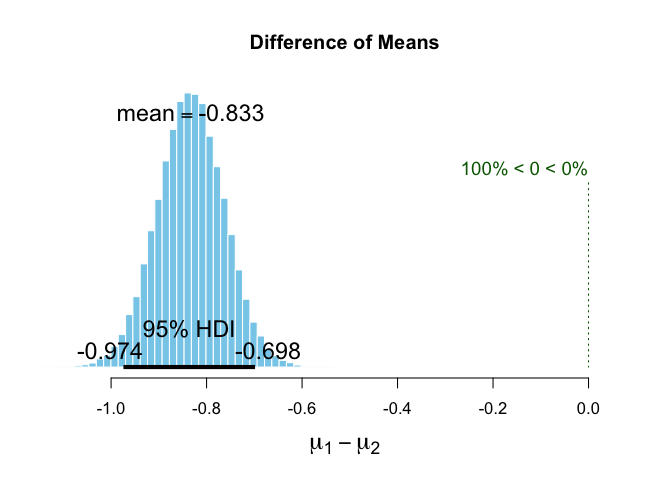
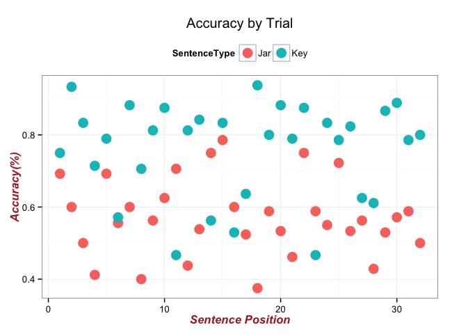
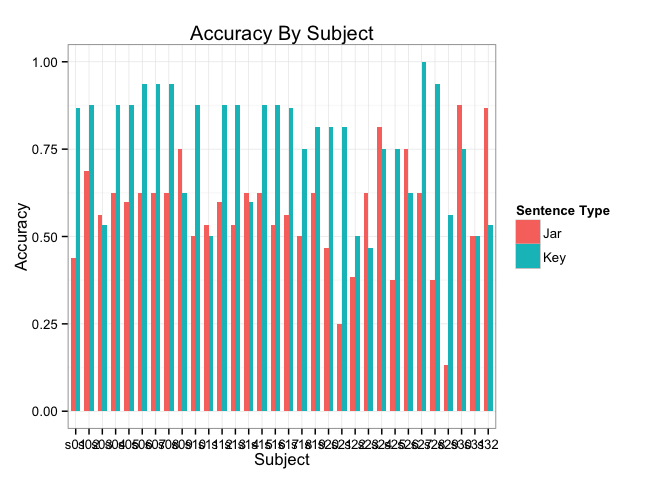
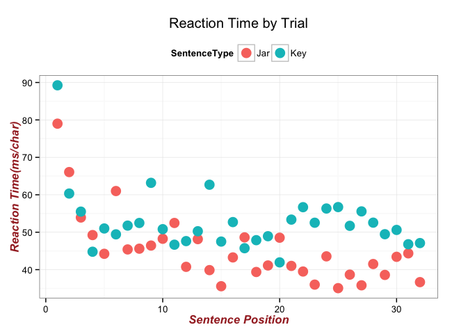
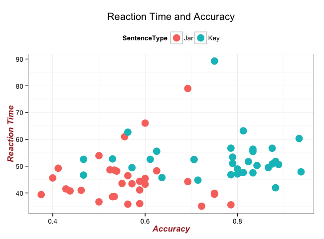

# Dial turning test analysis- Morgan Teskey
<!-- for more options study http://rmarkdown.rstudio.com/html_document_format.html  -->
<!-- The report is produced from
REPOSITORY: the-name-of-the-repository
BRANCH: the-name-of-the-branch
PATH: ../Reports/
-->

<!--  Set the working directory to the repository's base directory; this assumes the report is nested inside of only one directory.-->


<!-- Set the report-wide options, and point to the external script file. -->


#Introduction

Before reading this analysis complete the following fun activty!  
Answer these four questions with either 'counterclockwise' or 'clockwise' and remember your answers.   
1) Which way do you turn a lightbulb to unscrew it?  
2) Which way do you turn your car wheel to turn right?  
3) Which way do you turn your cars volume knob to increase the volume?  
4) Which way do you turn a jar lid to open it?   

Did you answer 1) Counterclockwise, 2)Clockwise, 3)Clockwise, 4)Counterclockwise?   
Would most people? Are any of those questions more likely to be incorrectly answered than the others- would any take longer to answer?

Why ask these questions?    

Highly cited studies in the field of emobodied cognition claim that reading a sentence about someone preforming a motor action involves the simulation of one's own motor system in a task-relevant way.  For instance, reading the sentence "The boy kicked the soccer ball" simulates the portion of the readers motor system that would be activited if the reader was the one kicking the ball.  This phenomenon can be tested using a dial turning paradigm wherein particpants progress through fragmented sentences by turning a dial mechanism either clockwise or counterclockwise. Critical sentences will describe an actor preforming a task such as sharpening a pencil or opening a water bottle. A study by Zwann and Taylor (2006) showed an increase in reading speed for trials where the dial was being turned in a direction congruent with the action being taken in the sentence. In 2015 a study by Claus provided evidence of the opposite effect- a match between the described and participant action led to longer reading times. However, in this second study the actions described pertained only to the opening and closing of containers such as jars or bottles. We hypothesize that this effect reversal was seen because in contrast to actual motor experience when opening and closing containers, people operate with a semantic misconception that opening is done with a clockwise turn and closing is achieved with a counterclockwise turn. To test this theory, 32 participants completed a task as part of a larger replicative study in which they read 32 sentences describing an actor carrying out a clockwise or counterclockwise action and using a dial mechanism, turned in the direction they believed matched the described action. Accuracy rates and reaction times were recorded. Below is an analysis of the results of this test. We begin be loading the nessesary packages into R:


```r
# Load the necessary packages.
base::require(base)
base::require(knitr)
base::require(markdown)
base::require(testit)
base::require(dplyr)
base::require(reshape2)
base::require(stringr)
base::require(stats)
base::require(ggplot2)
base::require(extrafont)
```
  Next we load in our data. These data files were prepared using the dial data preparation script included in the README. 'dssub' is a data set in which data is averaged across trials and reported for each partcipant. 'dssent' contains information about each trial and is averaged across subjects. We will be using both in the analysis to see how our dependent variables of reaction time and accuracy differ by subject and by trial. 
  

```r
# Link to the data source 
dssent <- readRDS("./data/derived/dialsentence.rds")
dssub <- readRDS("./data/derived/dialsubject.rds")
```

#Accuracy

  The most important question we want to ask is if people do infact have a misunderstanding about which direction they turn to open a jar. Therefore to begin the analysis we want to examine if accuracy rates differ significantly between sentences describing the opening/closing of contianers (here denoated by 'Jar') and other sentences that contain a clockwise/counterclockwise action but not accosicated with opening/closing containers (here called 'Key' sentences). We run a t-test to see if accuracy is different for Jar or Key sentences:


```r
tac<-t.test(dssub$accuracy~dssub$type)
tac
```

```

	Welch Two Sample t-test

data:  dssub$accuracy by dssub$type
t = -4.7706, df = 61.994, p-value = 1.156e-05
alternative hypothesis: true difference in means is not equal to 0
95 percent confidence interval:
 -0.2728455 -0.1117098
sample estimates:
mean in group Jar mean in group Key 
        0.5691807         0.7614583 
```

  There is a significant difference in accuracy rates between two sentence types.  The mean accuracy for 'Key' sentences is 76% and only 57% for Jar sentences. This is consistent with our hypothesis that people have a inherent misunderstanding of which direction you turn a lid to open a container. We preform opening/closing actions constantly in our daily life so incorrectly identifying what direction we turn to do this over 40% of the time is alarming.   
The low p-value and 95% confidence intervals lend strong support for us to reject the null. We can also create best posteriour distributions for a more informative look at what the probable value of this effect is:
  

```r
library(BEST)
bestout<-BESTmcmc(dssub$accuracy,dssub$type, verbose=FALSE)
summary(bestout)
```

```
            mean median   mode HDI%  HDIlo   HDIup compVal %>compVal
mu1        0.666  0.666  0.667   95  0.618   0.713                  
mu2        1.499  1.499  1.501   95  1.368   1.627                  
muDiff    -0.833 -0.833 -0.838   95 -0.974  -0.698       0         0
sigma1     0.187  0.186  0.182   95  0.154   0.222                  
sigma2     0.514  0.511  0.503   95  0.426   0.609                  
sigmaDiff -0.327 -0.324 -0.315   95 -0.430  -0.232       0         0
nu        56.298 48.423 33.248   95  9.510 123.388                  
log10nu    1.678  1.685  1.719   95  1.176   2.156                  
effSz     -2.166 -2.165 -2.175   95 -2.664  -1.676       0         0
```

```r
plot(bestout)
```



  The 95% highest density interval shows that the size of the effect of sentence type is likely not zero and responses to 'Jar' sentences are in fact different than those to 'Key' sentences. We can now graph this relationship and inspect it further.  As it seems plausible that participants may become more accurate with experience as they progress through the experiment we can plot accuracy over experimental trials. The sentence presentation order was randomized between subjects therefore 'sentence position' should not be biased towards representing any specific sentence type. 
  
##By Trial


```r
names(dssent)
```

```
[1] "type"     "pos"      "rt"       "accuracy"
```

```r
#Accuracy by temporal trial 
SentenceType <- factor(dssent$type)
SentAC<-ggplot(dssent, aes(x = dssent$pos, y = dssent$accuracy, colour =SentenceType)) + geom_point(size=5)+
  ggtitle("Accuracy by Trial")+
  labs(x="Sentence Position", y="Accuracy(%)")+
  theme_bw()+ theme(axis.title=element_text(face="bold.italic", 
                                            size="12", color="brown"), legend.position="top")
SentAC
```



  There does not appear to be a trend in changing accuracy over experimental trials. This graph does however nicely illustrate the tendency for 'Key' stimuli to be more accurately assesed than 'Jar' sentences, as is consistent with out hypothesis. We can also inspect accuracy rates by partcipant visually:
  
##By Subject


```r
SentenceType<-dssub$type
means.barplot <- qplot(x=dssub$subject, y=dssub$accuracy, fill=SentenceType, width=0.7,
                       data=dssub, geom="bar", stat="identity",
                       position="dodge")+
  theme_bw()+
  scale_fill_hue(name="Sentence Type")+
  xlab("Subject") +
  ylab("Accuracy") +
  ggtitle("Accuracy By Subject") 

means.barplot
```



  From inspecting the graph we can see that the majority of particpants show the same pattern of higher accuracy on 'Key' over 'Jar' trials.    
In addition to accuracy data, reaction times were also recorded from this experiment. This is the time between the presentation of the sentence and the turning of the dial divided by the total number of characters in the sentence. As with accuracy we can assess if sentence type leads to differential reaction times.

#Reaction Times


```r
SentenceType <- factor(dssent$type)
SentRT<-ggplot(dssent, aes(x = dssent$pos, y = dssent$rt, colour =SentenceType)) + geom_point(size=5)+
  ggtitle("Reaction Time by Trial")+
  labs(x="Sentence Position", y="Reaction Time(ms/char)")+
  theme_bw()+ theme(axis.title=element_text(face="bold.italic", 
                                            size="12", color="brown"), legend.position="top")
SentRT
```



  It appears that reaction times are long for the first 4 trials and then level out for the rest of the experiment. Behaviourly this is likely a practice effect and irrelevant to the conclusions of the study. Data is variable but it appears as though 'Key' sentences take longer to responde to than 'Jar' sentences. We can test the significance of this trend using a t-test:
  

```r
Trt<-t.test(dssub$rt~dssub$type)
Trt
```

```

	Welch Two Sample t-test

data:  dssub$rt by dssub$type
t = -2.9118, df = 61.573, p-value = 0.004999
alternative hypothesis: true difference in means is not equal to 0
95 percent confidence interval:
 -13.210641  -2.454784
sample estimates:
mean in group Jar mean in group Key 
         45.10010          52.93281 
```

  The two sample t-test shows that reaction time is significantly different for the two sentence types using null hypothesis significance testing. The p-value is 0.0049
We can also look for evidence of a relationship between our two dependent variables (accuracy and reaction time) by plotting accuracy and reaction time together:

#Accuracy and Reaction Time


```r
SentenceType <- factor(dssent$type)
RtAC<-ggplot(dssub, aes(x = dssent$accuracy, y = dssent$rt, colour =SentenceType)) + geom_point(size=5)+
  ggtitle("Reaction Time and Accuracy")+
  labs(x="Accuracy", y="Reaction Time")+
  theme_bw()+ theme(axis.title=element_text(face="bold.italic", 
                                            size="12", color="brown"), legend.position="top")
RtAC
```


From visual inspection there is no obvious correlation of our variables. We can see that Key sentences are more accurately assessed and take longer to react to than Jar sentences so we can conclude this data analysis and move to our conclusions. 

#Conclusions

Jar sentences elicit responses more quickly than Key sentences, but are also more often incorrect.  There could be many reasons for this but the more important implication of this study is that over 40% of responses indicating which way to turn to open/close a jar were incorrect. If this action truly was embodied how could accuracy rates be so low? This calls into question the conclusions made by past researchers claiming congruency effects found with a dial-turning paradigm are a result of emobodied processing. 
