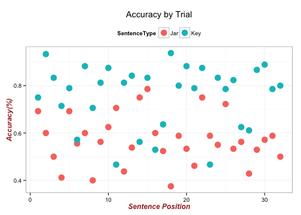
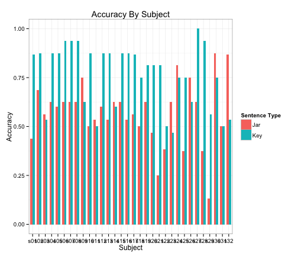
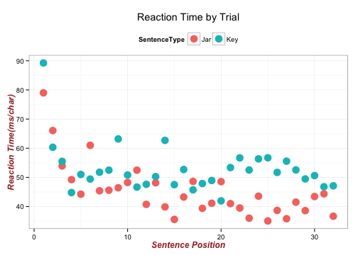
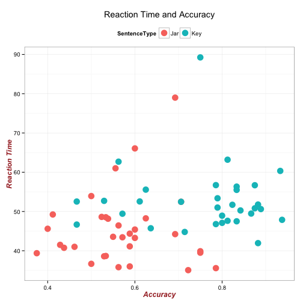

---
title       : Dial Turning Test
subtitle    : 532 Final Report
author      : Morgan Teskey
framework   : revealjs   # {io2012, html5slides, shower, dzslides, ...}
highlighter : highlight.js # {highlight.js, prettify, highlight}
hitheme     : googlecode      # 
revealjs    :
  theme: Sky
  transition: slide
  center: "true"
widgets     : quiz # {mathjax, quiz, bootstrap}
mode        : selfcontained # {standalone, draft}
knit        : slidify::knit2slides

--- .class id# bg:#dcead4

## Dial Turning Test
### 532 Final Report
<br>
#### Morgan Teskey 
##### December 7, 2015

--- .class id# bg:#dcead4

### Pop Quiz

#### Answer these four questions with either 'counterclockwise' or 'clockwise'

1. Which way do you turn a lightbulb to unscrew it?  
<br>
2. Which way do you turn your car wheel to turn right?  
<br>
3. Which way do you turn your cars volume knob to increase the volume?  
<br>
4. Which way do you turn a jar lid to open it?  
<br>
Which, if any, questions did you get wrong?  Is there any particular question that took longer to think about? Is there any question that stands out as being the hardest to answer?  
<br>

We will come back to this in a minute. 

--- .class #id bg:#dcead4

### The Question of Embodied Reading

Does reading sentences that describe an action activate motor processes associated with that action?  
<br>
Tested with a dial turning paradigm  
<br>
Study 1: Reading times were faster when the subject was turning in a way congruent with the actor and slower when they were turning in an incongruent direction.      
<br>
Study 2: Reading times were slower when the subject was turning in a way congruent with the actor and faster when they were turning in an incongruent direction.      
<br>
The critical difference between these two studies were the types of actions being described in the sentence  

--- .class #id bg:#dcead4
### Current Study

<i>The Question</i>: Do we respond differently to sentences describing opening/closing actions than sentences describing other clockwise/counterclockwise motions?  
<br>

<i>The Task</i>: After completing a task aimed to replicate the results of study 1 and 2, 32 partcipants completed a short post-test in which they read 32 sentences describing an actor carrying out a clockwise or counterclockwise action. Using a dial mechanism in front of the subjects turned the dial in the direction they believed matched the direction of the actor in the sentence.      
<br>

<i>The Hypothesis</i>: Opening/closing sentences will be responded to incorrectly more often than other critical sentences.   
<br>

<i>The Data</i>: We can now use R to analyze the results of this post-test.   

--- .class #id bg:#dcead4
## Loading Packages
First we load into R the packages nessesary for the analysis:

```r
base::require(base)
base::require(knitr)
base::require(markdown)
base::require(testit)
base::require(dplyr)
base::require(reshape2)
base::require(stringr)
base::require(stats)
base::require(ggplot2)
base::require(extrafont)
```

--- .class #id bg:#dcead4
## Loading Data
There are two data sets for this study- <i>ddsub</i> presents means for each participant across trials and <i>dssent</i> presents means for trials averaged across particpants. 

```r
dssent <- readRDS("../../data/derived/dialsentence.rds")
dssub <- readRDS("../../data/derived/dialsubject.rds")
```

--- .class #id bg:#dcead4
## Comparing Sentence Types
#### Accuracy
We can first see if subjects differ in their accuracy when responding to the two sentence types. We use 'Jar' to denote any sentences that refer to opening/closing a container and 'Key' to refer to any other sentences describing clockwise or counterclockwise actions. 


```

	Welch Two Sample t-test

data:  dssub$accuracy by dssub$type
t = -4.7706, df = 61.994, p-value = 1.156e-05
alternative hypothesis: true difference in means is not equal to 0
95 percent confidence interval:
 -0.2728455 -0.1117098
sample estimates:
mean in group Jar mean in group Key 
        0.5691807         0.7614583 
```
There is a significant difference in accuracy rates for the two sentence types- with Key sentences being answered correctly 20% more often than Jar sentences. 

--- .class #id bg:#dcead4
## Comparing Sentence Types
#### Accuracy 
We can now inspect these different accuracy rates visually. It is reasonable to estimate that accuracy may change over the course of the experiment with exposure, so here we will plot accuracy averaged across subjects by the experimental trial number.  
<br>



--- .class #id bg:#dcead4
## Comparing Sentence Types
#### Accuracy 
We can also look at the pattern of accuracy rates by subject:  
<br>



--- .class #id bg:#dcead4
## Comparing Sentence Types
#### Reaction Time
Reation Times reflect the amount of time between sentence presentation and a responce initialtion on the dial mechanism divided by the number of characters in the sentence as a means of standardization. 
As with accuracy we can first run a t-test of reaction times by sentence type.

```

	Welch Two Sample t-test

data:  dssub$rt by dssub$type
t = -2.9118, df = 61.573, p-value = 0.004999
alternative hypothesis: true difference in means is not equal to 0
95 percent confidence interval:
 -13.210641  -2.454784
sample estimates:
mean in group Jar mean in group Key 
         45.10010          52.93281 
```
Jar reaction times are significantly faster than Key reaction times.

--- .class #id bg:#dcead4
## Comparing Sentence Types
#### Reaction Time 
Key reaction times are significantly longer than Jar sentence reaction times. As wil accuracy we can plot this to see if it changes over the course of the experiment:  
<br>



--- .class #id bg:#dcead4
### Comparing Sentence Types
#### Accuracy and Reaction Time
Finally we can plot accuracy and reaction time together to discern if there is a relationship between the two variables:
<br>

 

--- .class #id bg:#dcead4
### Conclusions
These results support our hypothesis that 'Jar' sentences are responded to less accurately than 'Key' sentences. 
<br>

A 57% accuracy rate for 'Jar' are shockingly low.  According to the claims of the two studies described in the introduction, our knowledge of turning directions is implicit and emobodied. If subjects missunderstand which way the actor in the sentence is turning 43% of the time how can any conclusions about congruency and embodiment be drawn from studies utilizing this paradigm? 
<br>

Moving forward we can use this data to inform the conclusions drawn from studies within the embodied framework. 
