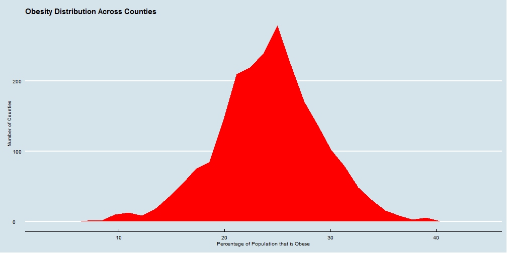
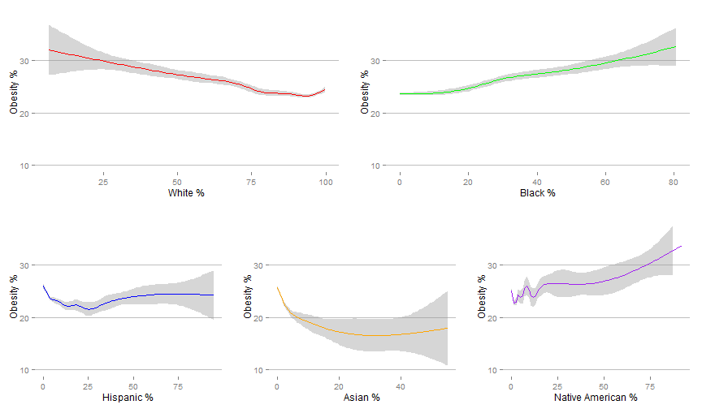
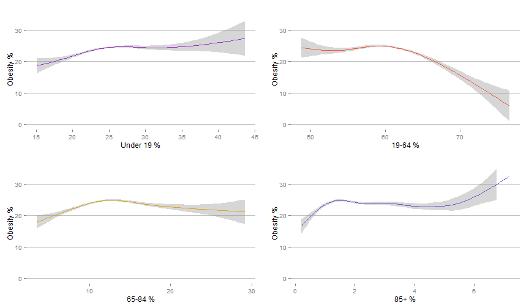
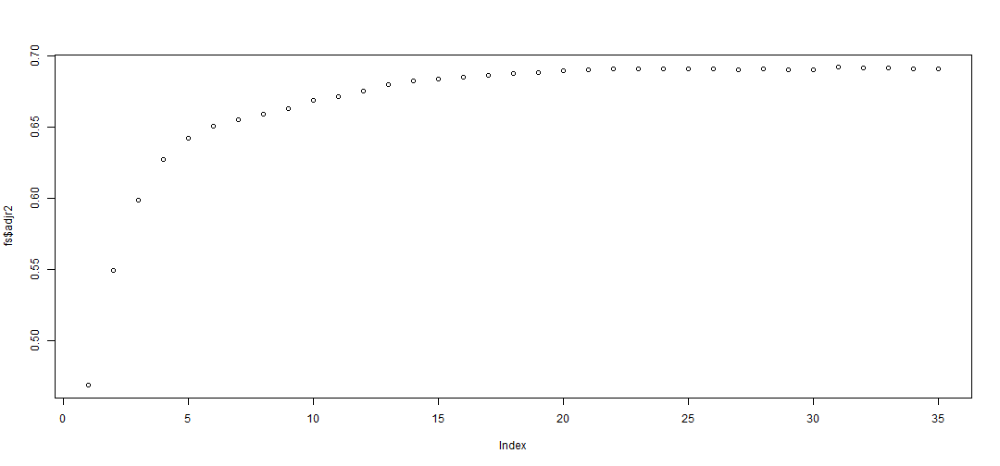
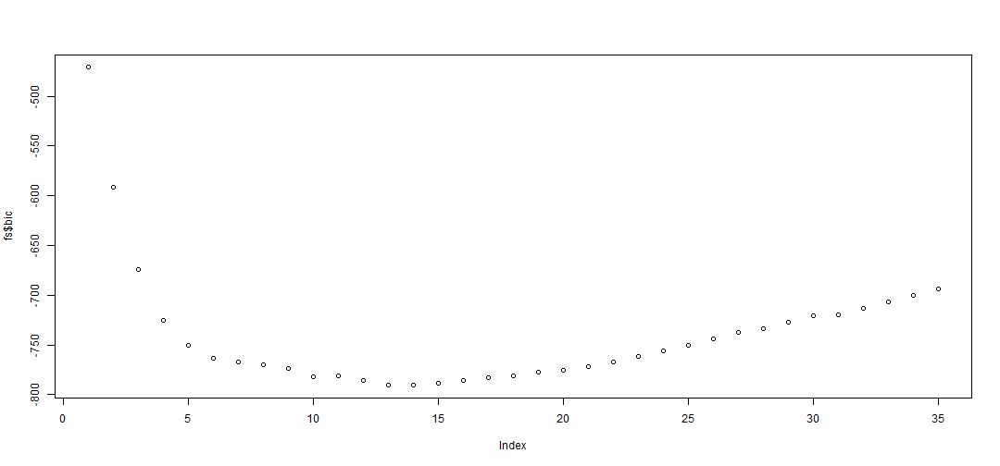
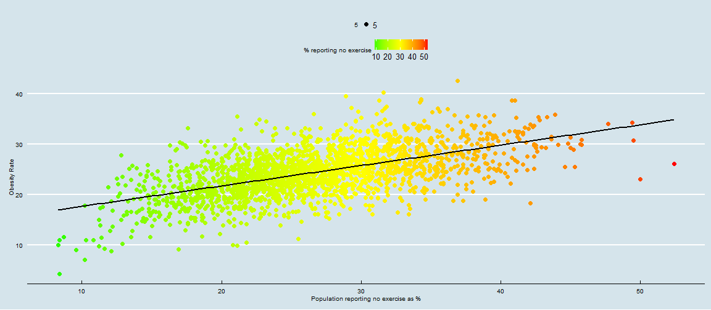
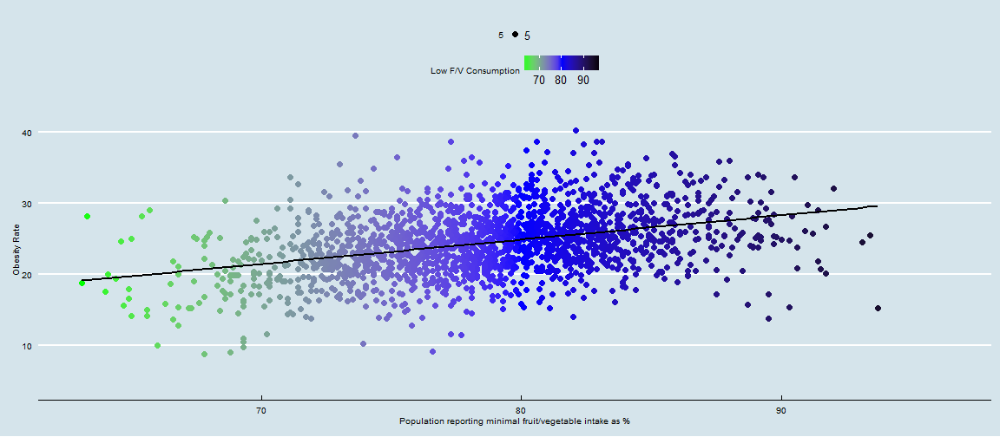

Working with the Community Health Status Indicator Data
========================================================
author: Myles A Maillet
date: December 3, 2015


About the Community Health Status Indicators Data
========================================================

Published in 2000, this dataset contains a number of health status indicators, risk factors, vulnerable population data, and mortality data for all 3141 counties in the United States.

The CHSI data set can be examined and downloaded [here](https://catalog.data.gov/dataset/community-health-status-indicators-chsi-to-combat-obesity-heart-disease-and-cancer), and specific county data investigated [here](http://wwwn.cdc.gov/communityhealth).

**For this project, we'll be investigating the obesity data and identifying predictors of county obesity rates.**

Loading Packages
========================================================
Let's load the R packages we'll be using for this investigation.

```r
base::require(ggplot2)
base::require(ggthemes)
base::require(grid)
base::require(gridExtra)
base::require(leaps)
```


Loading the Data
========================================================
First, we'll bring in the modified dataset that was compiled in the script [data_prep_script](./scripts/data/data_prep_script.R)


```r
dsm = readRDS("./data/derived/dsm.rds")
```

This dataset has only the variables of interest (38 variables). Three of the variables (Unemployed, Major Depression and No High School Diploma) have been also recoded as percentages, as the original value was a count, and all null values have been set to NA (as opposed to -1111,-2222, etc.).

Exploring the data
========================================================

 
  Mean Obesity Rate : 24.15 (sd = 4.9)

Exploring the data
========================================================
Here are the obesity rates by racial distribution across counties.
 

Exploring the data
========================================================
Below is the distribution of age groups and corresponding obesity rates across counties.
 


Exploring the data
========================================================
  
- counties with <span style="color:red">↑ proportion of white people</span> seem to have <span style="color:red">↓ obesity rates</span>
- <span style="color:red">↑ black proportion</span> seems to be associated with <span style="color:red">↑ obesity rates</span>
- counties with <span style="color:red">↑ proportions of people age 19-64</span> (adults) seem to have <span style="color:red">↓ obesity rates</span>
- there is not much for age we can determine here due to the <span style="color:limegreen">broad ranges</span> of the middle age group (16 - 64) and the <span style="color:limegreen">unreliability</span> of BMI as a childhood obesity measure

Predicting Obesity Rates
========================================================
Let's identify which variables can most strongly predict county obesity rate. 
First, we'll run a forward stepwise selection, since best model selection is not feasible due to the number of variables.


```r
fwd_model = regsubsets(dsm$Obesity~.,dsm, nvmax = 35, method = "forward")
fs = summary(fwd_model)
```

Examining our forward stepwise selection (Adj. R2)
========================================================
 

```r
which.max(fs$adjr2)
```

```
[1] 31
```

Examining our forward stepwise selection (BIC)
========================================================
 

```r
which.min(fs$bic)
```

```
[1] 14
```

Our model
========================================================
Based on this analysis, a 15 factor model is effective.

```r
coef(fwd_model, 15)
```
<span style="color:red">Obesity Estimate</span> = 50.82 + 0.02(**CHSI State Name**) + (-0.13(**Poverty**)) + 0.21(**Age 19 Under**) + (-0.03(**Hispanic**)) + (-0.41(**LBW**)) + 0.18(**Premature Birth**) + (-1.09(*Over 40 Births*) + 0.08(**Unmarried**) + (-.2(**Suicide**)) + 0.08(**High Blood Pressure**) + 0.29(**Diabetes**) + (-0.01(**Physician Rate**)) + (-0.47(**ALE**)) + 0.19(**Health Status**) + 44.41(**Unemployed %**)

New Model
========================================================
Our 15 factor model is largely uninterpretable, due to the multitude of factors. Let's create a model using 5 predictors instead.  

Here, we can used best subset selection because it is computationally feasible.

```r
small_best_model = regsubsets(dsm$Obesity~.,dsm, nvmax=5)
```

New Model
========================================================
Our simple, 5 factor model is as follows:

```r
coef(small_best_model, 5)
```

<span style="color:red">Obesity Estimate</span> = 84.3 + (1.33(**Over 40 Births**)) + (-0.21(**Suicide**))+ 0.55(**Diabetes**)  + (-0.02(**Physician Rate**)) + (-0.76(**ALE**))

An Obesity-Free World
========================================================
Based on the 5 variables in our simple model, I've input imaginary values for a utopian, healthy community.

Firstly, there would be **no births over the age of 40**.

Second, there would be **no suicides**, since it's a utopian community.

Next, there would be **few diabetes cases**. We can't eliminate it entirely, sometimes it's hereditary. Let's say 1 % of people.

We would have **600 primary care physicians** per 100,000 people.

And lastly, everyone would live to the **ripe age of 90, on average**.

An Obesity-Free World
========================================================
Inputting these imaginary values into our model, we find that our utopian society has an obesity rate of...

**4.45 % of the population**

It's not zero, since there are a number of other correlational and causal factors to take into account.

Further Analysis
========================================================
Unexpectedly, some variables associated with health risks did not factor into our models, such as **% reporting no exercise** and **% reporting minimal fruit and vegetable intake**.

Here's a graph examining exercise and obesity.
 

Further Analysis
========================================================

And here's a graph examining fruit and vegetable consumption and obesity.
 

Conclusions
========================================================
Our model is more descriptive than predictive, based on the nature of the factors that were selected using subset selection methods.

Obesity is a complex phenomenon, and it may be more effective to examine individual predictors as opposed to county-level predictors.
