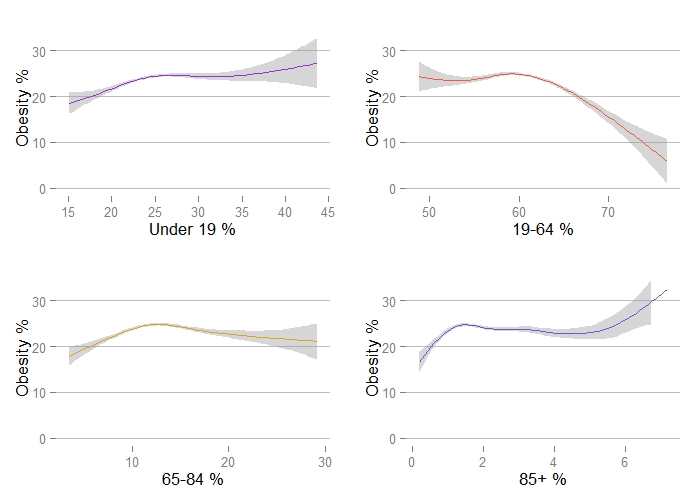
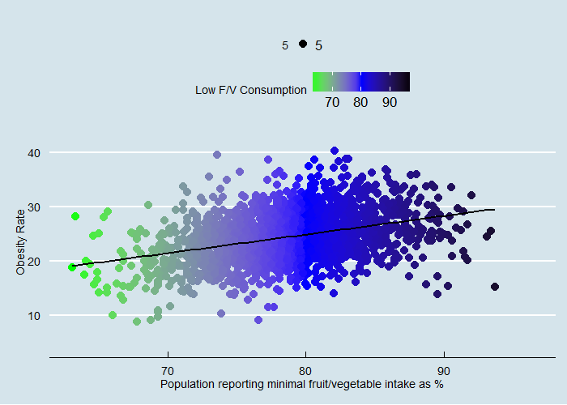

# Analyzing the Community Health Status Indicator Data
<!-- for more options study http://rmarkdown.rstudio.com/html_document_format.html  -->
<!-- The report is produced from
REPOSITORY: the-name-of-the-repository
BRANCH: the-name-of-the-branch
PATH: ../Reports/
-->

<!--  Set the working directory to the repository's base directory; this assumes the report is nested inside of only one directory.-->


<!-- Set the report-wide options, and point to the external script file. -->


By: **Myles A. Maillet** 

***


This dataset provides key health indicators for 
local communities and encourages dialogue about actions that can be taken to improve community health 
(e.g., obesity, heart disease, cancer). The CHSI and dataset, published in 2000, was designed not only for public health 
professionals but also for members of the community who are interested in the health of their community. 
The CHSI report contains over 200 measures for each of the 3,141 United States counties. Although CHSI presents 
indicators like deaths due to heart disease and cancer, it is imperative to understand that behavioral factors 
such as obesity, tobacco use, diet, physical activity, alcohol and drug use, sexual behavior and others substantially 
contribute to these deaths.

The CHSI data set can be examined and downloaded [here](https://catalog.data.gov/dataset/community-health-status-indicators-chsi-to-combat-obesity-heart-disease-and-cancer), and specific county data investigated [here](http://wwwn.cdc.gov/communityhealth).

Let's load the data and necessary packages for analysis.

```r
base::require(base)
base::require(knitr)
base::require(markdown)
base::require(testit)
base::require(dplyr)
base::require(reshape2)
base::require(stringr)
base::require(stats)
base::require(ggplot2)
base::require(extrafont)
base::require(ggthemes)
base::require(quantreg)
base::require(gridExtra)
base::require(grid)
base::require(leaps)
```


```r
dsm = readRDS("./data/derived/dsm.rds")
```

***

##The Problem of Obesity
Obesity rates have been rising in Canada, with 1 in 5 adults and youth currently Obese. This US county data provides data on a number of factors that are known to be associated with the development of obesity. This dataset can be used to examine how various factors within and between counties can be used to predict obesity rates. In other words, this county data can help us examine the development of *obese-city*.

###Obesity across counties
The following section indicates percentage of the population that is obese in each county, with a mean of 24% and a standard deviation of 4.9.

```r
mean(na.omit(dsm$Obesity))
```

```
[1] 24.14519
```

```r
sd(na.omit(dsm$Obesity))
```

```
[1] 4.904128
```

```r
g = ggplot(dsm, aes(dsm$Obesity))+
  geom_area(stat = "bin", fill="red" ,color=FALSE)+
  theme_economist()+
  ggtitle("Obesity Distribution Across Counties")+
  xlab("Percentage of Population that is Obese")+
  ylab("Number of Counties")
g
```

 

###Obesity by race
The following section indicates the obesity rates by racial distribution. It appears that obesity rates decrease with greater proportions of the population being white, and increase with greater proportions of the population being black. Obesity rates also appear to be generally higher in counties with more Native American and Hispanic people than Asian people.

```r
e1 = ggplot(dsm, aes(dsm$White, dsm$Obesity))+theme_hc()+
  geom_smooth(color="red")+xlab("White %")+ylab("Obesity %")+ylim(10,38)
e2 = ggplot(dsm, aes(dsm$Black, dsm$Obesity))+theme_hc()+
  geom_smooth(color="green")+xlab("Black %")+ylab("Obesity %")+ylim(10,38)
e3 = ggplot(dsm, aes(dsm$Hispanic, dsm$Obesity))+theme_hc()+
  geom_smooth(color="blue")+xlab("Hispanic %")+ylab("Obesity %")+ylim(10,38)
e4 = ggplot(dsm, aes(dsm$Asian, dsm$Obesity))+theme_hc()+
  geom_smooth(color="orange")+xlab("Asian %")+ylab("Obesity %")+ylim(10,38)
e5 = ggplot(dsm, aes(dsm$Native_American, dsm$Obesity))+theme_hc()+
  geom_smooth(color="purple")+xlab("Native American %")+ylab("Obesity %")+ylim(10,38)
pushViewport(viewport(layout = grid.layout(2, 6)))
vplayout <- function(x, y) viewport(layout.pos.row = x, layout.pos.col = y)
print(e1, vp = vplayout(1, 1:3))
print(e2, vp = vplayout(1, 4:6))
print(e3, vp = vplayout(2, 1:2))
print(e4, vp = vplayout(2, 3:4))
print(e5, vp = vplayout(2, 5:6))
```

 

###Obesity by age
Next, let's examine how obesity rates differ across age groups. It appears that are relatively consist across age groups, however this should be taken with caution. Firstly, the section between 19-64 is far too large of a range to make any conclusions, and BMI is an ineffective measure of obesity for those under 18 years of age.

```r
a1 = ggplot(dsm, aes(dsm$Age_19_Under, dsm$Obesity))+theme_hc()+
  geom_smooth(color="darkorchid")+xlab("Under 19 %")+ylab("Obesity %")+ylim(0,35)
a2 = ggplot(dsm, aes(dsm$Age_19_64, dsm$Obesity))+theme_hc()+
  geom_smooth(color="tomato2")+xlab("19-64 %")+ylab("Obesity %")+ylim(0,35)
a3 = ggplot(dsm, aes(dsm$Age_65_84, dsm$Obesity))+theme_hc()+
  geom_smooth(color="goldenrod")+xlab("65-84 %")+ylab("Obesity %")+ylim(0,35)
a4 = ggplot(dsm, aes(dsm$Age_85_and_Over, dsm$Obesity))+theme_hc()+
  geom_smooth(color="slateblue")+xlab("85+ %")+ylab("Obesity %")+ylim(0,35)
pushViewport(viewport(layout = grid.layout(2, 2)))
vplayout <- function(x, y) viewport(layout.pos.row = x, layout.pos.col = y)
print(a1, vp = vplayout(1, 1))
print(a2, vp = vplayout(1, 2))
print(a3, vp = vplayout(2, 1))
print(a4, vp = vplayout(2, 2))
```

 

***

###Predictors of Obesity
This dataset has a number of factors that may be associated with obesity rates. Let's perform best subset selection to determine which predictors account for the most variance in obesity rates.


```r
#creating a best subset model, up to 12 factors (due to my laptop's lack of computational power)
best_model = regsubsets(dsm$Obesity~.,dsm, nvmax = 12)
bms = summary(best_model)
par(mar=c(1,1,1,1))
plot(bms$adjr2)
```

 

```r
which.max(bms$rsq)
```

```
[1] 12
```

```r
plot(bms$bic)
```

 

```r
which.min(bms$bic)
```

```
[1] 12
```

```r
#with best subset selection, the best model is maxed out with 12 factors, so let's run forward and backward stepwise selections instead
#first the forward model
fwd_model = regsubsets(dsm$Obesity~.,dsm, nvmax = 35, method = "forward")
fs = summary(fwd_model)
plot(fs$adjr2)
```

 

```r
which.max(fs$adjr2)
```

```
[1] 31
```

```r
plot(fs$bic)
```

 

```r
which.min(fs$bic)
```

```
[1] 14
```

```r
#now the backward model
bwd_model = regsubsets(dsm$Obesity~.,dsm, nvmax = 35, method = "backward")
bs = summary(bwd_model)
plot(bs$adjr2)
```

 

```r
which.max(bs$adjr2)
```

```
[1] 27
```

```r
plot(bs$bic)
```

 

```r
which.min(bs$bic)
```

```
[1] 13
```

```r
#based on these plots and outputs, a 15 factor model will be an effective model
coef(fwd_model, 15)
```

```
        (Intercept)     CHSI_State_Name             Poverty        Age_19_Under            Hispanic                 LBW 
        50.82050783          0.02349094         -0.13048042          0.21393893         -0.02756302         -0.41857037 
          Premature             Over_40           Unmarried             Suicide     High_Blood_Pres            Diabetes 
         0.18233243         -1.09351955          0.07609379         -0.19695855          0.07851286          0.29297635 
Prim_Care_Phys_Rate                 ALE       Health_Status     Unemployed_perc 
        -0.01005582         -0.47077793          0.19106704         44.40976914 
```

```r
coef(bwd_model, 15)
```

```
        (Intercept)     CHSI_State_Name             Poverty        Age_19_Under            Hispanic                 LBW 
       4.986014e+01        2.418760e-02       -1.345321e-01        2.333849e-01       -2.749397e-02       -2.083883e-01 
            Over_40           Unmarried             Suicide     High_Blood_Pres            Diabetes Prim_Care_Phys_Rate 
      -1.041065e+00        8.415176e-02       -2.016455e-01        7.823918e-02        2.849984e-01       -9.756914e-03 
                ALE       Health_Status    Major_Depression          Unemployed 
      -4.469808e-01        2.091778e-01       -5.448609e-05        9.854111e-05 
```

####Our 15 factor model is as follows
obesity estimate = 50.82 + 0.02(CHSI State Name) + (-0.13(Poverty)) +
  0.21(Age 19 Under) + (-0.03(Hispanic)) + (-0.41(LBW)) + 0.18(Premature Birth)+
  (-1.09(Over 40 Births) + 0.08(Unmarried) + (-.2(Suicide)) + 0.08(High Blood Pressure)+
  0.29(Diabetes) + (-0.01(Physician Rate)) + (-0.47(ALE)) + 0.19(Health Status) +
  44.41(Unemployed %)
  
We use the factors in the forward selection model, because the backward selection model included major depression and unemployed counts, and we really only want the factors measured as percentages

The above raises some concerns. Firstly, it is not very interpretable. Second, some of the factors may seem counterintuitive. For example, it is generally assumed that obesity rates increase as poverty rates increase (seen in the graph below), but our 15 factor model has a negative coefficient for poverty.


```r
v = qplot(dsm$Poverty, dsm$Obesity, data=dsm, color=dsm$Obesity, size=3)+
  scale_color_gradient2(name="Obesity %",mid = "green", high = "red")+
  geom_smooth(method="lm", color="black", size=1, se=FALSE)+
  theme_economist()+xlab("Poverty Rate")+ylab("Obesity Rate")
v
```

 

For the sake of simplicity and interpretability, let's create a 5 factor model.

```r
small_best_model = regsubsets(dsm$Obesity~.,dsm, nvmax=5)
coef(small_best_model, 5)
```

```
        (Intercept)             Over_40             Suicide            Diabetes Prim_Care_Phys_Rate                 ALE 
        84.29911386         -1.32813468         -0.21358660          0.54859905         -0.01506391         -0.76072613 
```

Our new model is as follows:
*estimated obesity = 84.3 + (1.33(Over 40 Births)) + (-0.21(Suicide))+*
*0.55(Diabetes)  + (-0.02(Physician Rate)) + (-0.76(ALE))*

Obesity rates increase as births to mother over the age of 40 increase, and as diabetes rates increase. Obesity rates decrease as suicide rates increase, and the number of physicians in a county increases, and as average life expectancy increases.

*Physician rate:* This is not surprising. A region with more physicians per capita put more resources into health care in general, and would have increased physician accessibility for those needing help.

*Diabetes:* This is also not surprising: Research shows that being overweight and obese can result in the development of diabetes.

*Average Life Expectancy:* Still, not surprising. Counties with fewer obese people can expect longer lifespans on average, since obesity is strongly related to a number of conditions, such as heart disease and some forms of cancer.

*Suicide Rate:* Now, this is interesting. As suicide rates increase, obesity rates decrease. Other research suggests that obese individuals are more at risk for suicidal behaviour, so this requires further investigation.

*Births Over 40:* Again, this is interesting. Why are increasing rates of births to mothers over the age of 40 related to increasing obesity rates? Are overweight people more likely to give birth later on in life, perhaps because they have difficulty finding a mate? Or perhaps obese women have greater difficulty getting pregnant? We can only hypothesize as to why this factor is relevant to obesity.

***

###Conclusion
Obesity is a complex phenomenon, and it may be more effective to examine individual predictors as opposed to county-level predictors. It is worth noting that neither fruit and vegetable consumption nor lack of exercise were factored into our 15 and 5 factor models, yet one would assume they are predictive of the development of obesity. The graphs below plot these relationships.

```r
q = qplot(dsm$No_Exercise, dsm$Obesity, data=dsm, color=dsm$No_Exercise, size=5)+
  scale_color_gradient2(name="% reporting no exercise",low = "green", mid = "yellow", high = "red", midpoint = 30)+
  geom_smooth(method="lm", color="black", size=1, se=FALSE)+
  theme_economist()+xlab("Population reporting no exercise as %")+ylab("Obesity Rate")
q
```

 

```r
s = qplot(dsm$Few_Fruit_Veg, dsm$Obesity, data=dsm, color=dsm$Few_Fruit_Veg, size=5)+
  scale_color_gradient2(name="Low F/V Consumption", low = "green", mid = "blue", high = "black", midpoint = 80)+
  geom_smooth(method="lm", color="black", size=1, se=FALSE)+
  theme_economist()+xlab("Population reporting minimal fruit/vegetable intake as %")+ylab("Obesity Rate")
s
```

 

The rising obesity rates warrant our attention. This report highlights several factors that may influence the development of obesity, but no causal relations can be determined. Future analyses would benefit from examining data at an individual-level, opposed to a county or national level.


***
***
