# A Graphical Exploration of Multiple Factors Predicting Self-reported Deterioration in Perceived Health
<!-- for more options study http://rmarkdown.rstudio.com/html_document_format.html  -->
<!-- The report is produced from
REPOSITORY: the-name-of-the-repository
BRANCH: the-name-of-the-branch
PATH: ../Reports/
-->

<!--  Set the working directory to the repository's base directory; this assumes the report is nested inside of only one directory.-->


<!-- Set the report-wide options, and point to the external script file. -->

#Load Packages
Load the necessary packages

```r
base::require(base)
base::require(knitr)
base::require(markdown)
base::require(testit)
base::require(dplyr)
base::require(reshape2)
base::require(stringr)
base::require(stats)
base::require(ggplot2)
base::require(extrafont)
```

#Load Data
Link to the data source to load the data

```r
dsL = readRDS("./data/derived/dsL.rds")
```

#Load Sources
Load the source script for graph_themes

```r
source("./scripts/graphs/graph_themes.R")
```

#Variable Selection
There are a number of variables that can predict self-reported deterioration in perceived health.
Here we select desired variables from the larger dataset (dsL) and create a new smaller dataset (ds2). Then we verify that the pulled variables are there. 

```r
ds2 = dplyr::select(dsL, shlt, psych, bmi, heart, lung, cancr, diab)
head(ds2)
```

```
     shlt psych  bmi heart lung cancr diab
1176    2     0 28.1     0    0     0    1
2059    4     0 19.8     0    0     0    0
2153    3     0 21.1     1    0     0    0
2284    3     0 28.0     1    0     0    1
2585    3     0 36.2     1    0     0    0
3099    3     0 25.5     1    0     0    0
```

```r
sapply(ds2,class)
```

```
     shlt     psych       bmi     heart      lung     cancr      diab 
"integer" "integer" "numeric" "integer" "integer" "integer" "integer" 
```

#Change Class of the Variables
In order to properly inspect the data, we must change the status of  current continuous variables, to categorical variables in order to better fit the data that was captured. For example, a participant either has diabetes, or does not have diabetes. It is not useful to consider this concept on a continuum. Therefore, we add new variables to change the the class of the variables to factor/categorical. Then, we will create a new dataset (ds) with the newly classified variables we want to work with.

```r
ds2$diabF <- factor(ds2$diab, levels=c(0,1), labels=c("nDiab", "Diab"))
ds2$psychF = factor(ds2$psych, levels=c(0,1), labels=c("nPsyc", "Psyc"))
ds2$heartF = factor(ds2$heart, levels=c(0,1), labels=c("nHeart", "Heart"))
ds2$lungF = factor(ds2$lung, levels=c(0,1), labels=c("nLung", "Lung"))
ds2$cancrF = factor(ds2$cancr, levels=c(0,1), labels=c("nCancer", "Cancer"))

ds = dplyr::select(ds2, shlt, bmi, psychF, heartF, lungF, cancrF, diabF)

sapply(ds,class)
```

```
     shlt       bmi    psychF    heartF     lungF    cancrF     diabF 
"integer" "numeric"  "factor"  "factor"  "factor"  "factor"  "factor" 
```

#Multiple Regression Model
Here a multiple regression model was created to encompass all the factors of the dataset: BMI, psychiatric condition, lung condition, heart condition, diabetes condition, cancer condition as predictors of self-reported health. 
Change in Self Reported Health (shlt): These variables measure the change in self-reports of health categories (excellent, very good, good, fair, poor). 
The health categories are numbered from 1 (excellent) to 5 (poor), so that positive values of the change in self-reported health denote deterioration.
The results show that all the factors in the model are significant predictors of self reported health. Since they are all statistically significant, rather than exploring these relationships further using statistical modelling, we will move forward by exploring the relationships graphically.


```r
lm.fit = lm(shlt~ bmi + psychF + heartF + lungF + cancrF + diabF, data=ds)
summary(lm.fit)
```

```

Call:
lm(formula = shlt ~ bmi + psychF + heartF + lungF + cancrF + 
    diabF, data = ds)

Residuals:
     Min       1Q   Median       3Q      Max 
-3.15222 -0.69353 -0.08781  0.76726  2.44410 

Coefficients:
             Estimate Std. Error t value Pr(>|t|)    
(Intercept)  2.254665   0.171740  13.128  < 2e-16 ***
bmi          0.017514   0.006369   2.750  0.00607 ** 
psychFPsyc   0.525631   0.085254   6.165 9.96e-10 ***
heartFHeart  0.473244   0.064310   7.359 3.70e-13 ***
lungFLung    0.515131   0.084087   6.126 1.27e-09 ***
cancrFCancer 0.218399   0.077497   2.818  0.00492 ** 
diabFDiab    0.354139   0.074024   4.784 1.96e-06 ***
---
Signif. codes:  0 '***' 0.001 '**' 0.01 '*' 0.05 '.' 0.1 ' ' 1

Residual standard error: 1.018 on 1065 degrees of freedom
Multiple R-squared:  0.1643,	Adjusted R-squared:  0.1596 
F-statistic: 34.91 on 6 and 1065 DF,  p-value: < 2.2e-16
```

#Graphical Exploration
Graphical exploration: plot graphs to see the relationship between each individual factor and self reported health

### Self-reported deterioration in perceived health and having a psychiatric condition
On the x-axis is a comparison between the self-reported health ratings between two groups: those without a psychiatric condition, and those with a psychiatric condition. The y-axis tells us the number of people in the sample who have that particular rating on the self-reported health survey, in that particular group (psychiatric condition, or no psychiatric condition). 
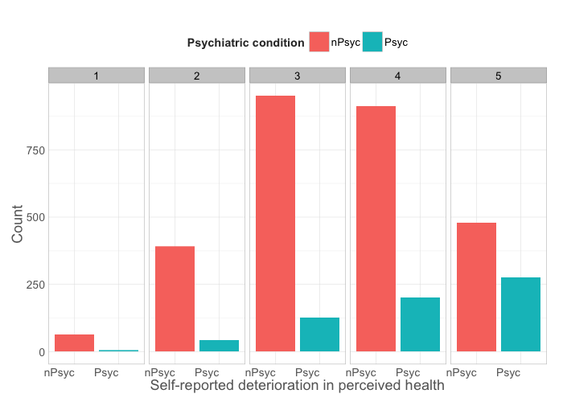 

### Self-reported deterioration in perceived health and having a lung condition
On the x-axis is the self-reported health ratings of those without a lung condition, and those with a lung condition. The y-axis tells us how many people in the sample fall within each category.
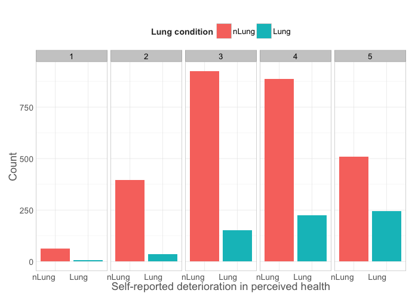 

### Self-reported deterioration in perceived health and having a heart condition
On the x-axis is the self-reported health ratings of those without a heart condition, and those with a heart condition. The y-axis tells us how many people in the sample fall within each category.
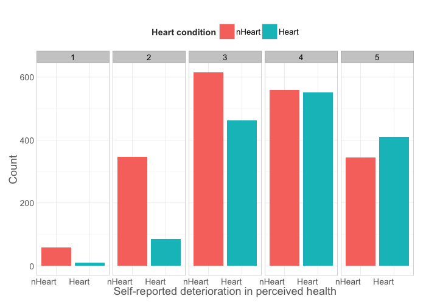 

### Self-reported deterioration in perceived health and having cancer
On the x-axis is the self-reported health ratings of those without cancer, and those with cancer. The y-axis tells us how many people in the sample fall within each category.

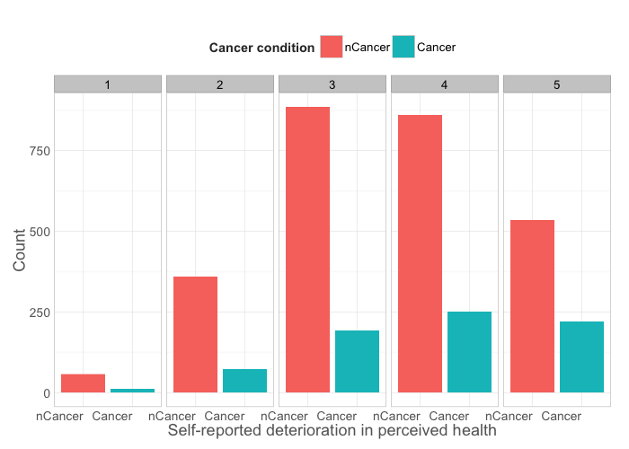 

### Self-reported deterioration in perceived health and having diabetes
On the x-axis is the self-reported health ratings of those without diabetes, and those with diabetes. The y-axis tells us how many people in the sample fall within each category.
It appears as though, in general, most participants experienced slight deterioration in self-reported health or remained the same across all factors (regardless of condition).
However, for those with some sort of health condition, there was a general trend of greater self-report of deterioration in health.
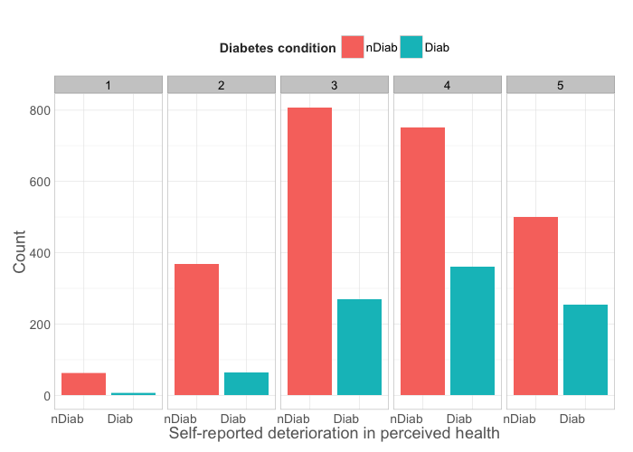 

##Exploration of Multiple Variables Contributing to Self-Reported Health

###Basic Graph: Self-reported deterioration in perceived health vs. Body Mass Index
This is the basic graph that we will be building on in order to explore the different interactions between multiple variables. On the x-axis, we have the continuous variable of BMI, while on the y-axis, we have the self-reported deterioration in perceived health of participants. When we look at BMI as a single predictor of self-reported health deterioration, we can fit both a smoother (blue line) as well as a linear model (red line). From both the smoother and the linear model, we can see a general trend of perceived health deteriorating as BMI increases.

*Note: "To smooth a data set is to create an approximating function that attempts to capture important patterns in the data, while leaving out noise or other fine-scale structures/rapid phenomena." (Wikipedia on "Smoothing")
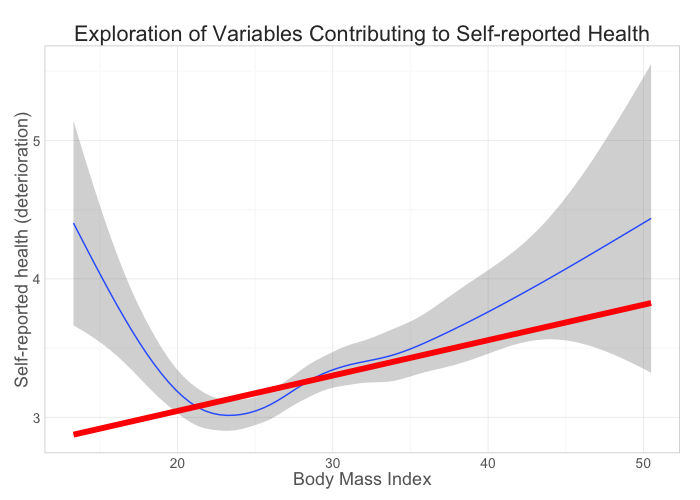 

###Heart, Lung, Diabetes & BMI as Predictors for Self-reported Health (Deterioration)
In this graph, we explore the interaction between BMI, heart condition, lung condition, and diabetic condition to predict perceived self-reported health deterioration. Here we have layered heart condition, lung condtion, and diabetic condition over the original graph. Horizontally, we have split the graph according to participants who either have no heart condition (nHeart) and participants who have a heart condition (Heart). Vertically, we have split the graph according to participants who either have no lung condition (nLung) and participants who have a lung condition (Lung). Lastly, in each quadrant, the red circles represent participants who do not have diabetes, while the blue circles represent participants who do have diabetes.

The four quadrants represent different interactions. In the top left hand corner, data from the participants who do not have a heart or lung condition is depicted. Here we can still see a positive linear relationship between BMI and perceived self-report health deterioration. Notably, we can see that there is a concentration of people with no diabetes (red circles) and lower BMI, reporting less deterioration in health, while the people with diabetes (blue circles) seem to have higher BMIs while also reporting higher deterioration in their health. 

In the top right had corner, we see the interaction between having a heart condition, no lung condition, and BMI through the red linear model. Again, the linear relationship between the three variables is positive. It seems as though having a heart condition, no lung condition, and a higher BMI interact to predict slightly higher ratings of perceived health deterioration compared with no health condition other than a high BMI. 

In the lower lefthand quadrant, the slope of the linear relationship gets steeper than in the previously discussed regressions. This suggests that the interaction between having no heart condition, having a lung condition, and having a higher BMI predict greater reports of perceived health deterioration than the other two previous combinations. 

However, in the lower right quadrant, it is clear that this linear relationship has the steepest slope. This quadrant represents the participants who have a heart condition and a lung condition. This positive relationship suggests that when a participant has a lung and heart condition, as well as a higher BMI, it is predicted that they will report more deterioration of their health. As well, we can see that those with diabetes (blue circles) on top of heart and lung conditions, are also reporting higher levels of deterioration in their health.
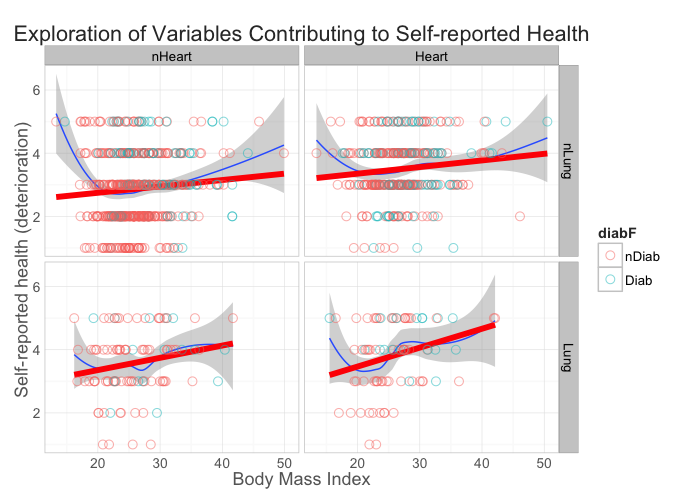 


###Psych, Lung, Heart & BMI as Predictors for Self-reported Health (Deterioration)
Here we see interactions between having a psychiatric condition, a lung condition, a heart condition, and BMI. 

In the top left quadrant, we see the interaction between having no psychiatric or lung condition, with BMI to produce a linear model prediction of self-reported health deterioration. The slope of the line implies a positive relationship between this mix of variables and higher ratings of deteriorated health. Observing those with no heart condition and those with a heart condition, a general pattern can be seen: those with a heart condition but no psychiatric or lung condition, tend to score higher on the health deterioration scale as BMI increases, while those with no heart condition tend to have lower BMIs as well as lower deterioration scores.

In the upper righthand quadrant, we see a different effect emerging. Out of the four quadrants displayed, this linear relationship seems to have the most gradual rise in slope. In this quadrant, participants have no lung condition, but have a psychiatric condition. As the smoothing line shows, there does not seem to be a good linear fit to this model, as the forced linear relationship will merely balance out. Additionally, it seems as though the error margin is relatively large. Further exploration of this combination may need to include a non-linear model fit. 

In the lower left quadrant, we see a much steeper positive slope between the variables of no psychiatric condition, a lung condition, and a higher BMI to predict higher ratings of health deterioration. There does not seem to be an obvious pattern happening with those who have a heart condition, other than that they are reporting higher levels of health deterioration.

In the lower right quandrant, we see the steepest positive slope out of all the slopes in this graph so far (variables are psych condition, lung condition, and BMI -- heart condition is depicted by the points on the graph). However, when we look at the smoother, we see that the data does not fit the linear model very well. There are at least two, if not three curvilinear patterns emerging. This indicates, that though there is indeed some sort of general positive relationship effect happening, a non-linear model may fit the data better.
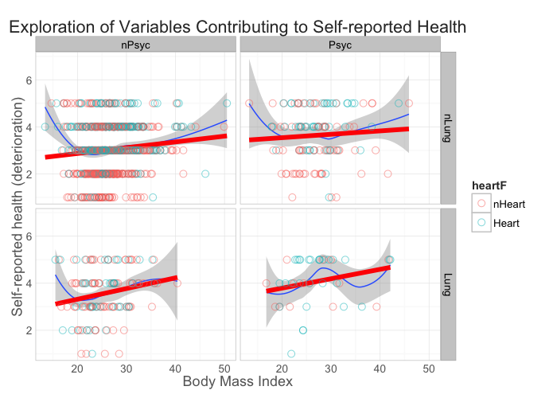 

###Diabetes, Lung, Heart & BMI as Predictors for Self-reported Health (Deterioration)

In this graph, we explore the interactions between diabetes, lung condition, heart condition, and BMI on self-reports of health deterioration. In the top two quadrants, we can see that there is a general poor fit of the linear model with the data. As well, the slope of the linear line is not extremely telling. As a result, further exploration may need to include non-linear models.

However, if we explore the lower lefthand quadrant, we see that the slope of the linear model is quite steep, and follows the smoother of the data quite nicely. This tells us that those with a lung condition, but without diabetes, tend to report higher levels of health deterioration as BMI increases. Additionally, those with heart conditions in this population tend to report higher levels of deterioration, even though their BMIs are not very high. This may seem counter intuitive, as in general, heart conditions like cardiovascular disease are associated with poor diet and higher BMIs. However, this makes sense, as this quadrant is reserved for those who do not have diabetes, and Type 2 diabetes is associated with obesity.

In the last quadrant, we see an interesting trend. This quadrant shows the part of the sample who have diabetes and a lung condition. Interestingly, it shows a negative linear prediction of these variables and BMI on self-reported health. This means, that in those with a lung condition and diabetes, as their BMI goes up, they do not believe that their health is deteriorating. However, if we look more closely at the y-axis, we see that the red line seems to stick around the 4-scale mark. This is still relatively high on the deterioration scale. So though the graph depicts a negative relationship, it does not mean that these participants believe that they are in good health. 
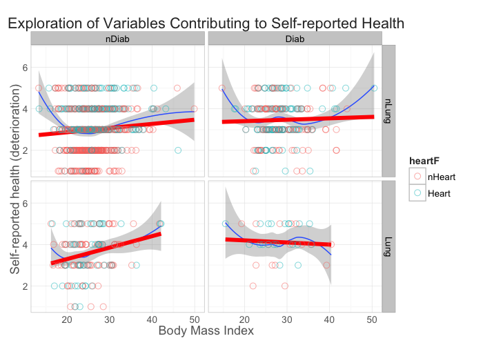 

###Psych, Heart, Lung & BMI as Predictors for Self-reported Health (Deterioration)

Here we look at the interaction between having a psychiatric condition, a heart condition, a lung condition, and BMI to predict self-reports in health deterioration. In this graph, we can see that all four quadrants (particularly the bottom two) fit the smoothers relatively well. 

In the top two graphs, we do not see a particularly eye-catching trend. What we do notice, is that in general, those with or without a lung condition within these populations tend to have BMIs that gravitate toward the lower end of the scale, rather than toward the higher end. 

As for the bottom lefthand quadrant (of no psychiatric condition, and having a heart condition), we see a positive linear trend that seems to follow the smoother quite nicely. This graph tells us that there is a positive linear relationship between increasing BMI, having a heart condition, and no psychiatric condition to predict deterioration in self-reports of health. Again, we see that for both those with and without lung conditions in this part of the population, the BMI tends to gravitate toward the lower end, rather than the higher end of the dimension.

In the final quadrant, we see there is a steeper positive linear relationship between having a psychiatric condition, a heart, condition, and a higher BMI to predict higher perceived deterioration in health. This linear line fits the smoother quite well, indicating that a linear model for this combination of variables is in fact quite suitable.
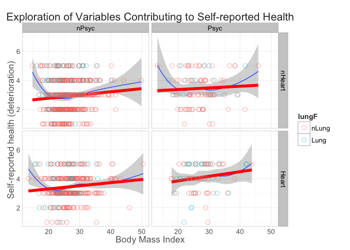 

###Diabetes, Heart, Psych & BMI as Predictors for Self-reported Health (Deterioration)
In this graph, we see the interactions of diabetes, heart condition, psychiatric condtion, and BMI on the prediction of self-reported health deterioration. 

In the first quadrant, we see the interaction between not having diabetes, no heart condition, and BMI as expressed through the red linear model. When comparing the linear model to the smoother, we see that a non-linear model may explain the data and positive relationship better for this combination of variables. 

In the top right quadrant, we see an interesting effect once again. Here, there is a negative linear relationship between having diabetes, no heart condition, and BMI. This means that those with diabetes, but no heart condition, do not believe their health is deteriorating, and in fact believe that their health is better than others with lower BMIs! To explain this, diabetes Type 2 is often a result of obesity. However, if this population has Type 2 diabetes, and their BMI is high, but do not have a subsequent heart condition, they may believe that their health is not in a deteriorating state because they have not developed a heart condition. 

In the bottom two quadrants, we see that both depict positive linear models. This implies that regardless of whether a participant has diabetes, if they have a heart condition, as BMI goes up, they are more likely to believe that their health is deteriorating. This makes sense if their heart conditions are a result of weight gain or obesity. 
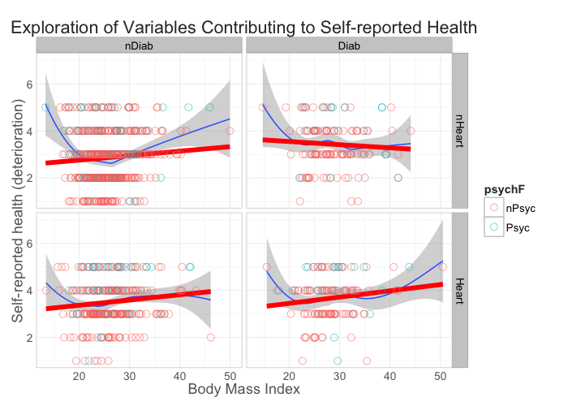 

###Lung, Heart, Psych & BMI as Predictors for Self-reported Health (Deterioration)

In this last graph, we look at the combination of lung condition and heart condtion with BMI again. As seen through the series of graphs that we have explored, having a heart condition or a lung condition, seem to predict higher rates of perceived health deterioration as BMI goes up. However, when the two are combined and participants have a heart and lung condition, there seems to be the steepest relationship between rising BMI rates and rising health deterioration beliefs.
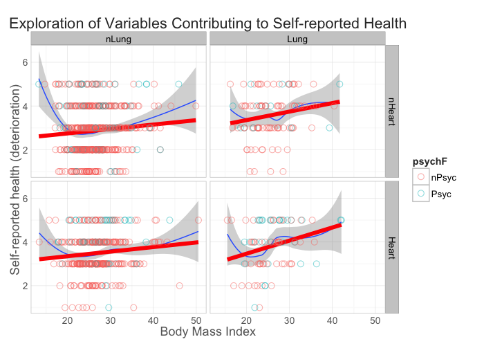 

###In sum:
In exploring the data, we find that participants who had a heart condition seemed to believe (more so than other groups) that their health was deteriorating as BMI went up. This might be due to the particular relationship between heart health and higher BMI. This belief seemed to be strengthened if they had another co-occuring condition.

Additionally, having a lung condition seemed to create a positive linear relationship in almost every graph it was included in.
This belief seemed to be strengthened if they had another co-occuring condition, except for when BMI increased and they also had diabetes. However, even in this condition, participants in general believed that their health was in a poorer state.

This trend in the heart and lung conditions, may be explained by psychological effects. Generally, heart and lung conditions tend to be quite serious and often fatal when compared to other more manageable conditions like diabetes and psychiatric conditions. As a result, participants may believe that their health has significantly deteriorated as a result of their beliefs about their disease, or as an objective look at the danger of their condition.


