# data analysis - hrs


<!-- Set the report-wide options, and point to the external script file. -->

---
## Slide 1

```r
# Load the necessary packages.

base::require(base)
base::require(knitr)
base::require(markdown)
base::require(testit)
base::require(dplyr)
base::require(reshape2)
base::require(stringr)
base::require(stats)
base::require(ggplot2)
base::require(extrafont)
```
---
## Slide 2

---
## Slide 3

```r
# Link to the data source

dsL = readRDS("./data/derived/dsL.rds")

ds = dplyr::select(dsL, shlt, psych, bmi, heart, lung, cancr, diab)

head(ds)
```

```
     shlt psych  bmi heart lung cancr diab
1176    2     0 28.1     0    0     0    1
2059    4     0 19.8     0    0     0    0
2153    3     0 21.1     1    0     0    0
2284    3     0 28.0     1    0     0    1
2585    3     0 36.2     1    0     0    0
3099    3     0 25.5     1    0     0    0
```
---
## Slide 4

```r
source("./scripts/graphs/graph_themes.R")
```
---
## Slide 5

```r
sapply(ds,class)
```

```
     shlt     psych       bmi     heart      lung     cancr      diab 
"integer" "integer" "numeric" "integer" "integer" "integer" "integer" 
```

```r
ds$diabF <- factor(ds$diab, levels=c(0,1), labels=c("No diabetes", "Diabetes"))

ds$psychF = factor(ds$psych, levels=c(0,1), labels=c("No psychiatric condition", "Psychiatric condition"))

ds$heartF = factor(ds$heart, levels=c(0,1), labels=c("No heart condition", "Heart condition"))
#error
ds$lungF = factor(ds$lung, levels=c(0,1), labels=c("No lung condition", "Lung condition"))
#error
ds$cancrF = factor(ds$cancr, levels=c(0,1), labels=c("No cancer", "Cancer"))
#what happened to the cancer graph? does not separate them according to category


# pairs(ds)


#shlt vs. bmi with psych as horizontal facet

p <- ggplot2::ggplot(data=ds, aes(x=bmi, y=shlt)) +
  geom_smooth()+
  stat_smooth(method="lm", formula = y ~ x, se=F, color="red", size=2) +
  theme1 +
  
  labs(x="Body Mass Index", y="Self-reported health", title="Exploration of Bivariate Relationship with Facets")
p
```

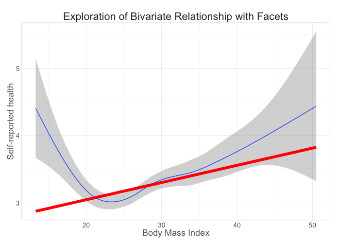 

```r
#finding slope and intercept to add to graph to fit linear line
# coef(lm(shlt ~ bmi, data = ds))
# p + geom_abline(intercept = 2.5, slope =.026)
# geom_abline(intercept = 2.5, slope =.026) +

  
# geom_line(aes(x=bmi, y=shlt),colour="red", linetype="dashed") +

g1 <- p + facet_grid(.~psychF)
g1
```

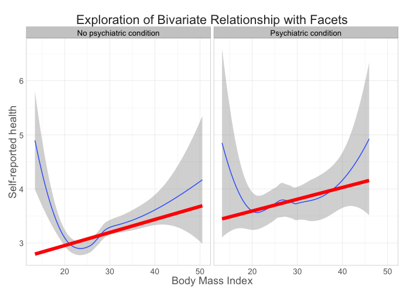 

```r
#TAKE THIS ONE
g3 <- p + facet_grid(lungF ~ heartF) +
  geom_point(aes( color=diabF), shape=21, fill=NA, size=3, alpha=.5) 
g3
```

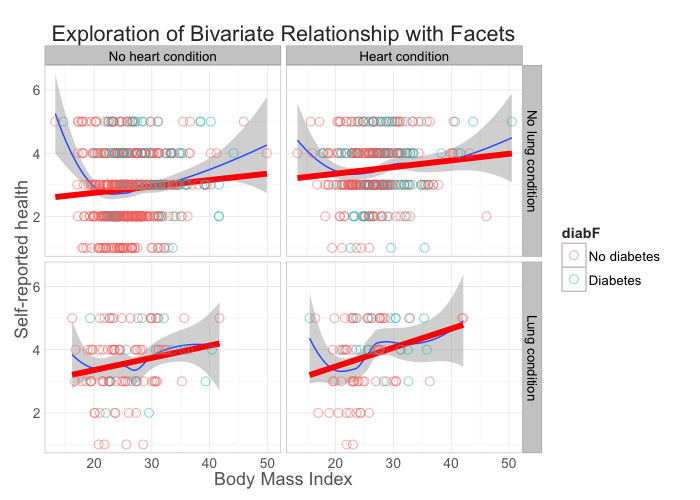 

```r
g4 <- p + facet_grid(lungF ~ psychF) +
  geom_point(aes( color=diabF), shape=21, fill=NA, size=3, alpha=.5) 
g4 
```

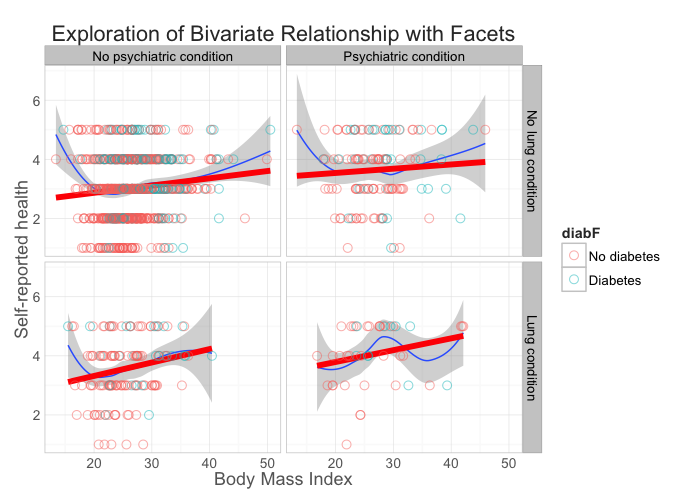 

```r
g2 <- p + facet_grid(heartF ~ psychF) +
  geom_point(aes( color=lungF), shape=21, fill=NA, size=3, alpha=.5) 
g2 
```

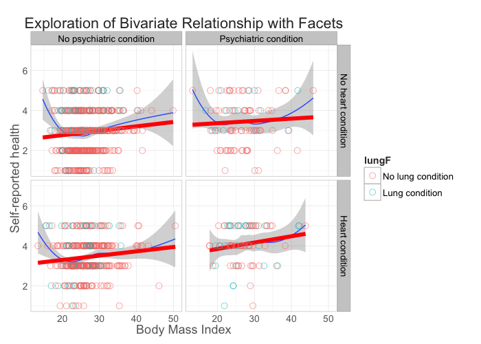 

```r
g5 <- p + facet_grid(heartF ~ psychF) +
  geom_point(aes( color=diabF), shape=21, fill=NA, size=3, alpha=.5) 
g5 
```

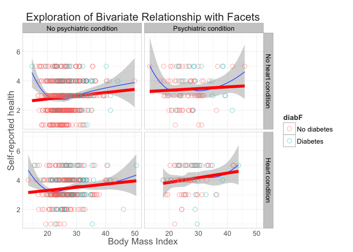 

```r
#shlt vs. bmi with heart as horizontal facet

g6 <- p + facet_grid(.~heartF)
g6
```

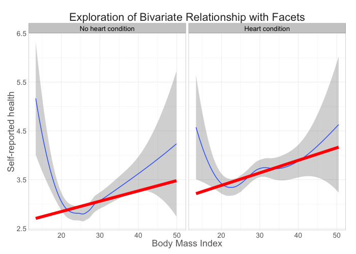 

```r
g7 <- p + facet_grid(psychF ~ heartF)
g7 
```

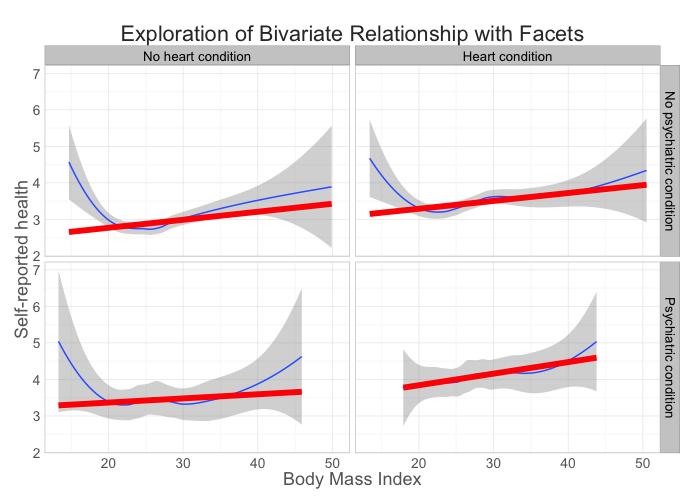 

```r
g8 <- p + facet_grid(psychF ~ lungF) +
  geom_point(aes( color=diabF), shape=21, fill=NA, size=3, alpha=.5) 
g8
```

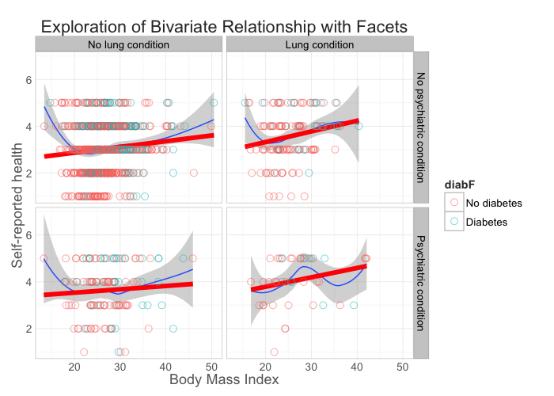 

```r
g9 <- p + facet_grid(diabF ~ heartF) +
  geom_point(aes( color=cancrF), shape=21, fill=NA, size=3, alpha=.5) 

g9 
```

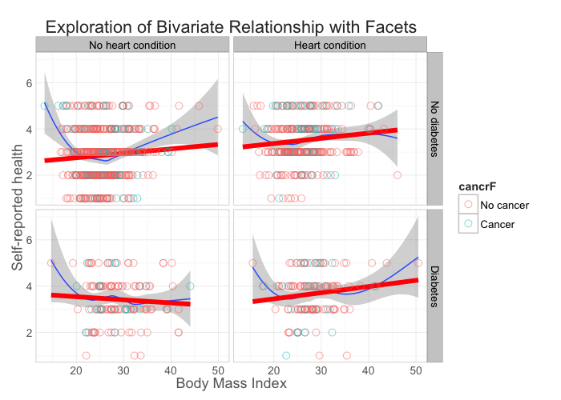 

```r
g10 <- p + facet_grid(cancrF ~ heartF)
g10 
```

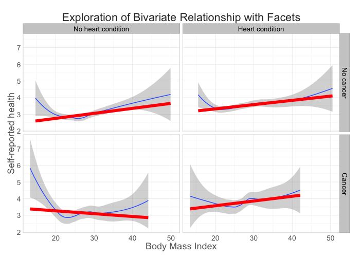 

```r
#shlt vs. bmi with lungF as horizontal facet
g11 <- p + facet_grid(.~lungF)
g11
```

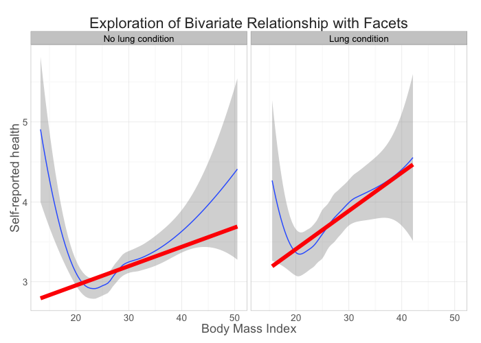 

```r
g12 <- p + facet_grid(heartF ~ lungF) + 
  geom_point(aes( color=psychF), shape=21, fill=NA, size=3, alpha=.5) 
g12
```

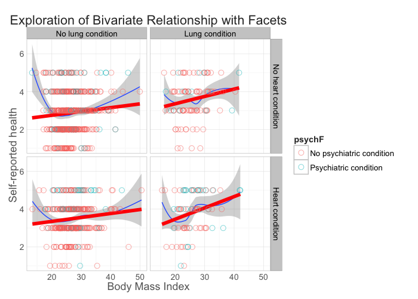 

```r
g13 <- p + facet_grid(psychF ~ lungF)
g13
```

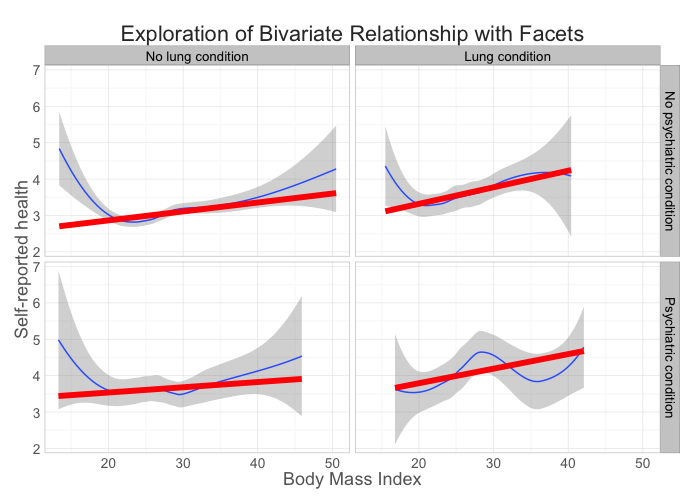 

```r
g14 <- p + facet_grid(diabF ~ lungF)
g14
```

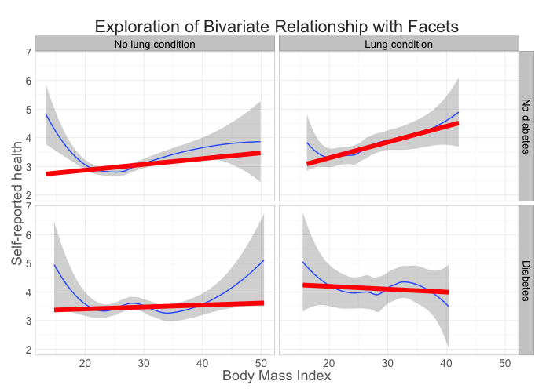 

```r
g15 <- p + facet_grid(cancrF ~ lungF)
g15
```

 

```r
#shlt vs. bmi with diabF as horizontal facet
g16 <- p + facet_grid(.~diabF)
g16
```

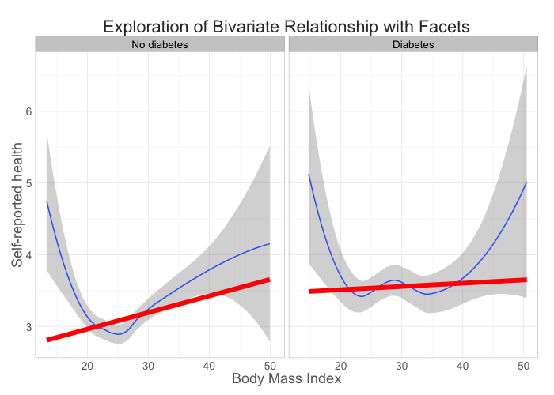 

```r
g17 <- p + facet_grid(psychF ~ diabF)
g17
```

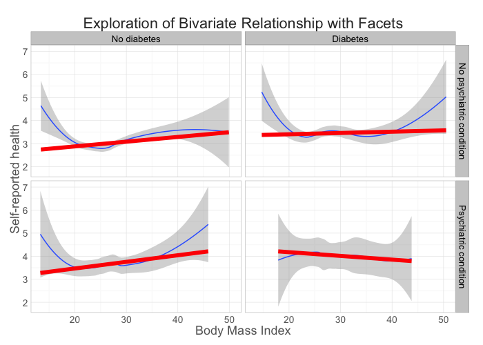 

```r
g18 <- p + facet_grid(heartF ~ diabF)
g18
```

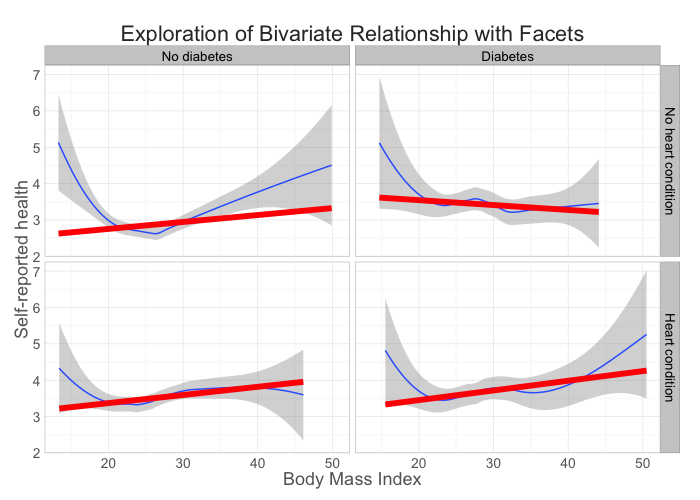 

```r
g19 <- p + facet_grid(lungF ~ diabF)
g19
```

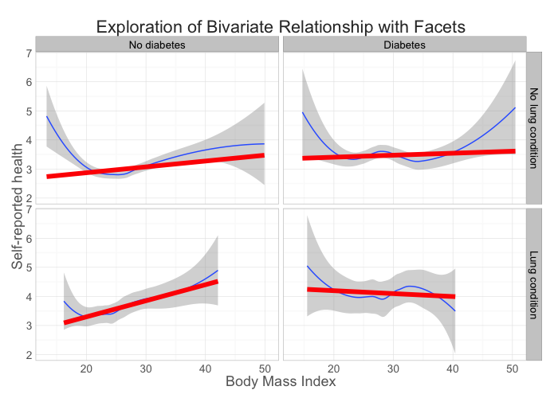 

```r
g20 <- p + facet_grid(cancrF ~ diabF)
g20
```

 

```r
#shlt vs. bmi with cancr as horizontal facet
g21 <- p + facet_grid(.~cancrF)
g21
```

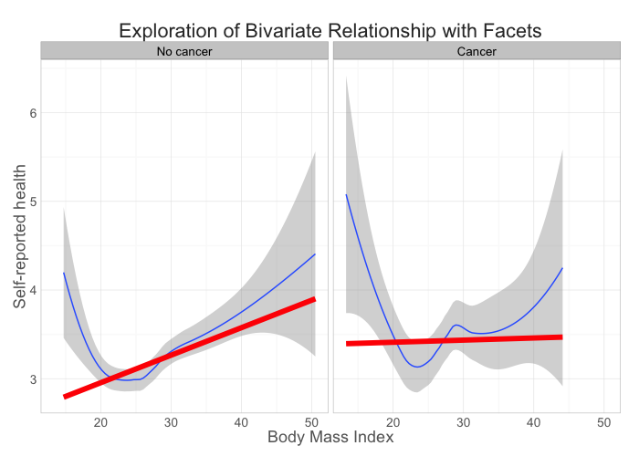 

```r
g22 <- p + facet_grid(cancrF ~ psychF)
g22
```

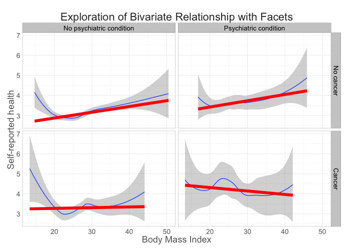 

```r
g23 <- p + facet_grid(cancrF ~ heartF)
g23
```

 

```r
g24 <- p + facet_grid(cancrF ~ lungF)
g24
```

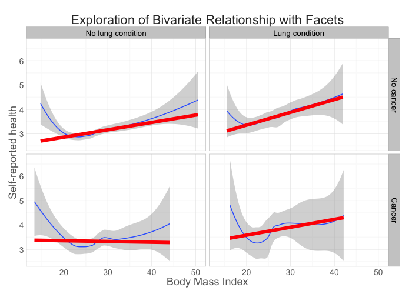 

```r
g25 <- p + facet_grid(cancrF ~ diabF)
g25
```

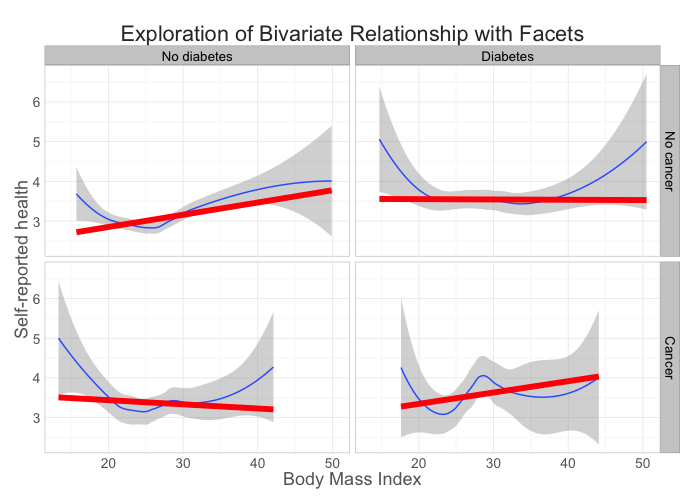 

```r
#shlt vs. psych
p = ggplot2::ggplot(data=ds, aes(x=psychF, y=shlt)) +
  geom_point()+
  geom_jitter()
p
```

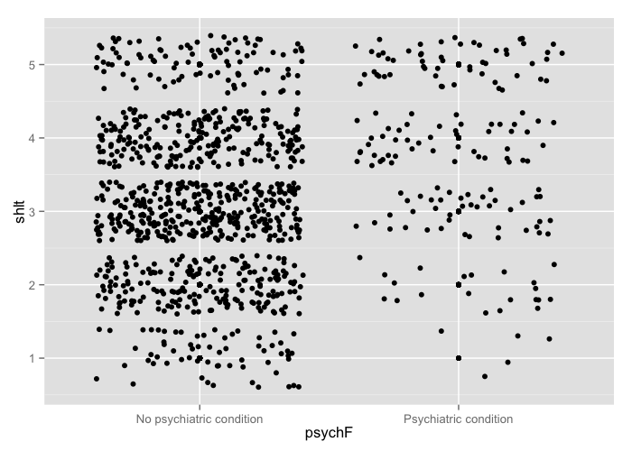 

```r
#shlt vs. heart
p = ggplot2::ggplot(data=ds, aes(x=heartF, y=shlt)) +
  geom_point()+
  geom_jitter()
p
```

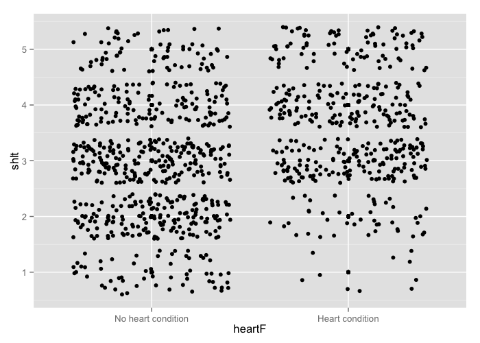 

```r
#shlt vs. lung
p = ggplot2::ggplot(data=ds, aes(x=lungF, y=shlt)) +
  geom_point()+
  geom_jitter()
p
```

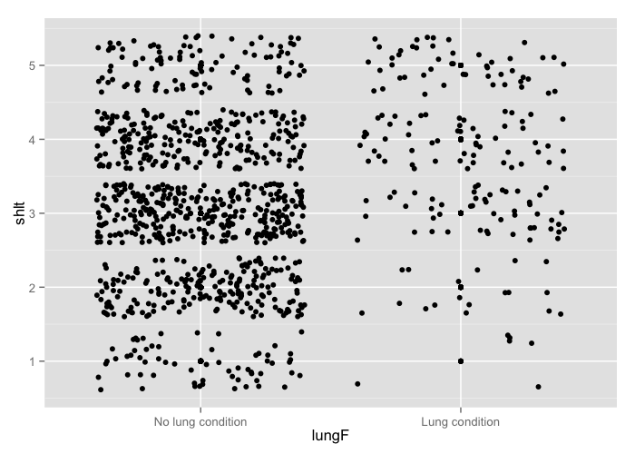 

```r
#shlt vs. cancr
p = ggplot2::ggplot(data=ds, aes(x=cancrF, y=shlt)) +
  geom_point()+
  geom_jitter()
p
```

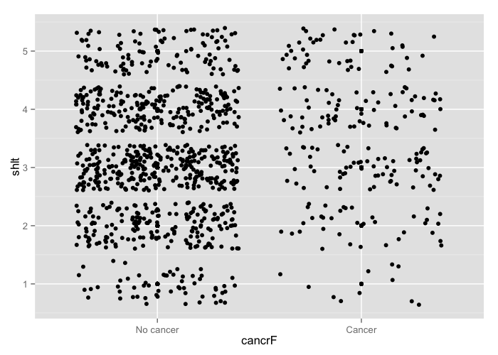 

```r
#shlt vs. diab
p = ggplot2::ggplot(data=ds, aes(x=diabF, y=shlt)) +
  geom_point()+
  geom_jitter()
p
```

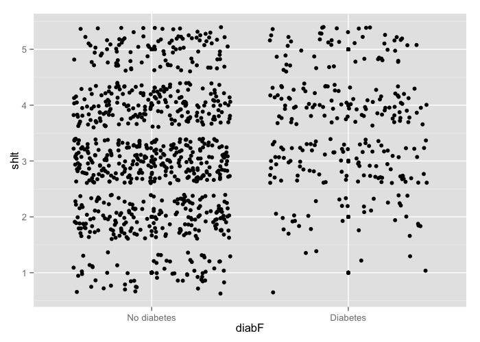 

```r
lm.fit = lm(shlt~ bmi + psychF + heartF + lungF + cancrF + diabF, data=ds)
#not working anymore

summary(lm.fit)
```

```

Call:
lm(formula = shlt ~ bmi + psychF + heartF + lungF + cancrF + 
    diabF, data = ds)

Residuals:
     Min       1Q   Median       3Q      Max 
-3.15222 -0.69353 -0.08781  0.76726  2.44410 

Coefficients:
                            Estimate Std. Error t value Pr(>|t|)    
(Intercept)                 2.254665   0.171740  13.128  < 2e-16 ***
bmi                         0.017514   0.006369   2.750  0.00607 ** 
psychFPsychiatric condition 0.525631   0.085254   6.165 9.96e-10 ***
heartFHeart condition       0.473244   0.064310   7.359 3.70e-13 ***
lungFLung condition         0.515131   0.084087   6.126 1.27e-09 ***
cancrFCancer                0.218399   0.077497   2.818  0.00492 ** 
diabFDiabetes               0.354139   0.074024   4.784 1.96e-06 ***
---
Signif. codes:  0 '***' 0.001 '**' 0.01 '*' 0.05 '.' 0.1 ' ' 1

Residual standard error: 1.018 on 1065 degrees of freedom
Multiple R-squared:  0.1643,	Adjusted R-squared:  0.1596 
F-statistic: 34.91 on 6 and 1065 DF,  p-value: < 2.2e-16
```

```r
# lm.all = lm(shlt~., data=ds)

# fwd.model = step(lm.all, direction='forward', scope=(shlt ~ bmi + psychF + heartF + lungF + cancrF + diabF))

#search ggplot graphs
#graphical themes to change background
```
---
## Slide 6

---
## Slide 7

---
## Slide 8

---
## Slide 9


