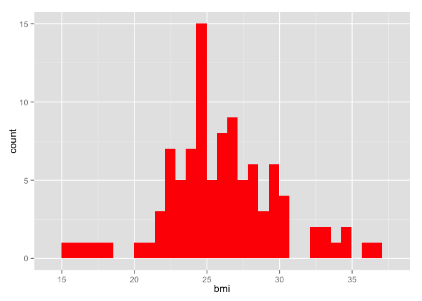

# PSYC 532 Data Preparation Report
<!-- for more options study http://rmarkdown.rstudio.com/html_document_format.html  -->
<!-- The report is produced from
REPOSITORY: PSYC532 Final Project
BRANCH: the-name-of-the-branch
PATH: ../reports/
-->

<!--  Set the working directory to the repository's base directory; this assumes the report is nested inside of only one directory.-->


<!-- Set the report-wide options, and point to the external script file. -->

##Set Up Environment
###Load Packages
Prepare RStudio environment for all tasks

```r
# Load the necessary packages.
base::require(base)
base::require(knitr)
base::require(markdown)
base::require(testit)
base::require(dplyr)
base::require(reshape2)
base::require(stringr)
base::require(stats)
base::require(ggplot2)
base::require(extrafont)
base::require(gamair)
base::require(lme4)
base::require(nlme)
base::require(leaps)
```

###Load Data
Link to the data source

```r
# Link to the data source 
pathDir <- getwd()
myExtract <- file.path(pathDir,"data/raw/hrs_data/hrs_retirement")
pathSourceData <- paste0(myExtract,".csv") 
SourceData <- read.csv(pathSourceData,header=TRUE, skip=0,sep=",")
ds0 <- SourceData
```

###Load Graph Settings

```r
# load themes used to style graphs
source("./scripts/graphs/graph_themes.R")
```

##Modify Data
###Rename Variables
Rename variables for easier handling

```r
# rename variables for easier handling
ds0 <- plyr::rename(ds0, 
                    c("hhidpn"="id",
                      "ragender"="sex",
                      "raracem"="race",
                      "rabyear"="byear",
                      "agey"="age"
                    )
)
```

###Group by ID

```r
ds0 <- dplyr::group_by(ds0,id)
```

###Sample Data

```r
ds1 <- subset(ds0, id<10050000)
dsM <- subset(ds1, id>2000)
```

###Graph Outcome Variable
We see relatively even distribution for BMI

```r
n <- ggplot(dsM, aes(x=bmi))
n <- n + geom_histogram(fill = "red")
n
```

 

###Filter Variables
Select variables that are necessary for analysis: id, wave, age, sex, bmi, arthr

```r
dsM <- dplyr::filter(dsM) %>%
  select(id, wave, age, sex, bmi, arthr) 
```

###Remove Missing Data
Remove missing data so that only complete cases are left

```r
hrs_analysis <- na.omit(dsM)
```

##Finishing Touches
###Save Derived Data
Save new dataset for future analysis

```r
pathdsLcsv <- "./data/derived/hrs/hrs_analysis.csv"
write.csv(hrs_analysis,pathdsLcsv,  row.names=FALSE)

pathdsLrds <- "./data/derived/hrs/hrs_analysis.rds"
saveRDS(object=hrs_analysis, file=pathdsLrds, compress="xz")
```

###Remove Other Datasets
Keep only the final dataset

```r
# # remove all but specified dataset
rm(list=setdiff(ls(), "hrs_analysis"))
```
