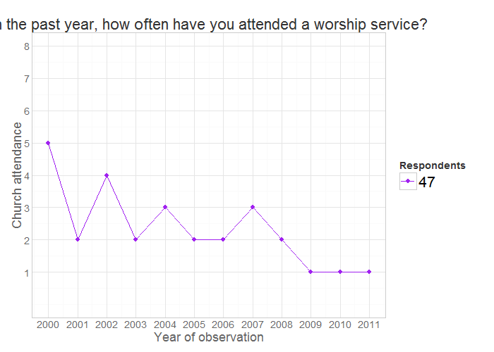
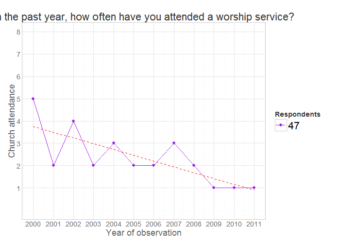

# Change the title of your report
<!-- for more options study http://rmarkdown.rstudio.com/html_document_format.html  -->
<!-- The report is produced from
REPOSITORY: the-name-of-the-repository
BRANCH: the-name-of-the-branch
PATH: ../Reports/
-->

<!--  Set the working directory to the repository's base directory; this assumes the report is nested inside of only one directory.-->


<!-- Set the report-wide options, and point to the external script file. -->


```r
# Load the necessary packages.
base::require(base)
base::require(knitr)
base::require(markdown)
base::require(testit)
base::require(dplyr)
base::require(reshape2)
base::require(stringr)
base::require(stats)
base::require(ggplot2)
base::require(extrafont)
```


```r
# Link to the data source 
pathDir <- getwd()
myExtract <- file.path(pathDir,"data/nlsy97/NLSY97_Attend_20141021/NLSY97_Attend_20141021")
# myExtract <- "./data/nlsy97/NLSY97_Attend_20141021/NLSY97_Attend_20141021"
# myExtract <- "https://raw.githubusercontent.com/IALSA/COAG-colloquium-2014F/master/Data/Extract/NLSY97_Attend_20141021/NLSY97_Attend_20141021"
pathSourceData <- paste0(myExtract,".csv") 
SourceData <- read.csv(pathSourceData,header=TRUE, skip=0,sep=",")
ds0 <- SourceData
```


```r
### NLSY97 variable "id" is linked to the descriptive label in the header of the STATA formated data file.dtc" ###
pathSourceLabels <- paste0(myExtract,".dct")
SourceLabels<-read.csv(pathSourceLabels,header=TRUE, skip=0,nrow=17, sep="")
SourceLabels$X.<-NULL # remove extra column
SourceLabels
```

```
     infile                           dictionary
1  R0000100             PUBID - YTH ID CODE 1997
2  R0536300                KEY!SEX (SYMBOL) 1997
3  R0536401          KEY!BDATE M/Y (SYMBOL) 1997
4  R0536402          KEY!BDATE M/Y (SYMBOL) 1997
5  R1482600     KEY!RACE_ETHNICITY (SYMBOL) 1997
6  R4893400 HOW OFTEN R ATTEND WORSHIP SERV 2000
7  R6520100 HOW OFTEN R ATTEND WORSHIP SERV 2001
8  S0919300 HOW OFTEN R ATTEND WORSHIP SERV 2002
9  S2987800 HOW OFTEN R ATTEND WORSHIP SERV 2003
10 S4681700 HOW OFTEN R ATTEND WORSHIP SERV 2004
11 S6316700 HOW OFTEN R ATTEND WORSHIP SERV 2005
12 S8331500 HOW OFTEN R ATTEND WORSHIP SERV 2006
13 T0739400 HOW OFTEN R ATTEND WORSHIP SERV 2007
14 T2781700 HOW OFTEN R ATTEND WORSHIP SERV 2008
15 T4495000 HOW OFTEN R ATTEND WORSHIP SERV 2009
16 T6143400 HOW OFTEN R ATTEND WORSHIP SERV 2010
17 T7637300 HOW OFTEN R ATTEND WORSHIP SERV 2011
```

```r
# rename columns to match NLS Web Investigator format
SourceLabels<-plyr::rename(SourceLabels,
                     replace=c("infile"="RNUM","dictionary"="VARIABLE_TITLE")
) 
# sort for visual inspection
SourceLabels<-SourceLabels[ with(SourceLabels, order(RNUM)), ]
SourceLabels
```

```
       RNUM                       VARIABLE_TITLE
1  R0000100             PUBID - YTH ID CODE 1997
2  R0536300                KEY!SEX (SYMBOL) 1997
3  R0536401          KEY!BDATE M/Y (SYMBOL) 1997
4  R0536402          KEY!BDATE M/Y (SYMBOL) 1997
5  R1482600     KEY!RACE_ETHNICITY (SYMBOL) 1997
6  R4893400 HOW OFTEN R ATTEND WORSHIP SERV 2000
7  R6520100 HOW OFTEN R ATTEND WORSHIP SERV 2001
8  S0919300 HOW OFTEN R ATTEND WORSHIP SERV 2002
9  S2987800 HOW OFTEN R ATTEND WORSHIP SERV 2003
10 S4681700 HOW OFTEN R ATTEND WORSHIP SERV 2004
11 S6316700 HOW OFTEN R ATTEND WORSHIP SERV 2005
12 S8331500 HOW OFTEN R ATTEND WORSHIP SERV 2006
13 T0739400 HOW OFTEN R ATTEND WORSHIP SERV 2007
14 T2781700 HOW OFTEN R ATTEND WORSHIP SERV 2008
15 T4495000 HOW OFTEN R ATTEND WORSHIP SERV 2009
16 T6143400 HOW OFTEN R ATTEND WORSHIP SERV 2010
17 T7637300 HOW OFTEN R ATTEND WORSHIP SERV 2011
```


```r
# rename variables for easier handling
ds0 <- plyr::rename(ds0, 
            c("R0000100"="id",
              "R0536300"="sex",
              "R1482600"="race",
              "R0536402"="byear",
              "R0536401"="bmonth",
              "R4893400"="attend_2000",
              "R6520100"="attend_2001",
              "S0919300"="attend_2002",
              "S2987800"="attend_2003",
              "S4681700"="attend_2004",
              "S6316700"="attend_2005",
              "S8331500"="attend_2006",
              "T0739400"="attend_2007",
              "T2781700"="attend_2008",
              "T4495000"="attend_2009",
              "T6143400"="attend_2010",
              "T7637300"="attend_2011"
              )
            )
```


```r
# with $
a <- ds0$id # extracts column "id" from dataset "ds0"
class(a)
```

```
[1] "integer"
```

```r
str(a)
```

```
 int [1:8984] 1 2 3 4 5 6 7 8 9 10 ...
```


```r
# with [ ]
a <- ds0[,c("id","sex")] # extracts column "id" from dataset "ds0"
class(a)
```

```
[1] "data.frame"
```

```r
str(a)
```

```
'data.frame':	8984 obs. of  2 variables:
 $ id : int  1 2 3 4 5 6 7 8 9 10 ...
 $ sex: int  2 1 2 2 1 2 1 2 1 1 ...
```


```r
# with dplyr package
require(dplyr)
dplyr::filter(ds0, id<5) %>% dplyr::select(id, sex, race)
```

```
  id sex race
1  1   2    4
2  2   1    2
3  3   2    2
4  4   2    2
```


```r
# Manually create the vector that contains the names of the variables you would like to keep. 
attend_years <- paste0("attend_",c(2000:2011))
selectVars <- c("id", "sex", "race", "byear", "bmonth", attend_years)
dsW <- ds0[,selectVars]
head(dsW)
```

```
  id sex race byear bmonth attend_2000 attend_2001 attend_2002 attend_2003 attend_2004 attend_2005 attend_2006
1  1   2    4  1981      9           1           6           2           1           1           1           1
2  2   1    2  1982      7           2           2           1           1           2           2          -5
3  3   2    2  1983      9           3           2           2           2           1          -5          -5
4  4   2    2  1981      2           2           1           3           1           2           2           2
5  5   1    2  1982     10           3           3           3           2           1           2           1
6  6   2    2  1982      1           2           3           2           7           7           2           7
  attend_2007 attend_2008 attend_2009 attend_2010 attend_2011
1           1           1           1           1           1
2          -5           3           1           2           2
3          -5          -5           6          -5           2
4           2           2           1           2           5
5           1           4           3           2           2
6           7           7           7           7           7
```


```r
require(dplyr)
dplyr::filter(dsW, id < 5) 
```

```
  id sex race byear bmonth attend_2000 attend_2001 attend_2002 attend_2003 attend_2004 attend_2005 attend_2006
1  1   2    4  1981      9           1           6           2           1           1           1           1
2  2   1    2  1982      7           2           2           1           1           2           2          -5
3  3   2    2  1983      9           3           2           2           2           1          -5          -5
4  4   2    2  1981      2           2           1           3           1           2           2           2
  attend_2007 attend_2008 attend_2009 attend_2010 attend_2011
1           1           1           1           1           1
2          -5           3           1           2           2
3          -5          -5           6          -5           2
4           2           2           1           2           5
```


```r
TIvars<-c("id", "sex","race", "bmonth","byear") # Time Invariant (TI)
# id.vars tells what variables SHOULD NOT be stacked
dsLong <- reshape2::melt(dsW, id.vars=TIvars) # melt 
dplyr::filter(dsLong, id == 1)
```

```
   id sex race bmonth byear    variable value
1   1   2    4      9  1981 attend_2000     1
2   1   2    4      9  1981 attend_2001     6
3   1   2    4      9  1981 attend_2002     2
4   1   2    4      9  1981 attend_2003     1
5   1   2    4      9  1981 attend_2004     1
6   1   2    4      9  1981 attend_2005     1
7   1   2    4      9  1981 attend_2006     1
8   1   2    4      9  1981 attend_2007     1
9   1   2    4      9  1981 attend_2008     1
10  1   2    4      9  1981 attend_2009     1
11  1   2    4      9  1981 attend_2010     1
12  1   2    4      9  1981 attend_2011     1
```


```r
# nrow(dsLong)/length(unique(dsLong$id)) # should be integer
dsLong <- dplyr::filter(dsLong,!is.na(id)) # remove obs with invalid id
# nrow(dsLong)/length(unique(dsLong$id)) # verify that melting is fine
# dplyr::filter(dsLong,id==1) # inspect
```


```r
# create varaible "year" by stripping the automatic ending in TV variables' names
# subset 4 characters from the end of the string a into new variable
dsLong$year<-str_sub(dsLong$variable,-4,-1) 
dplyr::filter(dsLong, id == 1)
```

```
   id sex race bmonth byear    variable value year
1   1   2    4      9  1981 attend_2000     1 2000
2   1   2    4      9  1981 attend_2001     6 2001
3   1   2    4      9  1981 attend_2002     2 2002
4   1   2    4      9  1981 attend_2003     1 2003
5   1   2    4      9  1981 attend_2004     1 2004
6   1   2    4      9  1981 attend_2005     1 2005
7   1   2    4      9  1981 attend_2006     1 2006
8   1   2    4      9  1981 attend_2007     1 2007
9   1   2    4      9  1981 attend_2008     1 2008
10  1   2    4      9  1981 attend_2009     1 2009
11  1   2    4      9  1981 attend_2010     1 2010
12  1   2    4      9  1981 attend_2011     1 2011
```


```r
# remove the automatic ending 
removePattern <- paste0("_",c(2000:2011))
for (i in removePattern){
  dsLong$variable <- gsub(pattern=i, replacement="", x=dsLong$variable) 
}
dsLong$year <- as.integer(dsLong$year) # Convert to a number.
dplyr::filter(dsLong,id==1) # inspect
```

```
   id sex race bmonth byear variable value year
1   1   2    4      9  1981   attend     1 2000
2   1   2    4      9  1981   attend     6 2001
3   1   2    4      9  1981   attend     2 2002
4   1   2    4      9  1981   attend     1 2003
5   1   2    4      9  1981   attend     1 2004
6   1   2    4      9  1981   attend     1 2005
7   1   2    4      9  1981   attend     1 2006
8   1   2    4      9  1981   attend     1 2007
9   1   2    4      9  1981   attend     1 2008
10  1   2    4      9  1981   attend     1 2009
11  1   2    4      9  1981   attend     1 2010
12  1   2    4      9  1981   attend     1 2011
```


```r
require(reshape2)
dsL <- dcast(dsLong, id + sex + race + bmonth + byear + year ~ variable, value.var = "value")
dplyr::filter(dsL,id==1)
```

```
   id sex race bmonth byear year attend
1   1   2    4      9  1981 2000      1
2   1   2    4      9  1981 2001      6
3   1   2    4      9  1981 2002      2
4   1   2    4      9  1981 2003      1
5   1   2    4      9  1981 2004      1
6   1   2    4      9  1981 2005      1
7   1   2    4      9  1981 2006      1
8   1   2    4      9  1981 2007      1
9   1   2    4      9  1981 2008      1
10  1   2    4      9  1981 2009      1
11  1   2    4      9  1981 2010      1
12  1   2    4      9  1981 2011      1
```


```r
#
dplyr::filter(dsL,id==1) %>% select(id,byear,year,attend)
```

```
   id byear year attend
1   1  1981 2000      1
2   1  1981 2001      6
3   1  1981 2002      2
4   1  1981 2003      1
5   1  1981 2004      1
6   1  1981 2005      1
7   1  1981 2006      1
8   1  1981 2007      1
9   1  1981 2008      1
10  1  1981 2009      1
11  1  1981 2010      1
12  1  1981 2011      1
```


```r
dsL <- dplyr::mutate(dsL, age = year - byear)
dplyr::filter(dsL,id==1) %>% select(id,byear,year,attend, age)
```

```
   id byear year attend age
1   1  1981 2000      1  19
2   1  1981 2001      6  20
3   1  1981 2002      2  21
4   1  1981 2003      1  22
5   1  1981 2004      1  23
6   1  1981 2005      1  24
7   1  1981 2006      1  25
8   1  1981 2007      1  26
9   1  1981 2008      1  27
10  1  1981 2009      1  28
11  1  1981 2010      1  29
12  1  1981 2011      1  30
```


```r
dsF <- dsL # add factors to the dataset
source("./scripts/data/labeling_factor_levels.R")
dsL <- dsF
rm(dsF)
dplyr::filter(dsL,id==1)
```

```
   id sex race bmonth byear year attend age   sexF       raceF bmonthF         attendF
1   1   2    4      9  1981 2000      1  19 Female Non-B/Non-H     Sep           Never
2   1   2    4      9  1981 2001      6  20 Female Non-B/Non-H     Sep About once/week
3   1   2    4      9  1981 2002      2  21 Female Non-B/Non-H     Sep   Once or Twice
4   1   2    4      9  1981 2003      1  22 Female Non-B/Non-H     Sep           Never
5   1   2    4      9  1981 2004      1  23 Female Non-B/Non-H     Sep           Never
6   1   2    4      9  1981 2005      1  24 Female Non-B/Non-H     Sep           Never
7   1   2    4      9  1981 2006      1  25 Female Non-B/Non-H     Sep           Never
8   1   2    4      9  1981 2007      1  26 Female Non-B/Non-H     Sep           Never
9   1   2    4      9  1981 2008      1  27 Female Non-B/Non-H     Sep           Never
10  1   2    4      9  1981 2009      1  28 Female Non-B/Non-H     Sep           Never
11  1   2    4      9  1981 2010      1  29 Female Non-B/Non-H     Sep           Never
12  1   2    4      9  1981 2011      1  30 Female Non-B/Non-H     Sep           Never
```


```r
# load themes used to style graphs
source("./scripts/graphs/graph_themes.R")
```


```r
dsM <- dplyr::filter(dsL,id==47) %>%
  select(id,byear, year, attend, attendF)
dsM
```

```
   id byear year attend              attendF
1  47  1982 2000      5    About twice/month
2  47  1982 2001      2        Once or Twice
3  47  1982 2002      4     About once/month
4  47  1982 2003      2        Once or Twice
5  47  1982 2004      3 Less than once/month
6  47  1982 2005      2        Once or Twice
7  47  1982 2006      2        Once or Twice
8  47  1982 2007      3 Less than once/month
9  47  1982 2008      2        Once or Twice
10 47  1982 2009      1                Never
11 47  1982 2010      1                Never
12 47  1982 2011      1                Never
```


```r
p <- ggplot(dsM, aes(x=year,y=attend, color=factor(id)))
p <- p + geom_line(size=.4)
p <- p + geom_point(size=2)
p <- p + scale_y_continuous("Church attendance",
                         limits=c(0, 8),
                         breaks=c(1:8))
p <- p + scale_x_continuous("Year of observation",
                         limits=c(2000,2011),
                         breaks=c(2000:2011))
p <- p + scale_color_manual(values=c("purple"))
p <- p + labs(title=paste0("In the past year, how often have you attended a worship service?"))
p <- p + guides(color = guide_legend(title="Respondents"))
p <- p + theme1
p
```

 


```r
dsM <- dplyr::filter(dsL,id==47) %>%
  select(id,byear, year, attend, attendF) 
dsM$model <-  predict(lm(attend~year,dsM))
```


```r
p <- ggplot(dsM, aes(x=year,y=attend, color=factor(id)))
p <- p + geom_line(size=.4)
p <- p + geom_point(size=2)
p <- p + geom_line(aes(y=model),colour="red", linetype="dashed")
p <- p + scale_y_continuous("Church attendance",
                            limits=c(0, 8),
                            breaks=c(1:8))
p <- p + scale_x_continuous("Year of observation",
                            limits=c(2000,2011),
                            breaks=c(2000:2011))
p <- p + scale_color_manual(values=c("purple"))
p <- p + labs(title=paste0("In the past year, how often have you attended a worship service?"))
p <- p + guides(color = guide_legend(title="Respondents"))
p <- p + theme1
p
```

 


```r
pathdsLcsv <- "./data/nlsy97/dsL.csv"
write.csv(dsL,pathdsLcsv,  row.names=FALSE)

pathdsLrds <- "./data/nlsy97/dsL.rds"
saveRDS(object=dsL, file=pathdsLrds, compress="xz")
```


```r
# # remove all but specified dataset
rm(list=setdiff(ls(), c("dsW","dsL")))
```

